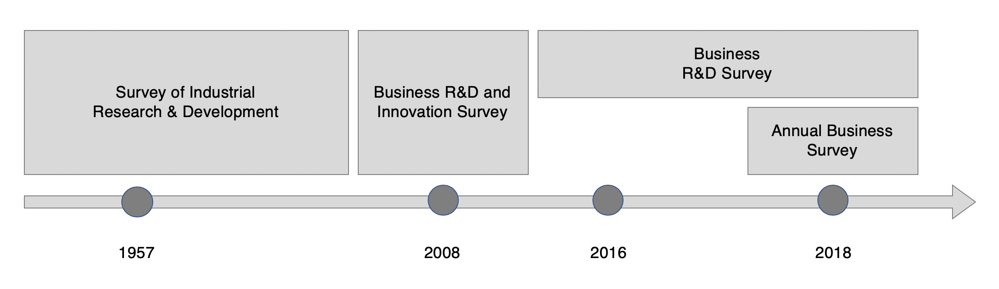
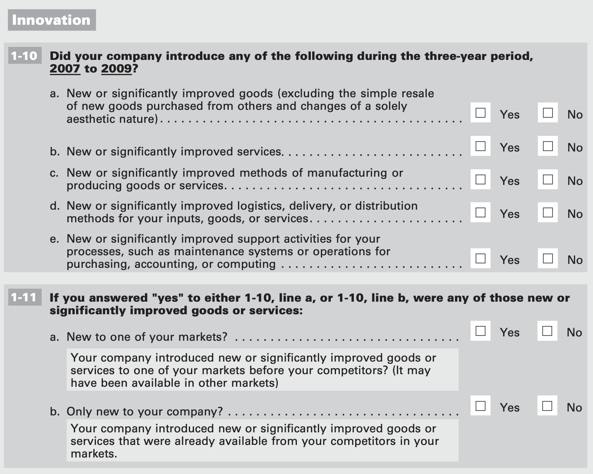
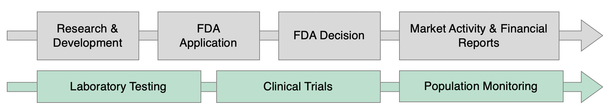

<style>
  .col2 {
    columns: 2 200px;         /* number of columns and width in pixels*/
    -webkit-columns: 2 200px; /* chrome, safari */
    -moz-columns: 2 200px;    /* firefox */
  }
  .col3 {
    columns: 3 100px;
    -webkit-columns: 3 100px;
    -moz-columns: 3 100px;
  }
</style>

```{r libraries, echo = FALSE, warning = FALSE, error = FALSE, message = FALSE, results = "hide"}
knitr::opts_chunk$set(echo = FALSE, warning = FALSE, error = FALSE, message = FALSE, results = "asis")
library(readr)
library(dplyr)
library(stringr)
library(xml2)
library(rvest)
library(stringr)
library(hunspell)
library(data.table)
library(htmltools)
library(magrittr)
library(htmltidy)
library(ggplot2)
library(corpus)

#library(wesanderson)

#library(rworldmap)
```

```{r functions}

remove_doc_types <- function(xml_string, types = c("GRAPHIC", "EXCEL", "ZIP", "EX-10.3", "EX-10.6", "EX-10.20")) {
  no_ns <- gsub("\\n", " ", xml_string)
  #browser()
  for (t in types) {
    find_str <- paste0("<DOCUMENT> ?<TYPE> ?", t)
    search_str <- paste0("<DOCUMENT> ?<TYPE> ?", t, ".*?</DOCUMENT>")
    found <-
      as.data.table(stringr::str_locate_all(no_ns, find_str))

    for (i in 1:nrow(found)) {
      locs <- as.data.table(stringr::str_locate(no_ns, search_str))
      st <- locs[1, start] - 1
      en <- locs[1, end] + 1
      ifelse(is.na(locs$start) == TRUE & is.na(locs$end) == TRUE, no_ns,
             no_ns <- paste0(substr(no_ns, 1, st), substr(no_ns, en, nchar(no_ns))) )
    }
  }
  no_ns
}


stem_hunspell <- function(term) {
  # look up the term in the dictionary
  stems <- hunspell::hunspell_stem(term)[[1]]

  if (length(stems) == 0) { # if there are no stems, use the original term
    stem <- term
  } else { # if there are multiple stems, use the last one
    stem <- stems[[length(stems)]]
  }

  stem
}

'%!in%' <- function(x,y)!('%in%'(x,y))

get_context_pos <- function(word_vec, target, n, p_o_s) {
  wordlist <- data.frame(word_vec) %>% 
    transmute(Word = as.character(word_vec), 
    eng = hunspell_check(Word), 
    stem = hunspell_stem(Word),
    id = row_number(), 
    target = ifelse(str_detect(str_to_lower(Word), pattern = target), 1, 0))
 
  target_rows <- wordlist  %>% filter(target == 1)
  target_rows
  target_rows$seq_up <- NA
  target_rows$seq_down <- NA
 
for (i in 1:length(target_rows$id)) {
  target_rows$seq_up[i] <- list(seq(target_rows$id[i] +1, target_rows$id[i] + n))
  target_rows$seq_down[i] <- list(seq(target_rows$id[i] -1, target_rows$id[i] - n))
}
  before_target <- unlist(target_rows$seq_up)
  after_target <- unlist(target_rows$seq_down)

  context <- wordlist[wordlist$id %in% before_target|wordlist$id %in% after_target, ] %>%
    mutate(pstn = ifelse(id %in% before_target, "before", ifelse(id %in% after_target, "after", "none")))

  context <- context %>%
    filter(!dataplumbr::var.is_blank(Word)) %>%
    tidyr::unnest() %>%
    count(stem) %>%
    arrange(desc(n)) %>%
    filter(stem %!in% stopwords_en) %>%
    left_join(tidytext::parts_of_speech, by = c("stem" = "word"))  %>%
    filter(pos == p_o_s)

  context
}
```

```{r load_1, results = "hide", message=FALSE, warning=FALSE}
# wordcounts_1_1000 <- read_csv("~/git/business_innovation/data/working/sec/wordcounts_1_1000.csv")
# wordcounts_1001_2000 <- read_csv("~/git/business_innovation/data/working/sec/wordcounts_1001_2000.csv")
# wordcounts_2000_2867 <- read_csv("~/git/business_innovation/data/working/sec/wordcounts_2000_2867.csv")
# allwordcounts <- as.data.table(rbind(wordcounts_1_1000, wordcounts_2000_2867, wordcounts_2000_2867))
#saveRDS(allwordcounts, "~/git/business_innovation/data/working/sec/all_wordlist.RDS")
#allwordcounts <- readRDS("~/git/business_innovation/data/working/sec/all_wordlist.RDS") duplicated below

datapath <- "/project/biocomplexity/sdad/projects-active/volume_nyc1_01/business_innovation/" #new rivanna location
datapath1 <- "/project/biocomplexity/sdad/projects_data/ncses/bi/binn/" #new rivanna location

paths_file <- paste0(datapath1, "original/edgar_filings/ALL_SEC_files.txt")
file_headers <- readr::read_tsv(paths_file, col_names = FALSE)
paths <- paste0(datapath1, "original/edgar_filings/Edgar_filings_folders/", file_headers$X1)
file_names <- unique(list.files(paths, full.names = TRUE))

ciknames <- readRDS(paste0(datapath1, "original/ciks_names.RDS"))
sic <- readRDS(paste0(datapath1, "original/sic.download.RDS"))
cik_ticker <- readr::read_delim(paste0(datapath1, "original/edgar_filings/cik_ticker.csv"), delim = "|")   #RANKANDFILE website
cikcountries <- readr::read_delim(paste0(datapath1, "original/edgar_filings/edgar_state_country.csv"), delim = "|") #RANKANDFILE website

allwords <- read_csv(paste0(datapath1, "working/sec/all_secwordlists.csv")) # 4M TOTAL WORDS ACROSS ALL FILINGS
allregwords <- read_csv(paste0(datapath1, "working/sec/all_secregwordlists.csv")) # 37K REG WORDS ACROSS ALL FILINGS
allwordcounts <- readRDS(paste0(datapath1, "working/sec/all_wordlist.RDS")) #15K NON ENGLISH WORDS ACROSS ALL FILINGS

### WORK IN PROGRESS - SEPTEMBER 2019 ATTEMPT at full company list  - ACTUALLy 
#companylist <- readRDS("~/git/business_innovation/data/working/sec/companylist.RDS") 
```

```{r joinprep_1, warning=FALSE}
colnames(sic) <- c("CIK", "SIC_CompName", "SIC_SIC", "SIC_Industry", "SIC_Location")
colnames(ciknames) <- c("CIK", "SEC_CompName", "SEC_SIC")
colnames(cik_ticker) <- c("CIK", "Ticker_TickerCode", "Ticker_CompName", "Ticker_Exchange", "Ticker_SIC", "Ticker_Location", "Ticker_Inc_Location", "Ticker_IRS")
colnames(cikcountries) <- c("Code", "Ticker_StateCountry")

sic$SIC_SIC <- as.numeric(sic$SIC_SIC)
sic$CIK <- as.numeric(sic$CIK)
ciknames$CIK <- as.numeric(ciknames$CIK)
ciknames$SEC_SIC <- as.numeric(ciknames$SEC_SIC)
```

```{r comp_reference_1}
cikcountries <- cikcountries %>%
  mutate(US = recode(Code, 
                     "CA"= "USA", "CO" = "USA", "CT" = "USA", "DC" = "USA", "FL" = "USA", "GA" = "USA",
                     "IL" = "USA", "IN" = "USA", "MA" = "USA", "MD" = "USA", "MN" = "USA", "MI" = "USA",
                     "MO" = "USA", "NC" = "USA", "NJ" = "USA", "NV" = "USA", "NY" = "USA", "OH" = "USA",
                     "PA" = "USA", "SC" = "USA", "TN" = "USA", "TX" = "USA", "UT" = "USA", "WA" = "USA",
                     "AK" = "USA", "AL" = "USA", "AR" = "USA", "AZ" = "USA", "DE" = "USA", "IA" = "USA",
                     "ID" = "USA", "ME" = "USA", "MS" = "USA", "MT" = "USA", "ND" = "USA", "NE" = "USA",
                     "OK" = "USA", "OR" = "USA", "PR" = "USA", "RI" = "USA", "SD" = "USA", "VA" = "USA",
                     "VT" = "USA", "WA" = "USA", "WI" = "USA", "WV" = "USA", "WY" = "USA", "NH" = "USA")) 

companyref <- sic %>% # 58K  
  full_join(ciknames, by = "CIK") %>% # 779      
  full_join(cik_ticker, by = "CIK") %>%  #13K
  full_join(cikcountries, by = c("Ticker_Location" = "Code")) #309 - but doens't affect rows
                                                 
companyref_pickname <- companyref %>%
  mutate(Name = ifelse(!is.na(SEC_CompName), SEC_CompName,
                       ifelse(!is.na(SIC_CompName), SIC_CompName,
                              ifelse(!is.na(Ticker_CompName), Ticker_CompName, paste(SEC_CompName, SIC_CompName, Ticker_CompName)))),
         SIC = ifelse(!is.na(SEC_SIC), SEC_SIC,
                       ifelse(!is.na(SIC_SIC), SIC_SIC,
                              ifelse(!is.na(Ticker_SIC), Ticker_SIC, 0)))) %>%
  transmute(Name = Name, CIK = CIK, SIC = SEC_SIC, SIC_Loc = SIC_Location, TickerCode = Ticker_TickerCode, Exchange = Ticker_Exchange, Ticker_Location, Ticker_Inc_Location, Ticker_StateCountry, US)

##################################################
#length(file_names) # 2867 filings
#length(unique(ciknames$CIK))  # 779 - total # of companies classified as pharm/med device by SEC 

patt1 <- "(?<=Edgar_filings_folders/)(.*)(?=.txt)"
patt2 <- "(?<=/)(.*)(?=_10-K_)"
orig_companies <- str_extract(str_extract((file_names), patt1), patt2)

#length(unique(orig_companies$orig_companies)) #703 companies with filings
#length(unique(wcbycomp$Company)) # 365 - # of companies that we found non-English words in their filings

orig_companies <- as.numeric(orig_companies)
orig_companies <- as.data.frame(orig_companies)

origcomp_details <- orig_companies %>%
  filter(!is.na(orig_companies)) %>% 
  unique() %>% 
  left_join(ciknames, by = c("orig_companies" = "CIK")) %>%
  left_join(sic, by = c("orig_companies" = "CIK", "SEC_SIC" = "SIC_SIC")) %>%
  left_join(cik_ticker, by = c("orig_companies" = "CIK"))

```

```{r remind_me_3_sets_are_1_and_2, eval=FALSE}
# 3 word datasets
# allwords # 4 million words across all filings
# allwordcounts # 15K non-English words across all filings 
# allregwords # 37K protected words across all filings
```

```{r company_reference_sets_and_multtokens }
company_reference_names <- companyref %>% distinct() %>% 
  mutate(CompanyString = paste(SIC_CompName, SEC_CompName, Ticker_CompName)) 

comp_tokens <- str_split(company_reference_names$CompanyString, pattern = " |[[:punct:]]")
stopwords <- as.vector(c("inc", "corp", "ltd","plc","llc","hold?ing?s","international","group","acquisition","american","china","usa"))
#stopwords <- paste0( stopwords, collapse = "|")

new_ref_companies <- tibble(company_reference_names$CompanyString, comp_tokens) %>% # head() %>% 
  tidyr::unnest() %>% filter(nchar(comp_tokens) >1) %>% as.data.frame() %>%
  left_join(company_reference_names, by = c("company_reference_names$CompanyString" = "CompanyString")) %>%
  mutate(comp_lowword = str_to_lower(str_squish(comp_tokens))) %>% filter(comp_lowword %!in% stopwords) %>% 
  mutate(comp_low_hun = corpus::text_tokens(comp_lowword, stemmer = stem_hunspell)) %>% tidyr::unnest() %>% distinct()

colnames(new_ref_companies) <- c("CompanyString", "Tokens", "CIK", "SIC_Company_Name", "SIC_SIC", "SIC_Industry", "SIC_Location", "SEC_Company_Name", "SEC_SIC", "Ticker_Code", "Ticker_Company_Name", "Ticker_Exchange", "Ticker_SIC_Code", "Ticker_Location", "Ticker_IncLoc", "Ticker_IRS", "CIK_Ticker_US_Country", "CIK_Ticker_USA", "token_low", "token_hun")

multtokens <- new_ref_companies %>% group_by(Tokens) %>% summarise(n = n()) %>% filter(n > 1)
#knitr::kable(multtokens[str_detect(multtokens$Tokens, "Apogee"),])
new_ref_companies2 <- new_ref_companies
new_ref_companies <- new_ref_companies %>% filter(Tokens %!in% multtokens$Tokens)

multenglishtokens <- new_ref_companies2 %>% mutate(eng = hunspell::hunspell_check(token_hun)) %>% filter(eng == "TRUE") %>% group_by(token_hun) %>% summarise(n = n()) %>% filter(n > 1)
```

```{r stopwordsandpatterns}
pharmstopwords <- c("biopharma", "therapeutics?", "pharmaceuticals?", "international", "sciences?", "medical", "technology",  "pharma?", "bio", "biosciences?", "anda", "fdca", "uspto", "investigational")
pharmstopwords <- paste0(paste0("\\b", pharmstopwords, "\\b"), collapse = "|")

patt = paste0("^", new_ref_companies$Tokens, "$", collapse = "|")
pattlow = paste0("^", new_ref_companies$token_low, "$", collapse = "|")
patthun = paste0("^", new_ref_companies$token_hun, "$", collapse = "|")

```

```{r wordlistsandsearchcompanies}
allregwords <- allregwords %>% count(Company, Year, Words)
allwordcounts$n <- allwordcounts$count
allwordcounts$count <- NULL
wordlist_engreg_rbind <- rbind(allwordcounts, allregwords)

wordlist_enreg_count <- wordlist_engreg_rbind %>% 
  mutate(Protect = str_extract(Words, "®|™"), Token = str_remove(Words, "®|™")) %>% 
  group_by(Company, Year, Token, Protect) %>% 
  summarise(n = sum(n)) %>% as.data.frame()

wcbycomp <- reshape2::dcast(wordlist_enreg_count, Company + Token + Protect ~ Year, value.var = "n", fun.aggregate = sum)

wcbycomp %>% count(Company, Token) %>% select(-n) %>% count(Company)

#table(is.na(wordlist_enreg_count$Protect))

wcbyword_searchcompanies <- wcbycomp %>% mutate(
  word_low = str_to_lower(Token),
  companyTF = str_detect(Token, patt), 
  compmatch = str_extract(Token, patt), 
  complowTF = str_detect(word_low, pattlow),
  complowmatch = str_extract(word_low, patthun))

```

```{r remove_companies_from_final_wordlist_2_final_set }
wcbyword_findcompanies <- wcbyword_searchcompanies %>% 
  left_join(company_reference_names %>% select(CIK, CompanyString), by = c("Company" = "CIK")) %>%
  mutate(Self = ifelse(str_detect(str_to_lower(CompanyString), pattern = complowmatch), 1, 0),
         Pharma = ifelse(str_detect(string = str_to_lower(Token), pattern = pharmstopwords), 1, 0 )) #%>%  
  #select(-word_low, -companyTF, -compmatch, -complowmatch, -CompanyString)

final_product_list <- wcbyword_findcompanies %>% 
  filter(complowTF == FALSE & Pharma == 0) %>% 
  #select(-word_low, -companyTF, -compmatch, -complowTF, -complowmatch, -Self, -Pharma) %>% 
  left_join(companyref_pickname, by = c("Company" = "CIK"))

final_product_list_clean <- wcbyword_findcompanies %>% 
  filter(complowTF == FALSE & Pharma == 0) %>% 
  select(-word_low, -companyTF, -compmatch, -complowTF, -complowmatch, -Self, -Pharma) %>% 
  left_join(companyref_pickname, by = c("Company" = "CIK"))
```

```{r firstmention}
#### for each company - what was the first time they individually mentioned that product? 
firstmention_by_company <- final_product_list_clean %>% 
  transmute(Name = Name, 
        first_mention = ifelse(`2012` > 0, 2012, 
                                ifelse(`2013` > 0, 2013, 
                                        ifelse(`2014` > 0, 2014, 
                                                ifelse(`2015` > 0, 2015, 
                                                        ifelse(`2016` > 0, 2016,
                                                               ifelse(`2017` > 0, 2017, 1900)))))), 
         #Product = ifelse(!is.na(Protect), paste0(Token, Protect), Token),
        Token = Token, 
        Protect = Protect)


#### for commonly mentioned products - which company mentioned it first? for ties - remove the tokens

#### how to find tokens that have multiple companies mentioning them
#firstmention_by_company %>% count(Token, Name) %>% select(-n) %>% count(Token) %>% filter(n>1)
#### example of how to find first mention YEAR among multiple company years with Abilify
#firstmention_by_company %>% filter(Token == "Abilify") %>% group_by(Token) %>% summarise(minyear = min(first_mention))
#### example how to take first mention YEAR and then filter for rows with that year
#firstmention_by_company %>% filter(Token == "Abilify") %>% group_by(Token) %>% summarise(minyear = min(first_mention)) %>% left_join(firstmention_by_company %>% filter(Token == "Abilify"), by = c("Token")) %>% filter(minyear == first_mention)

#### run above on entire set 

# get earliest year
creditcompanybyfirstmention <- firstmention_by_company %>% group_by(Token) %>% summarise(minyear = min(first_mention)) %>% left_join(firstmention_by_company, by = c("Token")) %>% filter(minyear == first_mention)
# get tokens with multiple companies first mentions
tokens_with_tied_firstmention <- creditcompanybyfirstmention %>% count(Token, Name) %>% select(-n) %>% count(Token) %>% filter(n>1)

# remove mult-tokens from set
creditcompanybyfirstmention_NO_TIES <- creditcompanybyfirstmention %>% filter(Token %!in% tokens_with_tied_firstmention$Token) %>% select(Token, Protect, Name, minyear)

# join back to original list 
final_product_list_singlefirstmentionsONLY <- final_product_list_clean %>% 
  left_join(firstmention_by_company, by = c("Name", "Token", "Protect")) %>% 
  inner_join(creditcompanybyfirstmention_NO_TIES, by = c("Token", "Name", "Protect", "first_mention" = "minyear"))

```

```{r venn_data}
nonenglish_mentions <- allwordcounts %>% transmute(mention_id = paste(Company, Words))
protected_mentions <- allregwords %>% transmute(mention_id = paste(Company, str_remove(Words, "®|™")))
nonenglish_mentions <- unique(nonenglish_mentions$mention_id)
protected_mentions <- unique(protected_mentions$mention_id)
nonenglish_tokens <- unique(allwordcounts$Words)
protected_tokens <- unique(str_remove(allregwords$Words, "®|™"))
```

```{r}

#datapath <- "/project/biocomplexity/sdad/projects-active/volume_nyc1_01/business_innovation/" #new rivanna location
datapath <- "/project/biocomplexity/sdad/projects_data/ncses/bi/binn/"
fda <- readxl::read_excel(paste0(datapath, "original/fda_drugs/Copy of FDA Database - COMBINED V2.xlsx"), sheet = "Sheet1")
ndc_product <- readr::read_tsv(paste0(datapath1, "original/NDC/product.txt"))

colnames(fda) <- dataplumbr::name.standard_col_names(colnames(fda))

# device_510k <- read_rds("~/git/business_innovation/data/original/FDA_Med_Device_Dataset/510k.RDS")
# device_hde <- read_rds("~/git/business_innovation/data/original/FDA_Med_Device_Dataset/hde.RDS") %>% select(1:4)
# device_pma <- read_rds("~/git/business_innovation/data/original/FDA_Med_Device_Dataset/pma.RDS")
# 
# colnames(device_hde) <- device_hde[4,]
# device_hde <- device_hde[5:nrow(device_hde),]
# colnames(device_hde) <- dataplumbr::name.standard_col_names(colnames(device_hde))
```


```{r}
# saveRDS(final_product_list_clean, file = "~/git/business_innovation/data/working/sec/finalwordlists/final_product_list_dec20.RDS")
# saveRDS(final_product_list_singlefirstmentionsONLY, file = "~/git/business_innovation/data/working/sec/finalwordlists/final_product_list_singmention_dec20.RDS")

final_product_list <- readRDS(paste0(datapath, "working/sec/finalwordlists/final_product_list_dec20.RDS"))
final_product_list_singlefirstmentionsONLY <- readRDS(paste0(datapath, "working/sec/finalwordlists/final_product_list_singmention_dec20.RDS"))
```

```{r}
ndc_names <- ndc_product %>% 
  mutate(year = str_extract(string = STARTMARKETINGDATE, pattern = "^\\d{4}")) %>% 
  select(21, 4, 6, 14) %>% 
  distinct() %>% 
  mutate(Prop_low = str_to_lower(PROPRIETARYNAME), 
         Nonprop_low = str_to_lower(NONPROPRIETARYNAME),
         Sub_low = str_to_lower(SUBSTANCENAME))

```


```{r plotsettings2}
customPlot2 = list(
  theme(#plot.margin = unit(c(1,1,2,2), "cm"),
        axis.text.x  = element_text(vjust=0.5, size=12),
        plot.title=element_text(size=12, vjust=2),
        panel.grid.major = element_blank(), panel.grid.minor = element_blank(),
        panel.background = element_rect(fill = "#FFFFFF") , 
        legend.position="right"),  #coord_flip(), 
  guides(fill=guide_legend(title="Key", ncol = 1),
        colour =guide_legend(title="Key", ncol = 1))
)
```

```{r plotsettings_3}
customPlot3 = list(
  theme(axis.text.x  = element_text(vjust=0.5, size=12), #plot.margin = unit(c(1,1,2,2), "cm"),
        plot.title=element_text(size=12, vjust=2),
        panel.grid.major = element_blank(), panel.grid.minor = element_blank(), #axis.title.x = element_blank(), axis.title.y = element_blank(),
        panel.background = element_rect(fill = "#FFFFFF") , 
        legend.position="bottom"), 
  coord_flip(), 
  guides(fill=guide_legend(title="Key", ncol = 3),
        colour =guide_legend(title="Key", ncol = 3))
)

```

```{r}
library(RColorBrewer)
myCol <- brewer.pal(3, "Pastel2")
myCol6 <- brewer.pal(6, "Pastel2")
```


**Outline**

I.  Introduction 
II.  Data Sources 
    A.  SEC 10-K Filings
    B.  Food & Drug Administration
        1.  FDA Approvals
        2.  National Drug Codes
III.  Natural Language Processing Methods
    A.  Text Ingestion
    C.  Candidate Product Capture
        1.  Non-English
        2.  Branded
    D.  Refine Capture Results
        1.  Company Names 
        2.  Industry Terms
        3.  Compare candidate product captures to dictionaries
        4.  Assign credit to company with first mention
    E.  Validate Captures
IV.  Results
    A.  Text Ingestion
    B.  Candidate Product Capture
        1.  Non-English
        2.  Branded
        3.  Compare Capture Approaches
    C.  Results of Dictionary Generation
    D.  Refine Capture Results
        1.  Company Names
        2.  Industry Terms
        3.  First mention 
    E.  Validate Captures
V.  Discussion
    A.  Conclusions 
    B.  Challenges/Limitations
    C.  Future Works
VI.  Bibliography
VII.  Data Citations
VIII.  Appendix


***

### I. Introduction

* Why does innovation matter?  Economic growth
* BRDIS 
* OSLO Definition

*History of Federal Surveys of Innovation*

To better understand and foster economic growth via stimulation of innovation, the federal government has taken a number of survey approaches over time to measuring innovation nationally. The first iteration of these efforts, the Survey of Industrial Research & Development, deployed in 1957 to for-profit companies to gather information about the kinds of research activities companies undertake (e.eg. basic versus applied research) and how companies invest in and profit from R&D activities. 

Historically, this data was used to develop tax policy and investigate company productivity; however, in 2008, the survey was succeeded by the Business R&D and Innovation Survey (BRDIS) which sought to expand the information collected to capture the innovations that resulted from these R&D activities. Conducted annually from 2008-2016, BRDIS targeted for-profit businesses employing 5 or more individuals (excluding farms) to survey innovation via two critical questions shown in the snapshot image of the 2009 questionnaire below. It cannot be understated how crucial a step this served, as the addition of thse questions represented for the first time, insight into how the R&D activities translated into real-life products and services. The data was used (and continues to be of use) across many federal agencies, including:

* legislators, particularly those involved in tax legislation
* policymakers, like those from Bureau of Economoic Analysis
* congressional staff, like those involved with the Congressional Research Service
* Congress members (e.g., the House and Senate science committees) 

The collection of this data allowed stakeholders nationally insight into innovation and facilitated decision-making in key areas whose impact is felt in legislation and the economy. 


STRATIFIED by industry, company size, ownership frames
Sampling in ABS more complicated
COmpanies without employees not included



<div class="col2">

blah blah blah blah blah blah blah blah blah blah blah blah blah blah blah blah blah blah blah blah blah blah blah blah blah blah blah blah blah blah blah blah blah blah blah blah blah blah blah blah blah blah blah blah blah blah blah blah blah blah blah blah blah blah blah blah blah blah blah blah blah blah blah blah blah blah blah blah blah blah blah blah blah blah blah blah blah blah blah blah blah blah blah blah blah blah blah blah blah blah blah blah blah blah blah blah blah blah blah blah blah blah blah blah blah 



</div>

[SIRD - lot of info](https://nsf.gov/statistics/srvyindustry/sird.cfm)
[SIRD - basic info](https://www.census.gov/econ/overview/mu1200.html)
[BRDIS 2008 including who uses this](https://bhs.econ.census.gov/bhs/brdis/about.html)
[BRDIS 2009 questionnaire image, page 7](https://nsf.gov/statistics/srvyindustry/about/brdis/surveys/srvybrdis_2009.pdf)
[BRDS 2017 onwards](https://nsf.gov/statistics/srvybrds/#sd)
[ABS 2018 onwards](https://nsf.gov/statistics/srvyabs/)

However, there are a number of opportunities BRDIS highlights for us as researchers to extend the findings of the BRDIS innovation data, and those opportunities are the focus of this work. The primary aim of this project is to test the feasibility to identify, measure, and characterize product innovation using non-survey data sources. Our goal is to develop methods to complement and enhance the BRDIS survey data. Specifically, we are developing text-based methods to determine:

* whether a company has launched a new product?
* how many new products are introduced?
* what are the features of the new product(s)?
* how that innovation trends over time?

To answer these questions, we levy our text-based methods against administrative data, specifically financial filings. We measure innovation in terms of products, and seek to capture a new product and characterize its trajectory across a number of text based sources. In asking the question -- what portion of these new products can we capture using administrative and opportunity data -- we assume that annual financial reports filed by publicly-traded companies mention products in their portfolio that bear relevance to and help explain their financial well-being to regulatory bodies.

Our focus in this work lies with the pharmaceutical industry, given by the SIC industry code 2834, Pharmaceutical Preparations, for a number of reasons. First, the pharmaceutical industry provides us a concrete product to focus on: drugs. According to the FDA, a new drug is defined as "any product that is intended for use in the diagnosis, cure mitigation, treatment or prevention of disease; and that is intended to affect the structure or any function of the body." 

[drug definition fda media handout](https://www.fda.gov/media/82381/download) 

The second benefit of focusing on this space is the degree of regulation that new products undergo prior to arriving on the market. All new, and even modified, drugs in this space require approval from the Food and Drug Administration (FDA) in a tightly-controlled, well-segmented process, which often takes years, before the products can be marketed and sold in the United States. While the process differs between the two industries and types of products, with different regulatory bodies overseeing the approval process, we consider the following as a high-level summary of the process a new drug might take to the market:

1. *Research & Development:* Company undertakes research to develop, test, and trial new device and drug, including laboratory and animal testing. 
2. *FDA Application:* Company submits application to FDA for device or drug approval, and begins Phase I, II, and III clinical trials.
3. *FDA Decision*: FDA publicly announces decision to approve or reject drug application. Approved drugs are now marketable, but the FDA will monitor the population for adverse effects reported by physicians and clinicians.
4. *Market Activity & Financial Reports:* Company retails device or drug and publicly-traded companies submit financial reports to US Securities & Exchange Commission (SEC). 
5. *Press Activity:* Media outlets report on all activities throughout the drug development pipeline, from initial R&D through the approval announcements and launches to market, often including information about company and competitor relationships.




Third is the availability of a well-validated reference set of new products. We make the assumption that the Food and Drug Administration (FDA) approval dataset (which is publicly available) is the universal set of all new products eligible for market launch and that the National Drug Code represents the portion of those eligible new products that did actually arrive to market. 

```{r illustrate_counts_1}
compcount1 <- origcomp_details %>% 
    count(SIC_Industry) 

compcount2 <- ciknames %>% 
  left_join(sic, by = c("CIK", "SEC_SIC" = "SIC_SIC")) %>% 
  count(SIC_Industry) 

compcount3 <- allwordcounts %>% 
  count(Company, Year) 

compcount4 <- allregwords %>% 
  count(Company, Year) 
```

By tracing products through their lifecycle from FDA approval through financial impact, we can expand upon the BRDIS survey results by providing additional context and information around what innovation looks like in the pharmaceutical industry. Furthermore, we can illustrate a process by which innovation can be uncovered and measured, at least in a highly regulated environment. 

***

### II. Data Sources 

##### A. SEC Filings

The U.S. Securities and Exchange Commission (SEC) is an independent agency created by the 1934 Securities Exchange Act. As an arm of the federal government, the SEC's primary responsibilities lie in the regulation of the nation's securities, which refer to any financial instruments used in trade. These responsibilities include oversight of the national stock and options exchanges. Publicly traded companies are those that are those companies whose equity is distributed through shares that are traded on a stock exchange, and thus, their oversight falls too to the SEC. Public companies are required to disclose their financial performance annually to the SEC, via lengthy reports that often cover a wide range of topics including (but not limited to):

* company history
* organizational structure
* financial statements
* earnings per share
* corporate hierarchy
* executive compensation

The 10-K form is one such report filed by publicly traded companies. These filings are comprehensive reports that summarize and break down the company's financial performance into a number of dimensions. The form itself consists of the following sections:

1. Overview of business: *What products and services does the company provide? How does it conduct its main operations?* 
2. Foreseeable risks: *What risks pose threats to the company's future?*
3. Highlighted financial data: *How has the company performed recently?*
4. Management discussion and analysis: *How does the company explain its performance from the previous fiscal year?*
5. Financial statements and supplementary data: *What other materials help to explain the company's position?*

The reports represent sources containing rich and detailed information about the companies and present an opportunity to glean data of interest from its text. 

This work makes use of filings submitted by companies belonging to the pharmaceutical industry, given by the SIC code 2834. Our primary aim is to capture full product names from the yearly SEC 10-K filings. Once captured, these names will represent the universe of drugs and devices associated with companies who submitted these filings. *** For the purposes of this work, we treat drugs and devices mentioned in the 10-K filings as our product innovations. ***


***

##### B. Food & Drug Administration 

The U.S. Food & Drug Administration (FDA) is a different federal agency, created by the 1906 Pure Food and Drugs Act and housed within the U.S. Department of Health & Human Services. As an extension of the federal executive department, the FDA's primary responsibilities lie in the regulation of food products, drugs, and other substances, including: 

[source](https://www.fda.gov/about-fda/history-fdas-fight-consumer-protection-and-public-health )

* tobacco products
* prescription drugs (synthetics, synthesized in lab)
* over-the-counter drugs (synthetics, synthesized in lab)
* vaccines
* biopharmaceuticals (biologics, extracted from biological sources)
* blood transfusions
* medical devices
* electromagnetic radiation emitting devices
* cosmetics
* ~~ animal foods & feed~~
* ~~ veterinary products~~

[source](https://www.fda.gov/about-fda/fda-basics/what-does-fda-regulate)

Here, we focus on a subset of these products: medical devices and drugs. Drugs, for this work, includes any synthetic or biologic agent, regardless of its accessibility (whether it is available over-the-counter (OTC) or whether it requires prescription). Development of new treatments, on a whole, is an extremely complex process, often requiring several years of clinical trials to determine the safety and efficacy of a new treatment as well as evaluate and weigh its potential risks.

***FDA Approvals***

All companies seeking to develop, manufacture, or distribute new drugs or medical devices must seek approval from the FDA. The approval processes differ between drugs and medical devices. They must submit either a New Drug Application (NDA) or, depending on the novelty and the ***invasiveness*** (word choice) of their device,  file for pre-market notifications or approvals. 

Here, we use the FDA approvals as a candidate for our single source of truth for innovations. We take the FDA approvals of drugs and devices as our reliable, known universe of *actual* innovation. This necessitates the assumption that all innovations in drugs and medical devices must go to and through the FDA for review prior to availability on the market, per the OSLO definition of innovation.  

[opinions about FDA as source for innovation](https://jnis.bmj.com/content/5/4/269)
[metadata](https://www.fda.gov/drugs/drug-approvals-and-databases/drugsfda-data-files)
[[MISSING]] - link to where the FDA data came from originally, drugs @ fda 

```{r manip_fda}
fda <- fda %>% mutate(sub_type = stringr::str_extract(Submission, "ORIG|SUPPL"),
                      sub_class = recode(`Submission Classification *`, 
                                         "Type 1 - New Molecular Entity" = "Type 1",
                                         "Type 2 - New Active Ingredient" = "Type 2",
                                         "Type 3 - New Dosage Form" = "Type 3",
                                         "Type 4 - New Combination" = "Type 4",
                                         "Type 5 - New Formulation or New Manufacturer" = "Type 5",
                                         "Type 7 - Drug Already Marketed without Approved NDA" = "Type 7",
                                         "Type 8 - Partial Rx to OTC Switch" = "Type 8",
                                         "Type 9 - New Indication Submitted as Distinct NDA, Consolidated with Original NDA after Approval" = "Type 9",
                                         "Type 1 - New Molecular Entity and Type 4 - New Combination" = "Combo - 1, 4",
                                         "Type 10 - New Indication Submitted as Distinct NDA - Not Consolidated" = "Type 10",
                                         "Type 2 - New Active Ingredient and Type 3 - New Dosage Form" = "Combo - 2, 3",
                                         "Type 2 New Active Ingredient and Type 4 New Combination" = "Combo - 2, 4",
                                         "Type 3 - New Dosage Form and Type 4 - New Combination" = "Combo - 3, 4"
                                           ),
                      sub_class_simple = recode(sub_class,
                                                "Type 1" = "Single",
                                                "Type 2" = "Single",
                                                "Type 3" = "Single",
                                                "Type 4" = "Single",
                                                "Type 5" = "Single",
                                                "Type 7" = "Single",
                                                "Type 8" = "Single",
                                                "Type 9" = "Single",
                                                "Type 10" = "Single",
                                                "Combo - 1, 4" = "Combo",
                                                "Combo - 2, 3" = "Combo",
                                                "Combo - 2, 4" = "Combo",
                                                "Combo - 3, 4" = "Combo"
                                                ))

fda <- fda %>% filter(`Submission Status` == "Approval")
```

There are several avenues to submit for approval of a new or modified drug to the FDA, particularly for NDAs. The NDA Classification Codes are as follows:

OSLO Notes | Change Type| Classification Type | Meaning
-----|------|--------|----------------------------------------------------------
brand new |Ingredients| Type 1 - New Molecular Entity | No ingredient has previously been approved
brand new |Ingredients| Type 2 - New Active Ingredient | Active ingredient is new, but other ingredients are previously approved
? |Dosage| Type 3 - New Dosage Form | New dosage of active ingredient, but all ingredients previously approved
brand new |Ingredients| Type 4 - New Combination | New (chemical or physical) combination of previously approved active ingredients
brand new |Ingredients| Combo 1, 4 | New combination of ingredients, but one inactive ingredient needs approval
brand new |Ingredients| Combo 2, 4 | New combination of ingredients, but one active ingredient needs approval
depends? new to company |Formulation| Type 5 - New Formulation / Manufacturer | Formulation changes (e.g. swaps bioequivalent inactive ingredients, generic manufacturer, standalone active ingredient from combination approval)
new to market?  |Ingredients | Type 7 - Previously Marketed without NDA | Historical drugs needing updated approvals
expanded market |Ingredients | Type 8 - Rx to OTC | Prescription drug switching to Over-the-Counter
price change |Indication | Type 9 - New Indication/Claim | duplicate drug product (labeling/proprietary name distinct from original NDA)
new? |Ingredients | Medical Gas | 
market change |Packaging | Labeling | Safety information on label changes
sig imp |Performance | Efficacy | changes in efficacy
new? |Manufacturer | Manufacturer (CMC) | changes in manufacturer 
new? |  | REMS | Risk Evaluation and Mitigation Strategies
new? |  | Supplement | 

[source on Types 1:10 + combos](https://www.fda.gov/media/94381/download)

[source on labeling?](https://www.fda.gov/drugs/drug-safety-and-availability/drug-safety-labeling-changes-slc-database)

[fda drug labeling resources](https://www.fda.gov/drugs/laws-acts-and-rules/prescription-drug-labeling-resources)

[CFR - regulations for labeling](https://www.accessdata.fda.gov/scripts/cdrh/cfdocs/cfCFR/CFRSearch.cfm?CFRPart=201)

<div class="col2">
```{r}
ggplot(data = fda, aes(x = sub_type, fill = sub_type)) +
  geom_bar() + 
  geom_text(stat = "count", aes(label = ..count..), hjust = .5) +
  coord_polar("y", start = 0) + 
  customPlot2 +
  scale_fill_manual(values = myCol6[c(1,3)], na.translate = FALSE) +
  labs(title = "What kinds of applications did the FDA approve over the study period?", 
       subtitle = "Number of FDA Approvals by Application Type", 
       x = "Number of applications", y = "Application Type") 
```

```{r}
ggplot(data = fda, aes(x = as.integer(lubridate::year(`Approval Date`)), fill = sub_type)) +
  geom_bar(stat = "count", position = position_dodge2(preserve = "single")) + 
  geom_text(stat = "count", aes(label = ..count..), vjust = 2, 
            position = position_dodge2(preserve = "single", width = 1)) +
  customPlot2 +
  scale_fill_manual(values = myCol6[c(1,3)], na.translate = FALSE) +
  labs(title = "What categories did FDA supplemental approvals fall into?", 
       subtitle = "FDA Supplemental Approvals by Application Type", 
       y = "Number of applications", x = "Application Type") 
```
</div>

<div class="col2">
```{r}
ggplot(data = fda %>% filter(sub_type == "ORIG"), aes(x = sub_class_simple, fill = sub_type)) +
  geom_bar(position = position_dodge2(preserve = "single")) +
  geom_text(stat = "count", aes(label = ..count..), hjust = .5) +
  customPlot3 +
  scale_fill_manual(values = myCol[1], na.translate = FALSE) +
  labs(title = "What categories did FDA original approvals fall into?", 
       subtitle = "FDA Original Approvals by Application Type", 
       y = "Number of applications", x = "Application Type") 
```

```{r}
ggplot(data = fda %>% filter(sub_type == "SUPPL"), aes(x = sub_class_simple, fill = sub_type)) +
  geom_bar(position = position_dodge2(preserve = "single")) +
  geom_text(stat = "count", aes(label = ..count..), hjust = .5) +
  customPlot3 +
  scale_fill_manual(values = myCol[3], na.translate = FALSE) +
  labs(title = "What categories did FDA supplemental approvals fall into?", 
       subtitle = "FDA Supplemental Approvals by Application Type", 
       y = "Number of applications", x = "Application Type") 
```
</div>


<div class="col2">
```{r}
ggplot(data = fda %>% filter(sub_type == "ORIG"), aes(x = sub_class, fill = sub_type)) +
  geom_bar() +
  geom_text(stat = "count", aes(label = ..count..), hjust = .5) +
  customPlot3 +
  scale_fill_manual(values = myCol[1], na.translate = FALSE) +
  labs(title = "What categories did FDA supplemental approvals fall into?", 
       subtitle = "FDA Supplemental Approvals by Application Type", 
       y = "Number of applications", x = "Application Type") 
```

```{r}
ggplot(data = fda %>% filter(sub_type == "SUPPL"), aes(x = sub_class, fill = sub_type)) +
  geom_bar() +
  geom_text(stat = "count", aes(label = ..count..), hjust = .5) +
  customPlot3 +
  scale_fill_manual(values = myCol6[3], na.translate = FALSE) +
  labs(title = "What categories did FDA supplemental approvals fall into?", 
       subtitle = "FDA Supplemental Approvals by Application Type", 
       y = "Number of applications", x = "Application Type") 
```
</div>

***National Drug Codes***

In addition to the drug approvals, the FDA also furnishes a database of product identifiers for drugs, referred to as the National Drug Code (NDC). The Drug Listing Act of 1972 mandated collection of this data to facilitate FDA regulation of the manufacture and distribution of drugs. The NDC is particularly useful to this work, as the 1-11 digit numeric identifier is comprised of 3 component identifiers. The first indicates the labeler, the company involved in the manufacture, repacking, or distribution of a drug product. The second indicates the product, which represents not only the formulation of the drug, but also the strength and dosage specific to the company's product portfolio. The third indicates the packaging form and size, also specific to the company's product portfolio.

[source:](https://www.idmedicaid.com/Reference/NDC%20Format%20for%20Billing%20PAD.pdf)

Code | Length  | Meaning
-----|--------|---------
NDC|10-11 digits| product identifier, given per company
*Labeler*| 5-6 digits | company identifier
*Product*| 3-4 digits | product identifier
*Package*| 1-2 digits | packaging designation

The NDC serves here as a clean dataset of drug names as a registry of drugs and their associated labeller companies (`r nrow(ndc_product)`  such listings) over the time period 1900-2019. The drug names arise during the development and FDA approval processes. When a new drug is developed and discovered, it is assigned a substance name based on the scientific nomenclature of its chemical constituents. When a drug is submitted for FDA approval, the submitting company requests a proprietary name. The FDA can choose to accept or reject this name, in line with its responsibility to maintain a body of unique drug names. This proprietary name can only be used by companies who hold exlusive rights to market a drug (often via a number of patents) at the time of drug approval. Once the drug is approved, the United States Adopted Names (USAN) Council assigns the drug a generic name - regardless of whether the drug will be available as a generic at the time of approval. Once any applicable patents expire, other companies may choose whether or not to also manufacture the drug, but they can never make use of the proprietary name. It is important to note that not all drugs with expired patents will have generic versions (often due to difficulty and cost of production or size of potential market).

Name Type | Meaning  | N (# names)
-----|--------|---------
proprietary | brand names | `r ndc_names %>% count(PROPRIETARYNAME) %>% nrow() `
non-proprietary | generic names | `r ndc_names %>% count(NONPROPRIETARYNAME) %>% nrow() `
substance  | chemical names | `r ndc_names %>% count(SUBSTANCENAME) %>% nrow() `

[source? india?](https://www.ncbi.nlm.nih.gov/pmc/articles/PMC3770914/)
[merck source](https://www.merckmanuals.com/home/drugs/brand-name-and-generic-drugs/overview-of-generic-drugs-and-drug-naming)

The figure below shows when drugs listed in the NDC began being marketed, and though the registry stretches back to 1900, a huge subset of drugs did begin marketing in 2012 and later, our study period of interest. Specifically, 67,515 drugs are considered in study, while 38,164 drugs are considered out of study in this dataset. Almost 3/5 of the drugs listed in the NDC began marketing in our study period, quite recently. 

<div class="col2">
```{r}
year <- ndc_product %>% transmute(year = str_extract(STARTMARKETINGDATE, "^\\d{4}")) %>% mutate(Period = ifelse(as.numeric(year) > 2011, "Study Period", "Out of Study"))

ggplot(data = year, aes(x=as.numeric(year), fill = Period)) +
  geom_histogram(stat = "count", binwidth = 5, position = position_dodge2(preserve = "single")) +
  customPlot2 +
  scale_fill_manual(values = myCol, na.translate = FALSE) +
  labs(title = "When did drugs listed in National Drug Code registry begin marketing?", 
       subtitle = "Number of NDC Drugs Over Time by Marketing Start", 
       x = "Year", y = "Number of Drugs") 
```

```{r}
ggplot(data = year %>% filter(as.numeric(year) > 2011), aes(x=as.numeric(year), fill = Period)) +
  geom_histogram(stat = "count", binwidth = 5, position = position_dodge2(preserve = "single")) +
  customPlot2 +
  scale_fill_manual(values = myCol[2], na.translate = FALSE) +
  labs(title = "When did drugs listed in National Drug Code registry begin marketing?", 
       subtitle = "Number of NDC Drugs Over Time by Marketing Start", 
       x = "Year", y = "Number of Drugs") 
```
</div>

<div class="col2">
```{r}
ndc_cat_year <- ndc_product %>% 
  transmute(type = MARKETINGCATEGORYNAME, year = str_extract(STARTMARKETINGDATE, "^\\d{4}")) %>% 
  mutate(Period = ifelse(as.numeric(year) > 2011, "Study Period", "Out of Study")) %>% 
  mutate(simplecategory = recode(type,
                                 "UNAPPROVED MEDICAL GAS" = "Unapproved", 
                                 "UNAPPROVED HOMEOPATHIC" = "Unapproved", 
                                 "UNAPPROVED DRUG OTHER" = "Unapproved", 
                                 "UNAPPROVED DRUG FOR USE IN DRUG SHORTAGE" = "Unapproved", 
                                 "OTC MONOGRAPH NOT FINAL" = "OTC", 
                                 "OTC MONOGRAPH FINAL" = "OTC", 
                                 "NDA AUTHORIZED GENERIC" = "NDA Auth Gen"
                                 ))

ggplot(ndc_cat_year %>% filter(as.numeric(year) > 2011), aes(x=simplecategory, fill = simplecategory)) +
  geom_histogram(stat = "count", binwidth = 5, position = position_dodge2(preserve = "single")) +
  customPlot2 +
  scale_fill_manual(values = myCol6, na.translate = FALSE) +
  labs(title = "What categories did NDC listings fall into?", 
       subtitle = "Number of NDC listings by Marketing Category", 
       x = "Marketing Category", y = "Number of Drugs") 
```

```{r}
ggplot(ndc_cat_year %>% filter(as.numeric(year) > 2011), aes(x=as.numeric(year), fill = simplecategory)) +
  geom_histogram(stat = "count", binwidth = 5, position = position_dodge2(preserve = "single")) +
  customPlot2 +
  scale_fill_manual(values = myCol6, na.translate = FALSE) +
  labs(title = "What categories did NDC listings fall into over time?", 
       subtitle = "Number of NDC Listings Over Time by Marketing Categories", 
       x = "Year", y = "Number of Listings") 
```
</div>


Upon approval, the FDA also assigns a permissible marketing category. 

Proprietaries:

* NDA: New Drug Application, formal review of new pharmaceuticals

Generics:

* NDA Authorized Generic: Generic drugs marketed under an approved NDA, rather than an ANDA (I think this means that the company who developed drug can also sell it as a generic)
* ANDA: Abbreviated New Drug Application, abbreviated review of a generic drug product must only demonstrate bioequivalence, not full clinical testing, sold by companies other than the original company

Other:

* BLA: Biologic License Application, review of those products synthesized in or extracted from biological sources, such as vaccines, blood, allergenics, somatic cells, gene therapies, tissues, recombinant proteins
* OTC Monograph: Over-the-Counter
* UNAPPROVED: Unapproved, other marketing categories 

[authorized generics](https://www.fda.gov/drugs/abbreviated-new-drug-application-anda/fda-list-authorized-generic-drugs)
[monograph source](https://www.chpa.org/FAQsOTCReview.aspx#Monograph)

```{r, eval = FALSE}
cats <- as.data.frame(table(ndc_product$MARKETINGCATEGORYNAME))
colnames(cats) <- c("MarketingCategory2", "Num Drugs")

cats <- cats %>% mutate(`Marketing Category` = recode(`MarketingCategory2`, 
                                              `NDA AUTHORIZED GENERIC` = "NDA AUTH GEN",        
                                              `OTC MONOGRAPH FINAL` = "OTC MONOGRAPH",
                                              `OTC MONOGRAPH NOT FINAL` = "OTC MONOGRAPH",
                                              `UNAPPROVED DRUG FOR USE IN DRUG SHORTAGE` = "UNAPPROVED",
                                              `UNAPPROVED DRUG OTHER` = "UNAPPROVED",
                                              `UNAPPROVED MEDICAL GAS` = "UNAPPROVED",
                                              `UNAPPROVED HOMEOPATHIC` = "UNAPPROVED")) %>%
  group_by(`Marketing Category`) %>% summarise(`Num Drugs` = sum(`Num Drugs`))

ggplot(data = cats, aes(x=`Marketing Category`, y = `Num Drugs`, fill = `Marketing Category`)) +
  geom_col(position = position_dodge2(preserve = "single")) +
  customPlot2 +
  scale_fill_manual(values = myCol6, na.translate = FALSE) +
  labs(title = "What kinds of drug products are represented by NDC?", 
       subtitle = "Number of NDC Drugs Over Time by Marketing Category", 
       x = "Marketing Category", y = "Number of Drugs") +
  theme(axis.text.x = element_text(angle = 90, vjust = 0))
```

[source](https://www.fda.gov/drugs/data-standards-manual-monographs/data-standards-manual-monograph-marketing-category)

Use of NDC Instead of FDA

```{r}
fda_compare <- fda %>% count(`Submission Status`, lubridate::year(`Approval Date`), sub_type,  sub_class_simple, sub_class)
colnames(fda_compare) <- c("Status", "Year", "Type", "Class_simple", "Class_detail", "n")

fda_grandtotals <- fda_compare %>% group_by(Status, Year) %>% summarise(sum = sum(n)) %>% mutate(source = "fda") %>% as.data.frame()

ndc_grandtotals <- ndc_product %>% mutate(Year = as.numeric(str_extract(STARTMARKETINGDATE, "\\d{0,4}"))) %>% group_by(Year) %>% summarise(sum = n()) %>% mutate(Status = "Approved", source = "ndc") %>% select(Status, Year, sum, source) %>% filter(Year > 2010) %>% as.data.frame()

compare_grandtotals_fda_ndc <- rbind(fda_grandtotals, ndc_grandtotals)
ggplot(data = compare_grandtotals_fda_ndc, aes(x = Year, y = sum, fill = source)) +
  geom_bar(stat = "identity",  position = position_dodge2(preserve = "single"))
```

<div class="col2">
```{r}
fda_grandtotals2 <- fda_compare %>% group_by(Status, Year, Type) %>% summarise(sum = sum(n)) %>% mutate(source = "fda") %>% as.data.frame()

ndc_grandtotals2 <- ndc_product %>% mutate(Year = as.numeric(str_extract(STARTMARKETINGDATE, "\\d{0,4}")), Type = MARKETINGCATEGORYNAME) %>% group_by(Year, Type) %>% summarise(sum = n()) %>% mutate(Status = "Approved", source = "ndc") %>% filter(Year > 2010) %>% as.data.frame()

compare_grandtotals_fda_ndc2 <- rbind(fda_grandtotals2, ndc_grandtotals2) %>% group_by(Status, Year, Type, source) %>% summarise(sum = sum(sum)) %>% as.data.frame() %>% arrange(Status, Year, Type, source, sum)


ggplot(data = compare_grandtotals_fda_ndc2 %>% filter(Year > 2012 & Year < 2016), aes(x = Type, y = sum, fill = source)) +
  geom_col(  position = position_dodge2(preserve = "single")) +
  facet_wrap(~Year, nrow = 3) + 
  coord_flip()
```

```{r}
ndc_grandtotals3 <- ndc_product %>% mutate(Year = as.numeric(str_extract(STARTMARKETINGDATE, "\\d{0,4}")), Type = PRODUCTTYPENAME) %>% group_by(Year, Type) %>% summarise(sum = n()) %>% mutate(Status = "Approved", source = "ndc") %>% filter(Year > 2010) %>% as.data.frame()

compare_grandtotals_fda_ndc3 <- rbind(fda_grandtotals2, ndc_grandtotals3) %>% group_by(Status, Year, Type, source) %>% summarise(sum = sum(sum)) %>% as.data.frame() %>% arrange(Status, Year, Type, source, sum)

ggplot(data = compare_grandtotals_fda_ndc3 %>% filter(Year > 2012 & Year < 2016), aes(x = Type, y = sum, fill = source)) +
  geom_col(  position = position_dodge2(preserve = "single")) +
  facet_wrap(~Year, nrow = 3) + 
  coord_flip()

```
</div>


```{r, eval = FALSE}
ndc_product %>% mutate(Year = as.numeric(str_extract(STARTMARKETINGDATE, "\\d{0,4}"))) %>% filter(Year == 2013) %>% filter(PROPRIETARYNAME == "Glucotrol")
```

```{r, eval = FALSE}
fda %>% filter(as.numeric(lubridate::year(`Approval Date`))  == 2013) %>% filter(str_detect(str_to_lower(`Drug Name`), "glipizide"))
fda %>% filter(str_detect(str_to_lower(`Drug Name`), "glipizide")) %>% arrange(`Approval Date`)
```


***

### III. Natural Language Processing Method

Our goal is to identify mentions of product launches for a given year using the 10-K filings of pharmaceutical companies. This is a challenging task, given the hundreds of filings in our dataset and the thousands of words within each filing. We specifically needed to find a way to: 

1. limit the body of text down to sections of the filings that describe products 
2. identify specific words most likely to represent a product

Below we step through our iterative process using one of the filings as an example (#1 above), and then walk through our two approaches for product capture (#2)

##### A. Text ingestion of SEC 10-K filings

```{r}
url <- "https://www.sec.gov/Archives/edgar/data/310158/000119312512084319/d274705d10k.htm"
edgar <- read_html(remove_doc_types(read_file(url)))
paragraphs <- edgar %>% 
  xml_find_all( ".//p") %>% 
  html_text() %>%
  str_squish

paragraphs <- paragraphs[dataplumbr::var.is_blank(paragraphs) == FALSE] #[c(1,5,7,10,11,12, 16, 64)]
```


First the text of all filings was ingested, such that each text element represented an observation of the dataset. An example SEC filing can be found here: [https://www.sec.gov/Archives/edgar/data/310158/000119312512084319/d274705d10k.htm](https://www.sec.gov/Archives/edgar/data/310158/000119312512084319/d274705d10k.htm). There were `r length(paragraphs)` text elements overall in this filing. For each of these text elements, we selected only those elements that were at least 20 characters. This reduces the example from its original size at `r length(paragraphs)` elements by `r length(paragraphs) - length(paragraphs[nchar(paragraphs)>20])` to `r length(paragraphs[nchar(paragraphs)>20])` elements. Below is a table showing the text sourced from the above linked Merck filing as an example, as well as each text element's length and its subsequent retention decision.

```{r illustrate_sectext_1}
merck_example <- paragraphs[c(1,5,7,10,11,12, 16, 64)]
#knitr::knit_print(merck_example) 
data.frame("Merck" = merck_example[1:7], 
           "Length" = nchar(merck_example[1:7]), 
           "Decision" = c("Kept", "Removed", "Kept","Kept", "Removed", "Removed", "Kept")) %>% 
  knitr::kable() %>% kableExtra::kable_styling(full_width = F, position = "float_right")
```


##### B. Candidate Product Capture

Given the 10-K filing of a company, our goal is to identify mentions of product launches for a given year. This requires identifying product names in these filings, and finding those that are mentioned as being launched in the respective year. Currently, we are developing two parallel approaches which will be combined eventually. The first one involves obtaining non-English words in a filing and identifying those that are used in close "proximity" with our keywords of innovation, i.e., launch, new product (list to be expanded). Among the `r length(file_names)` filings, `r nrow(compcount3) ` referenced non-English words in their filings. The second approach is to identify names that are used with a trademark or a registered trademark sign.

We wanted to determine the number and names of the new products and took two approaches to capturing candidate product words in the SEC 10-K filing text. 

**1. Searching text for non-English words**

We then wanted to identify text elements that contained our target innovation phrases, so we looked for elements that contained the phrase "launch" or "new product." As you can see, it looks like the keyword "launch" identified a product called "Zetia."

```{r illustrate_sectextbykeyword_1}
word_innov <- c("launch", "new product")
innov_text <- which(grepl(paste(word_innov, collapse = "|"), tolower(paragraphs)) == TRUE)

paragraphs[innov_text][11] %>% knitr::knit_print() #%>% kableExtra::kable_styling(full_width = F, position = "float_right")
```

Then, for these paragraphs containing "launch" or new product, we looked for any non-English words in these text elements. We do see "Zetia" in this list! 

```{r illustrate_sec_nonenglish_1}
#knitr::kable(allwordcounts[Company == 310158][1:5])
allwordcounts %>% filter(Company == 310158) %>% head(4) %>% as.data.frame() %>% knitr::kable(format = "pandoc")
```


**2. Searching text for protected brands**

Second, for any paragraph, we looked for any word with a "Registered" or "Trademarked" symbol adjacent to it. Below, you can see some registered and trademarked tokens we hope to match to our existing word list. Note that this list can include both English and non-English words. 

```{r illustrate_sec_protected_1}
protectedunique <- unique(allregwords$Words)
#knitr::knit_print(head(protectedunique, 3))
c(head(protectedunique, 3), protectedunique[protectedunique %in% c("Click®", "Coach®")]) %>% knitr::knit_print() #"Blue®"
```

##### C. Refine Capture Results

Ideally, all words captured by these two approaches would represent true product names; however, we observe that the list of words that we have obtained from the filings can also include (i) company names or (ii) sector-specific terms. Therefore,  dictionaries for these groups need to be generated to identify and eliminate them. In other words, we need to refine our results.  

```{r illustrates_refine_problem_2}
wordlist_enreg_count %>% 
  filter(Token %in% c("HUMIRA", "Abbvie", "ANDA", "Pharma", "AstraZeneca")) %>%  
  group_by(Token) %>% 
  summarise(n = sum(n)) %>% 
  mutate("Notes" = c("Company Name", "Pharma Term", "Company Name", "Product Name", "Pharma Term")) %>%
  as.data.frame() %>% 
  knitr::kable(format = "pandoc")

#wcbyword_findcompanies %>% count(complowTF, Self, Pharma) %>% knitr::kable()
```


**1. Company Names **

We needed to create a reference set, or a dictionary of unique company tokens. Once compiled, we could find words in our candidate product list that actually represent company names and remove them from our final list. 

1. Create company name stop words (e.g., incorporated, inc)
2. Combine company names from a variety of sources
    a) SIC
    b) SEC
    c) Stock Exchanges
3. Create columns to optimize matches
    a) Concatenate string of all names across CIK codes
    b) Tokenize company names
    c) Lower case of company tokens
    d) Stem company tokens
4. Reduce set
    a) remove single character tokens
    b) remove company name stop words 
    c) remove repeating tokens (tokens appearing for more than 1 company)


```{r illustrate_tokens_per_company}
tokens_example <- new_ref_companies2 %>% filter(str_detect(CompanyString, "Dorato Resources Inc")) %>% 
  #select(c(1,2, 19, 20)) 
  as.data.frame() %>% select(1, 20)

knitr::kable(tokens_example, format = "pandoc")
```


**2. Industry Terms**

Similarly, for words thats... Create dictionary generic industry terms

1. Create a summary set of tokens ranked by number of total appearances
2. Manually evaluate tokens with over 10 appearances
3. Create list of generic industry terms


```{r illustrate_industry_terms}

wcbyword_searchcompanies %>% 
  filter(str_detect(string = word_low, pattern = pharmstopwords) ==  TRUE) %>% 
  select(Token) %>% count(Token) %>% 
  arrange(desc(n)) %>% 
  head(4) %>% as.data.frame() %>% 
  knitr::kable(format = "pandoc")
```


**3. Compare candidate product captures to dictionaries**

1. Generate regular expressions patterns
    a) `r length(unique(new_ref_companies$Tokens)) ` company name tokens
        i) original
        ii) lower case
        iii) stemmed token
    b) `r length(pharmstopwords) ` industry terms
2. Create wordlist columns to optimize matches
    a) Lower case of tokens
3. Apply regular expressions patterns to wordlist resulting from Step 3
4. Remove words from wordlist that match either dictionary

```{r}
wcbyword_findcompanies %>% 
  select(Token, complowmatch, CompanyString, Self, Pharma) %>% 
  distinct() %>% 
  filter(Token %in% c("AbbVie", "HUMIRA", "LASIK", "Akorn", "ANDA", "Antihemophilic")) %>%
  filter(CompanyString %in% c("ABBOTT LABORATORIES NA Abbott Laboratories", "AKORN INC NA Akorn Inc", "BAXTER INTERNATIONAL INC BAXTER INTERNATIONAL INC Baxter International Inc")) %>% 
  as.data.frame() %>% 
  knitr::kable(format = "pandoc")
```

**4. Assign innovation credit to company with earliest mention of a product.**


1. Get earliest mention for each token. Note that capture "ACCURINS" has two companies mentioning this token in the same year. 

```{r}
firstmention_by_company %>% select(Token, Name, first_mention) %>% arrange(Token, first_mention) %>% filter(Token == "AbioCor"|Token == "Abrika"|Token == "ACCURINS") %>% knitr::kable()
```


2. Find captures with ties between companies for first mention. Note that "ACCURINS" has been included in this set, reflecting the 2 companies that mention it for the first time in the same year. 

```{r}
firstmention_by_company %>% count(Token, Name) %>% select(-n) %>% count(Token) %>% filter(n>1) %>% head(10) %>% knitr::kable()

firstmention_by_company %>% group_by(Token) %>% summarise(minyear = min(first_mention)) %>% left_join(firstmention_by_company, by = c("Token")) %>% select(Token,  minyear, Name, first_mention) %>% filter(Token == "Afrezza")  %>% knitr::kable()
```

3. Remove captures with these ties. Note that "ACCURINS" is now no longer in our set.

```{r}
final_product_list_singlefirstmentionsONLY %>% select(Token, Name, first_mention) %>% filter(Token == "AbioCor"|Token == "Abrika"|Token == "ACCURINS")   %>% knitr::kable()
```


##### D. Validate Captures


***

### IV. Results

The results presented below align with the methodology outlined previously, and illustrate the outputs of each step of this work. 

##### A. Results of SEC filing text ingestion the text of an SEC filing

As shown in Table X, a total of 779 companies across the pharmaceutical and medical device industries submitted a total of 703 10-K filings to the SEC. These filings were submitted over the years 2012-2018; however, the bulk of the observations fall in the years 2013-2017 and as mentioned previously, the pharmaceutical industry submits more filings than does the medical device industry. All together, these 703 filings consisted of over 4 million words with the bulk of filings showing sizes under 50,000 words. It is also interesting to note that on a whole, the filings submitted by pharmaceutical companies are decidely longer in word count than those by medical device companies.   

This portion of the research focused on the last stage of the lifecycle: whether a new product appears in the financial activities of a company. For this we used the SEC's EDGAR database of 10-K filings. Using the criteria of the two industries of interest, we identified `r length(unique(ciknames$cik))` companies in their database as belonging to the pharmaceutical/medical device industries. Of these, `r nrow(unique(orig_companies))` filed 10-K forms with the SEC, which report on their financial well-being as a company. 


Table below summarizes the number of companies on Edgar.

Company Sets | N            | Subset with 10-K Filings
------------- | -------------|----------
Total Number of Pharma Companies on Edgar | `r length(unique(ciknames$CIK))` | `r nrow(unique(orig_companies))`
SIC 2834: Drugs| `r as.integer(compcount2["1",2]) ` | `r as.integer(compcount1["2",2]) `
SIC 3841: Devices | `r as.integer(compcount2["2",2]) ` | `r as.integer(compcount1["3",2]) `


We collected the 10-K filings of the `r nrow(unique(orig_companies))` companies for the years 2013--2016, which makes a total of `r length(file_names)` filings. 

Filings Sets | N
------------- | -------------
Total 10-K Filings  | `r length(file_names)`
10-K Filings w non-English | `r nrow(compcount3) `
10-K Filings w Protected Brand | `r nrow(compcount4) `


```{r}
filing_years <- str_extract(file_headers$X1, pattern = "\\d{0,4}$")
filing_comps <- as.numeric(str_extract(file_headers$X1, pattern = "^\\d*"))
filings <- tibble(filing_years, filing_comps) %>% left_join(ciknames, by = c("filing_comps" = "CIK"))
#table(filings$filing_years)

filings_wc <- allwords %>% count(Company, Year) 
ciknames$cik2 <- as.double(ciknames$CIK)
filings_wc <- filings_wc %>% left_join(ciknames, by = c("Company" = "cik2"))
filings_wc2 <- filings_wc %>% group_by(Year,SEC_SIC) %>% summarise(sum = sum(n), mean = mean(n))
```


The 4 million words from the filings break out fairly evenly across the years 2013-2017 by total words across all filings. Because 2012 and 2018 have only 2 and 4 filings respectively, we are not surprised that these filings show very low total word counts. On a whole, filings typically seem to show lengths under 5,000 words.

<div class="col2">
```{r}
ggplot(data = filings, aes(x=as.factor(filing_years), fill = as.factor(SEC_SIC))) +
  geom_bar( position = "dodge") +
  customPlot2 +
  scale_fill_manual(values = myCol, na.translate = FALSE) +
  labs(title = "How many filings were submitted each year?", subtitle = "Filings Over Years Per Industry", x = "Years", y = "Number of Filings")
```

```{r}
ggplot(data = filings_wc, aes(x=(n), fill = as.factor(SEC_SIC))) +
  geom_bar(binwidth = 1000, position = position_dodge2(preserve = "single")) +
  customPlot2 +
  scale_fill_manual(values = myCol, na.translate = FALSE) +
  labs(title = "On a whole, how long are filings?", subtitle = "Filing Word Count Distribution", x = "Number of Words ", y = "Number of Filings")
```

</div>

When considering the 4 million words by mean words per filing, we look at how filing length changes over time by total words submitted and average filing size by word count. By total words submitted, the years appears to trend with the total number of filings. The average filing length by word count is similarly even for years 2013-2017, but, interestingly, shows year 2012’s 2 pharmaceutical filings with much greater average length than all other years and year 2018’s 4 pharmaceutical filings with much lower average length than all other years. 

***QUESTION Based on this, should we exclude 2012?***

<div class="col2">
```{r}
ggplot(data = filings_wc2, aes(x=as.factor(Year), y = (sum/1000), fill = as.factor(SEC_SIC))) +
  geom_col(position = position_dodge2(preserve = "single")) +
  customPlot2 +
  scale_fill_manual(values = myCol, na.translate = FALSE) +
  labs(title = "How do filings change in total length over years?", subtitle = "Total Words Across All Years of Filings", x = "Years", y = "Number of Words (Thousands)")
```

```{r}
ggplot(data = filings_wc2, aes(x=as.factor(Year), y = mean, fill = as.factor(SEC_SIC))) +
  geom_col(position = position_dodge2(preserve = "single")) +
  customPlot2 +
  scale_fill_manual(values = myCol, na.translate = FALSE) +
  labs(title = "How do filings change in average length over years?", subtitle = "Average Filing Word Count Per Year", x = "Years", y = "Number of Words (Thousands)")
```
</div>


##### B. Results of candidate product capture

```{r}
filings_wc_capture <- wordlist_enreg_count %>% left_join(ciknames, by = c("Company" = "cik2")) %>% group_by(Year,SEC_SIC) %>% summarise(sum = sum(n), mean = mean(n))
```

When considering the 16,815 candidate product words captured over the years, we note the difference in scale on the number of words identified as candidate products from the original 4 million words. For 2016, for example, just over 20,000 words were identified as candidate products from the original 800,000 words submitted across filings for that year.  We also find that the pharmaceutical industry seems to trend with the filing count, but the medical device industry appears to show fewer captures overall. Interestingly, the two industries are fairly similar in the number of captures per filing. 


<div class="col2">
```{r}
ggplot(data = filings_wc_capture, aes(x=as.factor(Year), y = (sum/1000), fill = as.factor(SEC_SIC))) +
  geom_col(position = position_dodge2(preserve = "single")) +
  customPlot2 +
  scale_fill_manual(values = myCol, na.translate = FALSE) +
  labs(title = "Total Captures Across All Years of Filings", x = "Years", y = "Number of Words (Thousands)")
```

```{r}
ggplot(data = filings_wc_capture, aes(x=as.factor(Year), y = mean, fill = as.factor(SEC_SIC))) +
  geom_col(position = position_dodge2(preserve = "single")) +
  customPlot2 +
  scale_fill_manual(values = myCol, na.translate = FALSE) +
  labs(title = "Average Captures Across All Years of Filings", x = "Years", y = "Number of Words")
```
</div>

##### C. Comparison of Capture Approaches

***Note this is after refining step...should this move?***


<div class="col2">
Captures by Mention
```{r}
venn::venn(list(nonenglish_mentions, protected_mentions), ilabels = TRUE,  zcolor = myCol[1:2], snames = c("Non-English", "Branded"))
```
Captures by Token
```{r}
venn::venn(list(nonenglish_tokens, protected_tokens), ilabels = TRUE, zcolor = myCol[1:2], snames = c("Non-English", "Branded"))
```
</div>

##### D. Results of dictionary generation

To reduce our word-capture list to those words that most likely represent a product name that can be attributed back to a company, we generated two dictionaries of company names and industry terms that help clean the results of our word capture.  

###### 1) Company Names


Company Name Set                     | N
-------------------------------------|--------
Total Company Names                  | `r nrow(company_reference_names)`
Uniquely Identifiable Company Names  | `r length(unique(new_ref_companies$CompanyString))`
Non-Unique Company Names             | `r length(setdiff(unique(new_ref_companies2$CompanyString), unique(new_ref_companies$CompanyString)))`

Company Token Set    | N
---------------------|--------
Total Company Tokens | `r nrow(new_ref_companies2)`
Unique Company Tokens| `r length(new_ref_companies$Tokens)`
Repeat Company Tokens| `r nrow(multtokens)`

```{r, eval=FALSE}
company_reference_names # string concatenated
new_ref_companies # unique tokens
new_ref_companies2 # all tokens

sum(multtokens$n) + nrow(new_ref_companies) # 252127 repeat tokens + 27929 unique tokens = 280056 total tokens

nrow(new_ref_companies2) # all tokens #280056 total tokens
length(new_ref_companies$Tokens) # unique tokens
nrow(multtokens) # repeat tokens

length(unique(company_reference_names$CompanyString)) # 59303 - total company names
length(unique(new_ref_companies$CompanyString)) # 22184 - uniquely identifiable company names
length(setdiff(unique(new_ref_companies2$CompanyString), unique(new_ref_companies$CompanyString))) # 37119 non-uniquely identifiable company names
```


```{r}
ggplot(data = wcbyword_findcompanies, aes(x = ifelse(complowTF == TRUE, "Company","No Match"), fill = ifelse(complowTF == TRUE, "Company","No Match"))) +
  geom_bar(width = 1) + 
  geom_text(stat = "count", aes(label = ..count..), hjust = .5) +
  coord_polar(theta = "y", start = 0) + 
  customPlot2 +
  scale_fill_manual(values = myCol6[c(1,3)], na.translate = FALSE) +
  labs(title = "What portion of captures were actually company names?", 
       subtitle = "Number of Captures by Match with Company Token", 
       x = "Number of Captures", y = "Match Type") 
```


###### 2) Pharmaceutical Industry terms

We find 16 terms that altogether represent 246 observations. 

```{r}
knitr::knit_print((c("biopharma", "therapeutics?", "pharmaceuticals", "international", "sciences", "medical", "technology",  "pharma", "bio", "biosciences", "anda", "fdca", "uspto", "investigational")))
```


```{r}
ggplot(data = wcbyword_findcompanies, aes(x = ifelse(Pharma == 0, "No Match", "Pharma"), fill = ifelse(Pharma == 0, "No Match", "Pharma"))) +
  geom_bar(width = 1) + 
  geom_text(stat = "count", aes(label = ..count..), hjust = .5) +
  coord_polar(theta = "y", start = 0) + 
  customPlot2 +
  scale_fill_manual(values = myCol6[c(1,3)], na.translate = FALSE) +
  labs(title = "What portion of captures were actually pharma industry terms?", 
       subtitle = "Number of Captures by Match with Pharma Token", 
       x = "Number of Captures", y = "Match Type") 
```

###### 3) Assign credit 

1. Get earliest mention for each token. 
2. Find captures with ties between companies for first mention. 
3. Remove captures with these ties. 

<div class="col2">
```{r}
ggplot(data = firstmention_by_company %>% full_join(tokens_with_tied_firstmention, by = "Token"), 
       aes(x = first_mention, fill = "1")) + 
  geom_bar(stat = "count", inherit.aes = T) + 
  geom_text(stat = "count", aes(label = ..count..), vjust = 0, 
             width = 1) +
  customPlot2 +
  scale_fill_manual(values = myCol6[c(1, 5)], na.translate = FALSE) +
  labs(title = "When did companies first mention their token?", 
       subtitle = "Total Captures by their Company's Earliest Mention Year Across Filings", 
       y = "Number of captures", x = "First Mention Year") 
```

```{r}
multcounts  <- firstmention_by_company %>% full_join(tokens_with_tied_firstmention, by = "Token") 

multcounts$n <- tidyr::replace_na(multcounts$n, replace = "1")

multcounts <- multcounts %>% 
  mutate(count_bucket = recode_factor(as.factor(n), `4` = ">3",`5` = ">3",`6` = ">3",`7` = ">3",`8` = ">3"))

ggplot(data = multcounts, 
       aes(x = count_bucket, fill = count_bucket)) + 
  geom_bar(stat = "count", inherit.aes = T, position = position_dodge("single", width = 1)) + 
  geom_text(stat = "count", aes(label = ..count..), vjust = -.5, hjust = -1.5,
             position = position_dodge("single", width = 1)) +
  customPlot2 +
  scale_fill_manual(values = myCol6, na.translate = FALSE) +
  labs(title = "How many shared captures are there?", 
       subtitle = "Number of captures by number of shared-companies", 
       y = "Number of capture", x = "Number of shared-companies") 
```
</div>

<div class="col2">
```{r}
ggplot(data = multcounts, 
       aes(x = first_mention, fill = count_bucket)) + 
  geom_bar(stat = "count", inherit.aes = T) +
  customPlot2 +
  scale_fill_manual(values = myCol6[1:4], na.translate = FALSE) +
  labs(title = "How many shared captures are there?", 
       subtitle = "All Captures by Shared-Mention Company Number", 
       y = "Number of capture", x = "First Mention Year") 
```

At this stage, we pulled individual companies with earliest year BUT multiple companies can have same earliest first year.
</div>


<div class="col2">
```{r}
ggplot(data = final_product_list_singlefirstmentionsONLY, aes(x = first_mention, fill = "1")) + 
  geom_bar(stat = "count", inherit.aes = T) + 
  geom_text(stat = "count", aes(label = ..count..), vjust = 1.5, 
             width = 1) +
  customPlot2 +
  scale_fill_manual(values = myCol6[c(1, 5)], na.translate = FALSE) +
  labs(title = "How many captures remain once captures with shared companies are removed?", 
       subtitle = "All Captures by their Company's First Mention Year", 
       y = "Number of capture-mentions", x = "First Mention Year") 
```

```{r}
ggplot(data = final_product_list_singlefirstmentionsONLY, aes(x = first_mention, fill = ifelse(is.na(Protect), "Protected", "Token-Only"))) + 
  geom_bar(stat = "count", inherit.aes = T) + 
  geom_text(stat = "count", aes(label = ..count..), vjust = 1.5, 
             width = 1) +
  customPlot2 +
  scale_fill_manual(values = myCol6[c(1, 5)], na.translate = FALSE) +
  labs(title = "How many captures remain once captures with shared companies are removed?", 
       subtitle = "All Captures by their Company's First Mention Year and Protection", 
       y = "Number of capture-mentions", x = "First Mention Year") 

```
</div>

```{r}

#### run above on entire set 

# get earliest year - at this stage, we pulled individual companies with earliest year BUT multiple companies can have same earliest first year
creditcompanybyfirstmention <- firstmention_by_company %>% group_by(Token) %>% summarise(minyear = min(first_mention)) %>% left_join(firstmention_by_company, by = c("Token")) %>% filter(minyear == first_mention)
# get tokens with multiple companies first mentions
tokens_with_tied_firstmention <- creditcompanybyfirstmention %>% count(Token, Name) %>% select(-n) %>% count(Token) %>% filter(n>1)

# remove mult-tokens from set
creditcompanybyfirstmention_NO_TIES <- creditcompanybyfirstmention %>% filter(Token %!in% tokens_with_tied_firstmention$Token) %>% select(Token, Protect, Name, minyear)

# join back to original list 
final_product_list_singlefirstmentionsONLY <- final_product_list_clean %>% 
  left_join(firstmention_by_company, by = c("Name", "Token", "Protect")) %>% 
  inner_join(creditcompanybyfirstmention_NO_TIES, by = c("Token", "Name", "Protect", "first_mention" = "minyear"))

```


##### E. Validating Product Captures

As discussed earlier, the reference set of products originate with the FDA and NDC. 

Reference | Size
----------|-----
NDC Proprietary Names | `r length(ndc_product$PROPRIETARYNAME)`
NDC Proprietary Names | `r length(ndc_product$NONPROPRIETARYNAME)`
NDC Proprietary Names | `r length(ndc_product$SUBSTANCENAME)`
FDA Drug Names | `r length(unique(fda$drug_name)) `
FDA Active Ingredient Names | `r length(unique(fda$active_ingredients)) `
<!-- FDA? 510k names | `r length(device_510k$results$device_name) `  -->
<!-- FDA? HDE names | `r length(device_hde$device_name) `  -->
<!-- FDA? PMA generic names | `r length(device_pma$results$generic_name) `  -->
<!-- FDA? PMA trade names | `r length(device_pma$results$trade_name) `  -->

^^ PRIOR TO MATCHING.... AND SLIDES
SEC - top companies by captures/cand products PER the 90 companies - mapped annually - stacked bars, each color is year, axis is companies, a second one with R / TM 
NDC - overall top labelers over years  - histogram of all AND top 20 
talk about the 90 in common in both

1 graph - unvalidated SEC captures vs. NDC ground truth - for top 10 of both sources - sorted by ground truth  ACCOUNTING FOR COMPANY
for each of the top 10 companies - what percent of that company's products were captured (x axis = count, y axis = company)
same graph again - validated ACCOUNTING FOR COMPANY
remake validated percentage - accounting for company

boxplot - MEAN percentage captured PER company BETWEEN unvalidated and validated


```{r}
#matches <- readRDS(paste0(datapath, "working/sec/ndc_matches1.RDS"))
#matches %>% filter(match > 0) %>% filter(year == 2015) %>% arrange(year, Nonprop_low) %>% head(10)

datapath1 <- "/project/biocomplexity/sdad/projects_data/ncses/bi/"
prop_results <- readRDS(paste0(datapath1, "ndc_prop_match_results.RDS"))
nonprop_results <- readRDS(paste0(datapath1, "ndc_nonprop_match_results.RDS"))
sub_results <- readRDS(paste0(datapath1, "ndc_sub_match_results.RDS"))

# OVERALL - without time matching
prop_matching_results <- prop_results %>% count(year, matches) %>%
  filter(as.integer(year) > 2010) %>%
  reshape2::dcast(year~matches, fun.aggregate = sum, value.var = "n") %>%
  transmute(year = year,
            products_unmatched = `0`,
            products_matched = `1`+`2`+`3`+`4`+`5`,
            perc_matched = paste0(as.character(as.integer(100*(products_matched/products_unmatched))), "%", sep = " "),
            match = "prop")

nonprop_matching_results <- nonprop_results %>% count(year, matches) %>%
  filter(as.integer(year) > 2010) %>%
  reshape2::dcast(year~matches, fun.aggregate = sum, value.var = "n") %>%
  transmute(year = year,
            products_unmatched = `0`,
            products_matched = `1`+`2`+`3`+`4`+`5`,
            perc_matched = paste0(as.character(as.integer(100*(products_matched/products_unmatched))), "%", sep = " "),
            match = "nonprop")

sub_matching_results <- sub_results %>% count(year, matches) %>%
  filter(as.integer(year) > 2010) %>%
  reshape2::dcast(year~matches, fun.aggregate = sum, value.var = "n") %>%
  transmute(year = year,
            products_unmatched = `0`,
            products_matched = `1`+`2`+`3`+`4`+`5`,
            perc_matched = paste0(as.character(as.integer(100*(products_matched/products_unmatched))), "%", sep = " "),
            match = "sub")

matching_results <- rbind(prop_matching_results, nonprop_matching_results, sub_matching_results)

ggplot(data = matching_results, aes(x = year, y = perc_matched, fill = match)) + 
  geom_bar(stat = "identity", position = "dodge") + 
  customPlot2 +
  scale_fill_manual(values = myCol6[c(2, 3, 5)], na.translate = FALSE) +
  labs(title = "What drug name generates the most matches?", 
       subtitle = "Annual NDC listings by Capture Match", 
       y = "Number of listings", x = "Year") 
  

```


Steps: 

1. read in NDC products, pull initial digits and labeler name (NDC Labeler Code + Name)
2. read in CIK submitting companies, filter for pharma,  clean names (punctuation, case), and distinct 
3. run inner and anti joins
4. generate string distances
5. manually check sec-ndc names using string distances 

Results - 
Total - 117 CIK codes, 131 NDC Labeler codes & 128 NDC Labeler names

```{r eval = FALSE}
datapath1

datapath1 <- "/project/biocomplexity/sdad/projects_data/ncses/bi/binn/"

ndc_companies <- readr::read_tsv(paste0(datapath1, "original/NDC/product.txt"))  %>% 
  count(l_num = str_extract(PRODUCTID, "^\\d*"), LABELERNAME) %>% 
  select(-n)

cik_companies <- readRDS(paste0(datapath1, "original/ciks_names.RDS")) %>% 
  filter(sic == 2834) %>% 
  mutate(name = str_trim(str_to_lower(str_replace_all(company_names, "[:punct:]", replacement = " ")))) %>% 
  distinct()

exactmatches <- cik_companies %>% 
  inner_join(ndc_companies, by = "name")

matchmakers <- cik_companies %>% 
  anti_join(ndc_companies, by = "name")

matchees <- ndc_companies %>% 
  anti_join(cik_companies, by = "name")

matchmakers_cleaned <- matchmakers %>% 
  select(-name) %>% 
  mutate(comp_split = str_split(company_names, ",")) %>% 
  tidyr::unnest(comp_split) %>% 
  mutate(cik, name = str_trim(str_to_lower(str_replace_all(comp_split, "[:punct:]", replacement = " "))))


rm(i)
distances <- matrix()
val <- numeric()
matchset <- data.frame()
finalset <- list()

for (i in 1:nrow(matchmakers_cleaned)) {
  distances <- adist(unique(matchees$name), matchmakers_cleaned$name[i])
  val <- min(distances[,1])
  distances <- as.data.frame(distances) %>% mutate(match = unique(matchees$name))
  colnames(distances)[1] <- matchmakers_cleaned$name[i]
  matchset <- distances[distances == val, ]
  finalset[[i]] <- tibble(SEC = rep(colnames(matchset)[1], times = length(matchset$match)), match = matchset$match, val = val)
}


finalset <- do.call("rbind", finalset)
#one_match_only <- finalset %>% count(SEC) %>% filter(n == 1)
#finalset %>% filter(SEC %in% one_match_only$SEC) %>% arrange(val)


#write.csv(finalset, "~/sec_ndc_name_distance_match_set_approach_2_1.csv")

ndc_sec_matches <- readxl::read_excel(paste0(datapath1, "working/NDC/the 90 SEC_NDC matches.xlsx"), sheet = "Sheet1")

ndc_sec_ref <- ndc_sec_matches %>% 
  left_join(ndc_companies, by = c("NDC company" = "name"))  %>% 
  left_join(matchmakers_cleaned, by = c("SEC Company" = "name")) %>% 
  select(cik, SECCompany = company_names, sic, l_num, NDCCompany = LABELERNAME) %>% # SEC_clean = `SEC Company`, NDC_clean = `NDC company` 
  distinct()

ndc_sec_ref
ndc_sec_exactmatches <- exactmatches %>% select(cik, SECCompany = company_names, sic,l_num, NDCCompany = LABELERNAME)

ndc_sec_ref <- rbind(ndc_sec_ref, ndc_sec_exactmatches)
#saveRDS(ndc_sec_ref, paste0(datapath1, "working/NDC/ndc_sec_ref90.RDS"))
# ndc_sec_ref <- readRDS(paste0(datapath1, "working/NDC/ndc_sec_ref90.RDS"))
```


```{r ndc_90_validation}
datapath1 <- "/project/biocomplexity/sdad/projects_data/ncses/bi/binn/"
ndc_product <-  readr::read_tsv(paste0(datapath1, "original/NDC/product.txt"))
final_product_list <- readRDS(paste0(datapath1, "working/sec/finalwordlists/final_product_list_dec20.RDS"))
final_product_list_singlefirstmentionsONLY <- readRDS(paste0(datapath1, "working/sec/finalwordlists/final_product_list_singmention_dec20.RDS"))

ndc_sec_ref <- readRDS(paste0(datapath1, "working/NDC/ndc_sec_ref90.RDS"))

ndc_names1 <- ndc_product %>%
  filter(LABELERNAME %in% ndc_sec_ref$NDCCompany) %>% 
  mutate(year = str_extract(string = STARTMARKETINGDATE, pattern = "^\\d{4}")) %>%
  select(21, 4, 6, 14) %>%
  distinct() %>%
  mutate(Prop_low = str_to_lower(PROPRIETARYNAME),
         Nonprop_low = str_to_lower(NONPROPRIETARYNAME),
         Sub_low = str_to_lower(SUBSTANCENAME))

captures <- final_product_list_singlefirstmentionsONLY %>% select(first_mention, Token, Name )

captures_patt <- paste0("\\b", "(", paste0( paste(str_trim(str_replace_all(str_remove_all(str_to_lower(unique(captures$Token)), "\\(|\\)"), "\\\u0097|\\\u0093", " ")), sep = ""), collapse = "|"), ")", "\\b")

library(data.table)
library(maditr)

### ALL TIME

prop_results1 <- ndc_names1 %>% as.data.table() %>%
  dt_select(year, PROPRIETARYNAME, Prop_low) %>%
  dt_mutate(prop_match = str_extract_all(Prop_low, pattern = captures_patt),
            matches = lengths(prop_match))

#saveRDS(prop_results, paste0(datapath1, "working/NDC/ndc_prop_match_results1.RDS"))

nonprop_results1 <- ndc_names1 %>%  as.data.table() %>%
  dt_select(year, NONPROPRIETARYNAME, Nonprop_low) %>%
  dt_mutate(nonprop_match = str_extract_all(Nonprop_low, pattern = captures_patt),
            matches = lengths(nonprop_match))

#saveRDS(nonprop_results, paste0(datapath1, "working/NDC/ndc_nonprop_match_results1.RDS")) 

sub_results1 <- ndc_names1 %>% as.data.table() %>%
  dt_select(year, SUBSTANCENAME, Sub_low) %>%
  dt_mutate(sub_match = str_extract_all(Sub_low, pattern = captures_patt),
            matches = lengths(sub_match))

#saveRDS(sub_results, paste0(datapath1, "working/NDC/ndc_sub_match_results1.RDS"))


# prop_results <- readRDS(paste0(datapath1, "working/NDC/ndc_prop_match_results1.RDS"))
# nonprop_results <- readRDS(paste0(datapath1, "working/NDC/ndc_nonprop_match_results1.RDS"))
# sub_results <- readRDS(paste0(datapath1, "working/NDC/ndc_sub_match_results1.RDS"))

# table(prop_results$matches)
# table(nonprop_results$matches)
# table(sub_results$matches)

# OVERALL - without time matching
prop_matching_results1 <- prop_results1 %>% count(year, matches) %>%
  filter(as.integer(year) > 2010) %>%
  reshape2::dcast(year~matches, fun.aggregate = sum, value.var = "n") %>%
  transmute(year = year,
            products_unmatched = `0`,
            products_matched = `1`+`2`,
            perc_matched = paste0(as.character(as.integer(100*(products_matched/(products_unmatched + products_matched)))), "%", sep = " "))

nonprop_matching_results1 <- nonprop_results1 %>% count(year, matches) %>%
  filter(as.integer(year) > 2010) %>%
  reshape2::dcast(year~matches, fun.aggregate = sum, value.var = "n") %>%
  transmute(year = year,
            products_unmatched = `0`,
            products_matched = `1`+`2`+`3`,
            perc_matched = paste0(as.character(as.integer(100*(products_matched/(products_unmatched + products_matched)))), "%", sep = " "))

sub_matching_results1 <- sub_results1 %>% count(year, matches) %>%
  filter(as.integer(year) > 2010) %>%
  reshape2::dcast(year~matches, fun.aggregate = sum, value.var = "n") %>%
  transmute(year = year,
            products_unmatched = `0`,
            products_matched = `1`+`2`,
            perc_matched = paste0(as.character(as.integer(100*(products_matched/(products_unmatched + products_matched)))), "%", sep = " "))

prop_matching_results1 <- prop_matching_results1 %>% mutate(match = "prop")
nonprop_matching_results1 <-nonprop_matching_results1 %>% mutate(match = "nonprop")
sub_matching_results1 <- sub_matching_results1 %>% mutate(match = "sub")

matching_results1 <- rbind(prop_matching_results1, nonprop_matching_results1, sub_matching_results1)


```

```{r}
matching_results1_ <-  matching_results1 %>% 
  select(-perc_matched) %>% 
  reshape2::melt(id = c("year")) %>% filter(variable != "match")

matching_results1_ %>% filter(year == 2011)

ggplot(data = matching_results1_, aes(x = year, y = value, fill = variable)) +
  geom_bar(stat = "identity") + 
  geom_text(aes(label = value), hjust = .5) + 
  customPlot2 +
  scale_fill_manual(values = myCol6[c(2, 3, 5)], na.translate = FALSE) +
  labs(title = "What drug name generates the most matches? (100 matched companies)", 
       subtitle = "Annual NDC listings by Capture Match", 
       y = "Number of listings", x = "Year") 


ggplot(data = matching_results1, aes(x = year, y = perc_matched, fill = match)) +
  geom_bar(stat = "identity", position = "dodge") +
  customPlot2 +
  scale_fill_manual(values = myCol6[c(2, 3, 5)], na.translate = FALSE) +
  labs(title = "What drug name generates the most matches? (100 matched companies)", 
       subtitle = "Annual NDC listings by Capture Match", 
       y = "Number of listings", x = "Year") 
```


```{r}
datapath <- "/project/biocomplexity/sdad/projects_data/ncses/bi/binn/" #new rivanna location
dna_cmda_hlbody <- readr::read_csv(paste0(datapath, "working/DNA_Aggregated/CMDA_FALL2019/CMDA_FALL2019_hlwbody_hlbasedlabel.csv"))
dna_cmda_hlbody <- dna_cmda_hlbody %>% transmute(id, label = recode(innovYN, `No` = 0, `no` = 0, `Yes` = 1, `yes` = 1), hl = title, text = paste0(title, body))
dna_cmda_hlbody

dna_cmda_body <- dna_cmda_hlbody %>%
  mutate(hl = stringr::str_trim(stringr::str_replace_all(str_remove_all(text, "\\(|\\)"), "[:punct:]", " ")),
         text_tokens = stringr::str_split(string = hl, pattern = " ")) %>%
  tidyr::unnest(text_tokens) %>%
  mutate(brand = str_extract(text_tokens, "®|™"),
         text_tokens = str_remove_all(str_trim(text_tokens), "®|™")) %>%    # filter(str_detect(text_tokens, "®|™")) # %>% select(text) %>% View()
  filter(text_tokens != "^\\s*$") %>%
  mutate(eng = hunspell::hunspell_check(text_tokens),
         caps = stringr::str_detect(text_tokens, pattern = "^[[:upper:]]"),
         stem = ifelse(eng == TRUE & caps == FALSE, 1, 0)) %>%
  filter(!dataplumbr::var.is_blank(text_tokens))

dna_cmda_body_nested_all <- dna_cmda_body %>% select(id, label, text_tokens, brand, eng) %>% tidyr::nest(cols = c("text_tokens", "eng", "brand"))
candidateproducts <- dna_cmda_body %>% select(id, label, text_tokens, brand, eng) %>% filter(!is.na(brand)|eng == FALSE)
candidateproducts_nested <- candidateproducts %>% tidyr::nest(cols = c("text_tokens", "eng", "brand"))

```


```{r}

candidateproducts <- candidateproducts %>% count(id, Token = text_tokens, brand, eng) 


dna_candprods_searchcompanies <- candidateproducts %>% mutate(
  word_low = str_to_lower(Token),
  companyTF = str_detect(Token, patt), 
  compmatch = str_extract(Token, patt), 
  complowTF = str_detect(word_low, pattlow),
  complowmatch = str_extract(word_low, patthun))

table(dna_candprods_searchcompanies$complowTF)

```

```{r remove_companies_from_final_wordlist_2_final_set2 }
wcbyword_findcompanies <- wcbyword_searchcompanies %>% 
  left_join(company_reference_names %>% select(CIK, CompanyString), by = c("Company" = "CIK")) %>%
  mutate(Self = ifelse(str_detect(str_to_lower(CompanyString), pattern = complowmatch), 1, 0),
         Pharma = ifelse(str_detect(string = str_to_lower(Token), pattern = pharmstopwords), 1, 0 )) #%>%  
  #select(-word_low, -companyTF, -compmatch, -complowmatch, -CompanyString)

final_product_list <- wcbyword_findcompanies %>% 
  filter(complowTF == FALSE & Pharma == 0) %>% 
  #select(-word_low, -companyTF, -compmatch, -complowTF, -complowmatch, -Self, -Pharma) %>% 
  left_join(companyref_pickname, by = c("Company" = "CIK"))

final_product_list_clean <- wcbyword_findcompanies %>% 
  filter(complowTF == FALSE & Pharma == 0) %>% 
  select(-word_low, -companyTF, -compmatch, -complowTF, -complowmatch, -Self, -Pharma) %>% 
  left_join(companyref_pickname, by = c("Company" = "CIK"))
```

```{r firstmention2}
#### for each company - what was the first time they individually mentioned that product? 
firstmention_by_company <- final_product_list_clean %>% 
  transmute(Name = Name, 
        first_mention = ifelse(`2012` > 0, 2012, 
                                ifelse(`2013` > 0, 2013, 
                                        ifelse(`2014` > 0, 2014, 
                                                ifelse(`2015` > 0, 2015, 
                                                        ifelse(`2016` > 0, 2016,
                                                               ifelse(`2017` > 0, 2017, 1900)))))), 
         #Product = ifelse(!is.na(Protect), paste0(Token, Protect), Token),
        Token = Token, 
        Protect = Protect)


#### for commonly mentioned products - which company mentioned it first? for ties - remove the tokens

#### how to find tokens that have multiple companies mentioning them
#firstmention_by_company %>% count(Token, Name) %>% select(-n) %>% count(Token) %>% filter(n>1)
#### example of how to find first mention YEAR among multiple company years with Abilify
#firstmention_by_company %>% filter(Token == "Abilify") %>% group_by(Token) %>% summarise(minyear = min(first_mention))
#### example how to take first mention YEAR and then filter for rows with that year
#firstmention_by_company %>% filter(Token == "Abilify") %>% group_by(Token) %>% summarise(minyear = min(first_mention)) %>% left_join(firstmention_by_company %>% filter(Token == "Abilify"), by = c("Token")) %>% filter(minyear == first_mention)

#### run above on entire set 

# get earliest year
creditcompanybyfirstmention <- firstmention_by_company %>% group_by(Token) %>% summarise(minyear = min(first_mention)) %>% left_join(firstmention_by_company, by = c("Token")) %>% filter(minyear == first_mention)
# get tokens with multiple companies first mentions
tokens_with_tied_firstmention <- creditcompanybyfirstmention %>% count(Token, Name) %>% select(-n) %>% count(Token) %>% filter(n>1)

# remove mult-tokens from set
creditcompanybyfirstmention_NO_TIES <- creditcompanybyfirstmention %>% filter(Token %!in% tokens_with_tied_firstmention$Token) %>% select(Token, Protect, Name, minyear)

# join back to original list 
final_product_list_singlefirstmentionsONLY <- final_product_list_clean %>% 
  left_join(firstmention_by_company, by = c("Name", "Token", "Protect")) %>% 
  inner_join(creditcompanybyfirstmention_NO_TIES, by = c("Token", "Name", "Protect", "first_mention" = "minyear"))

```


```{r}
match_tbl <- matches %>% count(year, match) %>% filter(year > 2011) 
match_tbl %>% reshape2::dcast(match~year)


matches_12onwards <- matches %>% 
  filter(year > 2011) %>% 
  mutate(match_type = paste0(ifelse(!is.na(propmatch), "prop ", ""), ifelse(!is.na(npmatch), "np ", ""), ifelse(!is.na(submatch), "sub ", "")))

table(matches_12onwards$match_type)

ggplot(data = matches_12onwards, aes(x = year, fill = as.factor(match))) + 
  geom_bar(stat = "count", inherit.aes = T) + 
  geom_text(stat = "count", aes(label = ..count..), vjust = 1.5, 
             width = 1) +
  customPlot2 +
  scale_fill_manual(values = myCol6[c(1, 5)], na.translate = FALSE) +
  labs(title = "How many of NDC's products per year are matched by ANY capture?", 
       subtitle = "Annual NDC listings by Capture Match", 
       y = "Number of listings", x = "Year") 

```


```{r validated_readin, eval=FALSE}
all_devices_unqnames <- readRDS("~/git/business_innovation/data/working/sec/finalwordlists/all_devices_unqnames_results.RDS")
validated <- readRDS(paste0(datapath, "working/sec/finalwordlists/all_devices_result_validated.RDS"))
```

```{r}
final_product_list_singlefirstmentionsONLY2 %>% count(Token, Company) %>% select(-n) %>% count(Token) %>% filter(n>1)
final_product_list_singlefirstmentionsONLY2 %>% count(Token, Name) %>% select(-n) %>% count(Token) %>% filter(n>1)
```


```{r}
url <- "https://www.sec.gov/Archives/edgar/data/1051514/000119312513091842/0001193125-13-091842.txt"

edgar <- read_html(remove_doc_types(read_file(url)))
paragraphs <- edgar %>% 
  xml_find_all( ".//p") %>% 
  html_text() %>%
  str_squish

paragraphs <- paragraphs[dataplumbr::var.is_blank(paragraphs) == FALSE] #[c(1,5,7,10,11,12, 16, 64)]

melafind <- paragraphs[str_detect(paragraphs, pattern = "MelaFind")]
melafind <- str_replace(melafind, pattern = "i\\.e\\.", replacement = "ie")
melafind <- str_replace(melafind, pattern = "e\\.g\\.", replacement = "eg")
melafind_ <- str_extract_all(melafind, "[^.]*MelaFind[^.]*")
melafind_ <- melafind_ %>% unlist()

test <- melafind_ %>% str_remove_all(pattern = "[:punct:]") %>% str_split(pattern = " ") %>% unlist()

```

```{r}
as.data.frame(get_context_pos(word_vec = test, target = "melafind", n = 1, p_o_s = "Adjective") ) %>% knitr::kable()

as.data.frame(unique(tidytext::parts_of_speech$pos)) %>% knitr::kable()
```


***

### V. DISCUSSION

##### A. Limitations
***QUESTION Where should this section go? Discussion? Introduction?***

For the purposes of this work, we treat drugs and devices mentioned in the 10-K filings as our product innovations. 

* products can be mentioned by companies who didn't create them
* products can be mentioned in years after they were brought to market
* 10-K filings intended to discuss financial performance; innovation is part of story but not true goal
* products without a brand protection or whose names consist entirely of English words are missed
* products with same name as company are missed
* companies whose names do not consist of unique tokens are not removed from candidate product capture 
* possibility of products outside of FDA? 


```{r}
# final_products_validating 
# final_products_validated %>% filter(matchtype == "no match")


```

