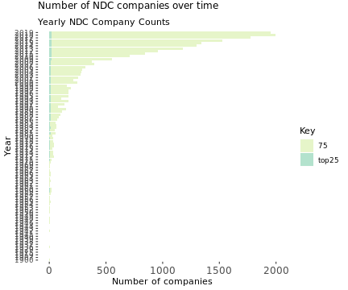
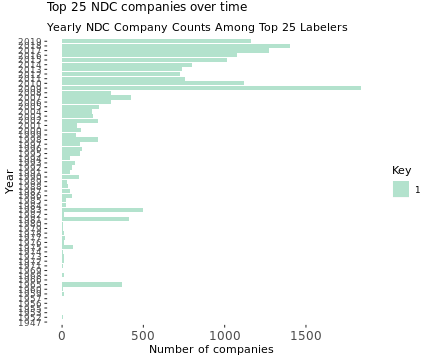
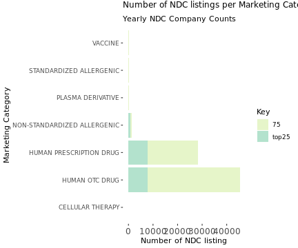
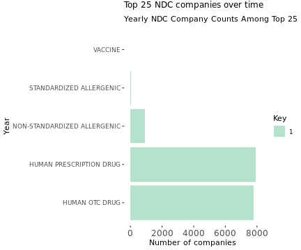
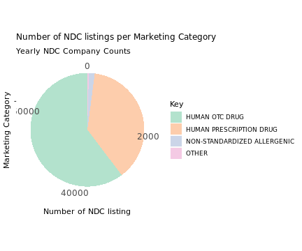
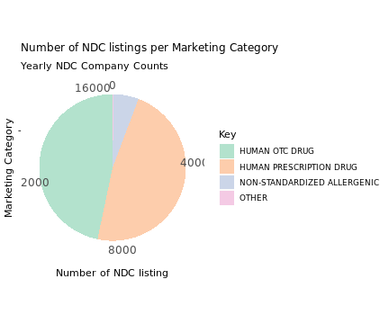
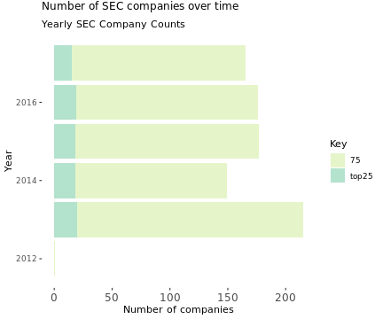
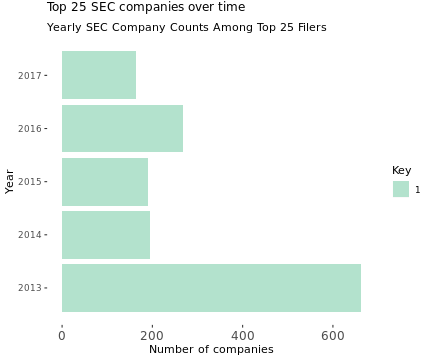
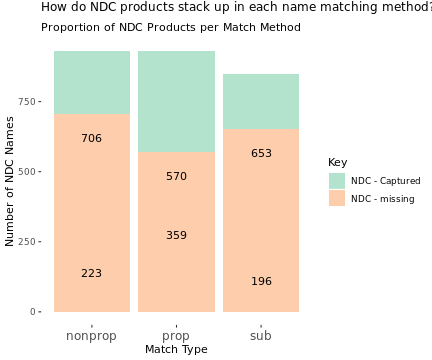
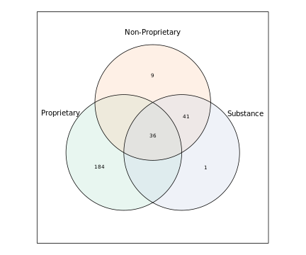

NLP Product Extraction Method
========================================================
author: SDAD
date: 2020-02-12
font-family: 'Helvetica'
autosize: true
<style>
.reveal .slides section .slideContent{
    font-size: 12pt;
}
</style>


Overview:
========================================================

NDC:
- Distributions of All Labelers (Companies)
- Distributions of Top 25 Labelers (Companies)
- Distributions of Marketing Categories

SEC:
- Distributions of All Filers (Companies)
- Distributions of Top 25 Filers (Companies)


Distributions of Labelers (Companies)
========================================================

All NDC Labelers


***
Top 25 NDC Labelers



Distributions of Marketing Categories
========================================================

NDC Listings by all Labelers


***
NDC Listings by Top 25 NDC Labelers



Marketing Categories (Pie)
========================================================

NDC Listings by all Labelers


***
NDC Listings by Top 25 NDC Labelers


N.B. Other includes the following categories: plasma derivative, standardized allergenic, vaccine, and cellular therapy. All Labelers had values for all 4 of these categories (values ranged from 6-132). The Top 25 labelers only had values for standardized allergenics and vaccines (both <30).


SEC Overview
========================================================

All SEC Filers


***
Top 25 SEC Filers




Matching Method
========================================================

- Company Name Matching
- Validating Captures

NDC <- SEC

Company Name Matching
========================================================

Steps:

1. Cleaned SEC & NDC Company names
    - split at comma
    - low case
    - remove punctuation
2. Identified exact name matches
3. Generated string distance matches
    - Calculated string distances
    - Identified smallest string distance value per SEC name
    - Pulled all NDC names with that minimum string distance value
4. Manually selected best (if any) match per match sets

***
Example:


SEC: Actavis Ltd, Actavis plc, Allergan plc

    a. actavis ltd
    b. actavis plc
    c. allergan plc

NDC: Allergan, Inc. --> allergan  inc


|             | allergan  inc|
|:------------|-------------:|
|actavis ltd  |            11|
|actavis plc  |            10|
|allergan plc |             3|


Product Name Matching
========================================================


SEC Steps:

1. Limited SEC captures (first, single mention only) - 4,651 captures
2. Cleaned SEC capture names
    - 4156 unique patterns
    - 495 repeating tokens due to capitalization and brand-protection

NDC Steps:

1. Limited NDC listings to those whose labeler companies existed in SEC
2. Cleaned NDC product names (75K distinct records by year, labeler, and 3 prod names -- all time)
    - proprietary (37K --> 33K)
    - non-proprietary (18K --> 15K)
    - substance (10K --> 10K)

Match Steps:

1. Detected presence of SEC capture WITHIN NDC product names
2. Joined back to SEC filers and NDC labelers (2 one to many joins!)


Validated Product Results
========================================================


***



Example "coreg" - NDC Match Results
========================================================


|   |Column          |Example             |
|:--|:---------------|:-------------------|
|7  |Token           |Coreg               |
|2  |PROPRIETARYNAME |COREG               |
|1  |year            |2007                |
|26 |LABELERNAME     |GlaxoSmithKline LLC |

***
Our token coreg matched with a proprietary name in NDC called "COREG." This particular listing shows a Marketing Start Date in 2007 by GlaxoSmithKline.

Example "coreg" - SEC Match Results A
========================================================


|   |Column        |Example |
|:--|:-------------|:-------|
|7  |Token         |Coreg   |
|6  |first_mention |2013    |
|9  |Protect       |NA      |
|10 |Company       |1012477 |
|18 |SIC           |2834    |
|19 |SIC_Loc       |L2      |
***
This token was pulled from an SEC filing filed by *FLAMEL TECHNOLOGIES SA, AVADEL PHARMACEUTICALS PLC* a pharma industry company. When it was pulled they didn't refer to it with a brand protection. The company is not based in the US. We have first mention as 2013, but note we haven't pulled filings prior to 2012.

Example "coreg" - SEC Match Results B
========================================================


|   |Column |Example |
|:--|:------|:-------|
|7  |Token  |Coreg   |
|11 |2012   |0       |
|12 |2013   |24      |
|13 |2014   |7       |
|14 |2015   |0       |
|15 |2016   |0       |
|16 |2017   |0       |
***
Here you can see how Flamel has referred to this token over time, with the most references in their 2013 10-K filing and a quarter of those in 2014.

Example "coreg" - SEC Match Results C
========================================================


|   |Column              |Example |
|:--|:-------------------|:-------|
|7  |Token               |Coreg   |
|20 |TickerCode          |FLML    |
|21 |Exchange            |NASDAQ  |
|22 |Ticker_Location     |I0      |
|23 |Ticker_Inc_Location |NA      |
|24 |Ticker_StateCountry |FRANCE  |
***
We also have some information about their stock exchange listing, where we see that they are based in France.


Slide With Plot
========================================================


```
Error in eval(lhs, parent, parent) : object 'ndc_names_122' not found
```
