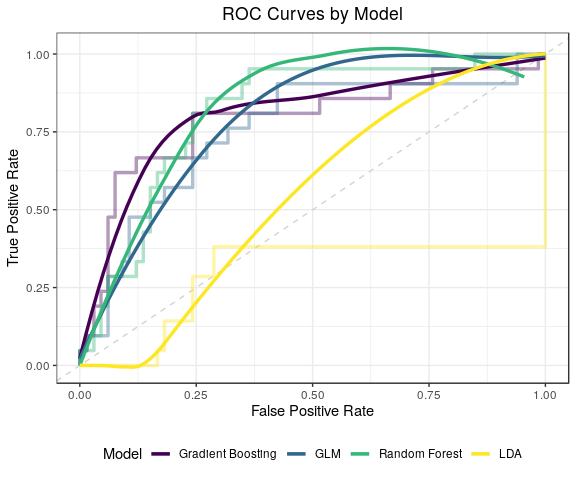
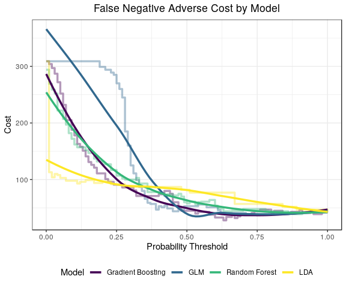

Final New Product ML
================
Quinton Neville
7/31/2019

1. Read, Tidy, and Split the Data
=================================

``` r
#Test train sample
#train.split <- 0.8
#N <- 1000
#set.seed(2019)
#train.samp <- sample(1:N, train.split * N, replace = FALSE)

#Here the data is being read in with split coming from Neil's python script for Neural Net

#Data read
#Train to dtm
train.df <- read_csv("./data/working/DNA_Aggregated/Machine_learning_sample/innovation_sample_data/trainset.csv", col_names = FALSE) %>%
  rename(body = X9, innovation = X5, an = X4) %>%
  mutate(innovation = ifelse(innovation == "Yes", TRUE, FALSE) %>% as.factor()) %>%
  select(innovation, body, an)

#Train to dtm
test.df <- read_csv("./data/working/DNA_Aggregated/Machine_learning_sample/innovation_sample_data/testset.csv", col_names = FALSE) %>% 
  rename(body = X9, innovation = X5, an = X4) %>%
  mutate(innovation = ifelse(innovation == "Yes", TRUE, FALSE) %>% as.factor()) %>%
  select(innovation, body, an)

#Full sample to dtm
dna.df    <- bind_rows(train.df, test.df)
sample.df <- bind_cols(dna.df %>% 
                         make_dtm(., 40) %>%
                         as_tibble(),
                       dna.df %>% dplyr::select(innovation) %>%
                         mutate(innovation = as.factor(innovation))) %>%
             dplyr::select(innovation, everything())
train.df  <- sample.df[1:nrow(train.df), ]
test.df   <- sample.df[(nrow(train.df) + 1):(nrow(train.df) + nrow(test.df)), ]

#Grab Sample Size
N <- nrow(dna.df)

#Test train split
#train.df <- sample.df %>% slice(train.samp)
#test.df  <- sample.df %>% slice(-train.samp)

#LDA Sample.df & test/train (different data format)
lda.sample <- CreateDtm(doc_vec = dna.df$body,
                                  doc_names = dna.df$an,
                                  ngram_window = c(1, 1),
                                  stopword_vec = c(stopwords::stopwords("en"),
                                                   stopwords::stopwords(source = "smart")),
                                  verbose = FALSE,
                                  cpus = 4)
lda.sample <- lda.sample[ ,colSums(lda.sample) >= 40]

train.lda <- lda.sample[1:nrow(train.df), ]
test.lda   <- lda.sample[(nrow(train.df) + 1):(nrow(train.df) + nrow(test.df)), ]
```

2. Tune and Fit Models
======================

``` r
#LDA Gibbs Parameters (iterations should be 1000, testing is needed for proper burn in paramter)
iter <- 1000
burn <- 500

#Fit lasso to get feature selection (word importance selection)
glm <- train(innovation ~ ., data = train.df, method = "glmnet", family = "binomial",
          trControl = trainControl(method = "cv", number = 5))

#Fit Models
a <- Sys.time()
mod.list <- list(
  glm = glm,
  rf  = train(innovation ~ ., 
              data = train.df[ ,coef(glm$finalModel, 
                                     glm$bestTune$.lambda) %>% 
                                     apply(., 1, function(x) {!all(x == 0)})
                               ],
              method = "rf", family = "bernoulli",
             trControl = trainControl(method = "cv", number = 5)),
  gbm = train(innovation ~ ., 
              data = train.df[ ,coef(glm$finalModel, 
                                     glm$bestTune$.lambda) %>% 
                                     apply(., 1, function(x) {!all(x == 0)})
                               ],
              distribution = "bernoulli", method = "gbm",
             trControl = trainControl(method = "cv", number = 5)),
  #svm = ,
  #nn  = ,
  lda   = FitLdaModel(train.lda, k = 2, method = "gibbs",
                                 iterations = iter, burnin = burn,
                                 optimize_alpha = TRUE)
  )
```

    ## Warning in (function (x, y, offset = NULL, misc = NULL, distribution =
    ## "bernoulli", : variable 235: watson has no variation.

    ## Iter   TrainDeviance   ValidDeviance   StepSize   Improve
    ##      1        1.2390            -nan     0.1000    0.0191
    ##      2        1.2010            -nan     0.1000    0.0165
    ##      3        1.1744            -nan     0.1000    0.0128
    ##      4        1.1517            -nan     0.1000    0.0098
    ##      5        1.1319            -nan     0.1000    0.0059
    ##      6        1.1172            -nan     0.1000    0.0039
    ##      7        1.1071            -nan     0.1000    0.0031
    ##      8        1.0949            -nan     0.1000    0.0042
    ##      9        1.0868            -nan     0.1000    0.0034
    ##     10        1.0752            -nan     0.1000    0.0043
    ##     20        1.0041            -nan     0.1000   -0.0016
    ##     40        0.8988            -nan     0.1000   -0.0035
    ##     60        0.8261            -nan     0.1000   -0.0007
    ##     80        0.7650            -nan     0.1000   -0.0015
    ##    100        0.7162            -nan     0.1000   -0.0012
    ##    120        0.6707            -nan     0.1000   -0.0008
    ##    140        0.6381            -nan     0.1000   -0.0026
    ##    150        0.6220            -nan     0.1000   -0.0027

    ## Warning in (function (x, y, offset = NULL, misc = NULL, distribution =
    ## "bernoulli", : variable 235: watson has no variation.

    ## Iter   TrainDeviance   ValidDeviance   StepSize   Improve
    ##      1        1.2259            -nan     0.1000    0.0208
    ##      2        1.1861            -nan     0.1000    0.0164
    ##      3        1.1563            -nan     0.1000    0.0117
    ##      4        1.1273            -nan     0.1000    0.0113
    ##      5        1.0937            -nan     0.1000    0.0095
    ##      6        1.0786            -nan     0.1000    0.0011
    ##      7        1.0582            -nan     0.1000    0.0051
    ##      8        1.0422            -nan     0.1000    0.0020
    ##      9        1.0263            -nan     0.1000   -0.0005
    ##     10        1.0093            -nan     0.1000    0.0051
    ##     20        0.8892            -nan     0.1000    0.0046
    ##     40        0.7463            -nan     0.1000    0.0003
    ##     60        0.6564            -nan     0.1000   -0.0005
    ##     80        0.5909            -nan     0.1000   -0.0019
    ##    100        0.5305            -nan     0.1000   -0.0004
    ##    120        0.4835            -nan     0.1000   -0.0020
    ##    140        0.4441            -nan     0.1000   -0.0009
    ##    150        0.4308            -nan     0.1000   -0.0020

    ## Warning in (function (x, y, offset = NULL, misc = NULL, distribution =
    ## "bernoulli", : variable 235: watson has no variation.

    ## Iter   TrainDeviance   ValidDeviance   StepSize   Improve
    ##      1        1.2280            -nan     0.1000    0.0182
    ##      2        1.1851            -nan     0.1000    0.0129
    ##      3        1.1431            -nan     0.1000    0.0183
    ##      4        1.1044            -nan     0.1000    0.0126
    ##      5        1.0640            -nan     0.1000    0.0110
    ##      6        1.0418            -nan     0.1000    0.0052
    ##      7        1.0146            -nan     0.1000    0.0077
    ##      8        0.9972            -nan     0.1000    0.0008
    ##      9        0.9769            -nan     0.1000    0.0051
    ##     10        0.9571            -nan     0.1000    0.0032
    ##     20        0.8217            -nan     0.1000    0.0002
    ##     40        0.6501            -nan     0.1000   -0.0017
    ##     60        0.5411            -nan     0.1000   -0.0021
    ##     80        0.4608            -nan     0.1000   -0.0025
    ##    100        0.4153            -nan     0.1000   -0.0023
    ##    120        0.3602            -nan     0.1000   -0.0009
    ##    140        0.3271            -nan     0.1000   -0.0024
    ##    150        0.3135            -nan     0.1000   -0.0023
    ## 
    ## Iter   TrainDeviance   ValidDeviance   StepSize   Improve
    ##      1        1.2495            -nan     0.1000    0.0156
    ##      2        1.2245            -nan     0.1000    0.0131
    ##      3        1.2033            -nan     0.1000    0.0081
    ##      4        1.1841            -nan     0.1000    0.0056
    ##      5        1.1675            -nan     0.1000    0.0058
    ##      6        1.1561            -nan     0.1000    0.0026
    ##      7        1.1484            -nan     0.1000   -0.0000
    ##      8        1.1266            -nan     0.1000    0.0081
    ##      9        1.1092            -nan     0.1000    0.0068
    ##     10        1.0961            -nan     0.1000    0.0044
    ##     20        1.0051            -nan     0.1000    0.0001
    ##     40        0.9094            -nan     0.1000    0.0006
    ##     60        0.8432            -nan     0.1000   -0.0017
    ##     80        0.7790            -nan     0.1000   -0.0006
    ##    100        0.7294            -nan     0.1000   -0.0030
    ##    120        0.6850            -nan     0.1000   -0.0027
    ##    140        0.6504            -nan     0.1000   -0.0010
    ##    150        0.6358            -nan     0.1000   -0.0008
    ## 
    ## Iter   TrainDeviance   ValidDeviance   StepSize   Improve
    ##      1        1.2255            -nan     0.1000    0.0187
    ##      2        1.1898            -nan     0.1000    0.0155
    ##      3        1.1650            -nan     0.1000    0.0123
    ##      4        1.1360            -nan     0.1000    0.0104
    ##      5        1.1137            -nan     0.1000    0.0072
    ##      6        1.1027            -nan     0.1000    0.0011
    ##      7        1.0928            -nan     0.1000   -0.0016
    ##      8        1.0649            -nan     0.1000    0.0071
    ##      9        1.0481            -nan     0.1000    0.0059
    ##     10        1.0321            -nan     0.1000    0.0019
    ##     20        0.9130            -nan     0.1000   -0.0037
    ##     40        0.7773            -nan     0.1000   -0.0004
    ##     60        0.6815            -nan     0.1000   -0.0026
    ##     80        0.6108            -nan     0.1000   -0.0009
    ##    100        0.5488            -nan     0.1000   -0.0008
    ##    120        0.4962            -nan     0.1000   -0.0009
    ##    140        0.4475            -nan     0.1000   -0.0027
    ##    150        0.4290            -nan     0.1000   -0.0018
    ## 
    ## Iter   TrainDeviance   ValidDeviance   StepSize   Improve
    ##      1        1.2271            -nan     0.1000    0.0184
    ##      2        1.1906            -nan     0.1000    0.0108
    ##      3        1.1539            -nan     0.1000    0.0123
    ##      4        1.1288            -nan     0.1000   -0.0001
    ##      5        1.0959            -nan     0.1000    0.0093
    ##      6        1.0715            -nan     0.1000    0.0086
    ##      7        1.0427            -nan     0.1000    0.0082
    ##      8        1.0226            -nan     0.1000    0.0050
    ##      9        1.0008            -nan     0.1000    0.0027
    ##     10        0.9824            -nan     0.1000    0.0062
    ##     20        0.8354            -nan     0.1000    0.0022
    ##     40        0.6738            -nan     0.1000   -0.0010
    ##     60        0.5731            -nan     0.1000   -0.0023
    ##     80        0.4883            -nan     0.1000   -0.0012
    ##    100        0.4255            -nan     0.1000   -0.0024
    ##    120        0.3779            -nan     0.1000   -0.0021
    ##    140        0.3327            -nan     0.1000   -0.0010
    ##    150        0.3174            -nan     0.1000   -0.0012
    ## 
    ## Iter   TrainDeviance   ValidDeviance   StepSize   Improve
    ##      1        1.2295            -nan     0.1000    0.0189
    ##      2        1.2036            -nan     0.1000    0.0122
    ##      3        1.1758            -nan     0.1000    0.0114
    ##      4        1.1564            -nan     0.1000    0.0068
    ##      5        1.1356            -nan     0.1000    0.0092
    ##      6        1.1169            -nan     0.1000    0.0064
    ##      7        1.1030            -nan     0.1000    0.0038
    ##      8        1.0863            -nan     0.1000    0.0058
    ##      9        1.0762            -nan     0.1000    0.0016
    ##     10        1.0636            -nan     0.1000    0.0042
    ##     20        0.9865            -nan     0.1000   -0.0009
    ##     40        0.8892            -nan     0.1000   -0.0005
    ##     60        0.8136            -nan     0.1000   -0.0013
    ##     80        0.7597            -nan     0.1000   -0.0009
    ##    100        0.7032            -nan     0.1000    0.0001
    ##    120        0.6668            -nan     0.1000   -0.0007
    ##    140        0.6267            -nan     0.1000   -0.0025
    ##    150        0.6117            -nan     0.1000    0.0002
    ## 
    ## Iter   TrainDeviance   ValidDeviance   StepSize   Improve
    ##      1        1.2255            -nan     0.1000    0.0209
    ##      2        1.1886            -nan     0.1000    0.0141
    ##      3        1.1571            -nan     0.1000    0.0076
    ##      4        1.1391            -nan     0.1000    0.0018
    ##      5        1.1181            -nan     0.1000    0.0041
    ##      6        1.0957            -nan     0.1000    0.0057
    ##      7        1.0680            -nan     0.1000    0.0071
    ##      8        1.0553            -nan     0.1000    0.0031
    ##      9        1.0351            -nan     0.1000    0.0068
    ##     10        1.0205            -nan     0.1000    0.0031
    ##     20        0.9138            -nan     0.1000   -0.0004
    ##     40        0.7651            -nan     0.1000   -0.0005
    ##     60        0.6515            -nan     0.1000    0.0010
    ##     80        0.5793            -nan     0.1000   -0.0029
    ##    100        0.5129            -nan     0.1000   -0.0021
    ##    120        0.4571            -nan     0.1000   -0.0008
    ##    140        0.4161            -nan     0.1000   -0.0015
    ##    150        0.3965            -nan     0.1000   -0.0014
    ## 
    ## Iter   TrainDeviance   ValidDeviance   StepSize   Improve
    ##      1        1.2131            -nan     0.1000    0.0249
    ##      2        1.1690            -nan     0.1000    0.0134
    ##      3        1.1324            -nan     0.1000    0.0129
    ##      4        1.1031            -nan     0.1000    0.0114
    ##      5        1.0786            -nan     0.1000    0.0038
    ##      6        1.0530            -nan     0.1000    0.0069
    ##      7        1.0267            -nan     0.1000    0.0086
    ##      8        1.0034            -nan     0.1000    0.0016
    ##      9        0.9805            -nan     0.1000    0.0053
    ##     10        0.9608            -nan     0.1000    0.0021
    ##     20        0.8339            -nan     0.1000    0.0002
    ##     40        0.6607            -nan     0.1000   -0.0062
    ##     60        0.5553            -nan     0.1000   -0.0008
    ##     80        0.4647            -nan     0.1000   -0.0014
    ##    100        0.4033            -nan     0.1000   -0.0035
    ##    120        0.3584            -nan     0.1000   -0.0015
    ##    140        0.3146            -nan     0.1000   -0.0015
    ##    150        0.3001            -nan     0.1000   -0.0025
    ## 
    ## Iter   TrainDeviance   ValidDeviance   StepSize   Improve
    ##      1        1.2529            -nan     0.1000    0.0124
    ##      2        1.2427            -nan     0.1000    0.0028
    ##      3        1.2139            -nan     0.1000    0.0100
    ##      4        1.1957            -nan     0.1000    0.0077
    ##      5        1.1787            -nan     0.1000    0.0061
    ##      6        1.1705            -nan     0.1000   -0.0002
    ##      7        1.1567            -nan     0.1000    0.0073
    ##      8        1.1437            -nan     0.1000    0.0049
    ##      9        1.1326            -nan     0.1000    0.0017
    ##     10        1.1174            -nan     0.1000    0.0023
    ##     20        1.0384            -nan     0.1000   -0.0007
    ##     40        0.9357            -nan     0.1000   -0.0040
    ##     60        0.8691            -nan     0.1000    0.0002
    ##     80        0.8120            -nan     0.1000   -0.0005
    ##    100        0.7671            -nan     0.1000   -0.0007
    ##    120        0.7294            -nan     0.1000   -0.0015
    ##    140        0.6923            -nan     0.1000   -0.0011
    ##    150        0.6740            -nan     0.1000    0.0000
    ## 
    ## Iter   TrainDeviance   ValidDeviance   StepSize   Improve
    ##      1        1.2364            -nan     0.1000    0.0161
    ##      2        1.2080            -nan     0.1000    0.0110
    ##      3        1.1795            -nan     0.1000    0.0033
    ##      4        1.1573            -nan     0.1000    0.0030
    ##      5        1.1326            -nan     0.1000    0.0086
    ##      6        1.1140            -nan     0.1000    0.0040
    ##      7        1.0940            -nan     0.1000    0.0062
    ##      8        1.0802            -nan     0.1000    0.0035
    ##      9        1.0604            -nan     0.1000    0.0052
    ##     10        1.0438            -nan     0.1000    0.0012
    ##     20        0.9298            -nan     0.1000   -0.0011
    ##     40        0.7997            -nan     0.1000   -0.0028
    ##     60        0.7047            -nan     0.1000   -0.0013
    ##     80        0.6300            -nan     0.1000   -0.0034
    ##    100        0.5686            -nan     0.1000   -0.0004
    ##    120        0.5219            -nan     0.1000   -0.0023
    ##    140        0.4841            -nan     0.1000   -0.0026
    ##    150        0.4662            -nan     0.1000   -0.0034
    ## 
    ## Iter   TrainDeviance   ValidDeviance   StepSize   Improve
    ##      1        1.2288            -nan     0.1000    0.0149
    ##      2        1.1918            -nan     0.1000    0.0137
    ##      3        1.1695            -nan     0.1000    0.0065
    ##      4        1.1436            -nan     0.1000    0.0074
    ##      5        1.1057            -nan     0.1000    0.0090
    ##      6        1.0862            -nan     0.1000    0.0024
    ##      7        1.0629            -nan     0.1000    0.0023
    ##      8        1.0518            -nan     0.1000   -0.0013
    ##      9        1.0334            -nan     0.1000    0.0038
    ##     10        1.0165            -nan     0.1000    0.0025
    ##     20        0.8869            -nan     0.1000   -0.0015
    ##     40        0.7206            -nan     0.1000   -0.0022
    ##     60        0.6019            -nan     0.1000   -0.0043
    ##     80        0.5202            -nan     0.1000   -0.0024
    ##    100        0.4564            -nan     0.1000   -0.0040
    ##    120        0.4083            -nan     0.1000   -0.0021
    ##    140        0.3668            -nan     0.1000   -0.0019
    ##    150        0.3463            -nan     0.1000   -0.0038
    ## 
    ## Iter   TrainDeviance   ValidDeviance   StepSize   Improve
    ##      1        1.2567            -nan     0.1000    0.0052
    ##      2        1.2285            -nan     0.1000    0.0131
    ##      3        1.2072            -nan     0.1000    0.0087
    ##      4        1.1851            -nan     0.1000    0.0094
    ##      5        1.1732            -nan     0.1000    0.0032
    ##      6        1.1550            -nan     0.1000    0.0079
    ##      7        1.1391            -nan     0.1000    0.0056
    ##      8        1.1234            -nan     0.1000    0.0051
    ##      9        1.1133            -nan     0.1000    0.0032
    ##     10        1.1022            -nan     0.1000    0.0037
    ##     20        1.0223            -nan     0.1000   -0.0015
    ##     40        0.9089            -nan     0.1000   -0.0014
    ##     60        0.8246            -nan     0.1000   -0.0020
    ##     80        0.7641            -nan     0.1000   -0.0022
    ##    100        0.7074            -nan     0.1000   -0.0025
    ##    120        0.6658            -nan     0.1000   -0.0010
    ##    140        0.6169            -nan     0.1000   -0.0005
    ##    150        0.6001            -nan     0.1000   -0.0006
    ## 
    ## Iter   TrainDeviance   ValidDeviance   StepSize   Improve
    ##      1        1.2295            -nan     0.1000    0.0163
    ##      2        1.1941            -nan     0.1000    0.0106
    ##      3        1.1648            -nan     0.1000    0.0116
    ##      4        1.1310            -nan     0.1000    0.0123
    ##      5        1.1047            -nan     0.1000    0.0082
    ##      6        1.0868            -nan     0.1000    0.0058
    ##      7        1.0730            -nan     0.1000    0.0016
    ##      8        1.0582            -nan     0.1000    0.0020
    ##      9        1.0421            -nan     0.1000    0.0041
    ##     10        1.0237            -nan     0.1000    0.0059
    ##     20        0.9054            -nan     0.1000    0.0029
    ##     40        0.7542            -nan     0.1000   -0.0010
    ##     60        0.6458            -nan     0.1000   -0.0041
    ##     80        0.5634            -nan     0.1000   -0.0008
    ##    100        0.5036            -nan     0.1000   -0.0012
    ##    120        0.4503            -nan     0.1000   -0.0029
    ##    140        0.4147            -nan     0.1000   -0.0007
    ##    150        0.3964            -nan     0.1000   -0.0007
    ## 
    ## Iter   TrainDeviance   ValidDeviance   StepSize   Improve
    ##      1        1.2230            -nan     0.1000    0.0210
    ##      2        1.1795            -nan     0.1000    0.0151
    ##      3        1.1449            -nan     0.1000    0.0114
    ##      4        1.1118            -nan     0.1000    0.0097
    ##      5        1.0865            -nan     0.1000    0.0072
    ##      6        1.0636            -nan     0.1000    0.0065
    ##      7        1.0369            -nan     0.1000    0.0107
    ##      8        1.0116            -nan     0.1000    0.0082
    ##      9        0.9872            -nan     0.1000    0.0006
    ##     10        0.9670            -nan     0.1000    0.0066
    ##     20        0.8257            -nan     0.1000   -0.0022
    ##     40        0.6344            -nan     0.1000   -0.0020
    ##     60        0.5167            -nan     0.1000   -0.0006
    ##     80        0.4419            -nan     0.1000   -0.0009
    ##    100        0.3814            -nan     0.1000   -0.0020
    ##    120        0.3306            -nan     0.1000   -0.0001
    ##    140        0.2951            -nan     0.1000   -0.0025
    ##    150        0.2771            -nan     0.1000   -0.0013
    ## 
    ## Iter   TrainDeviance   ValidDeviance   StepSize   Improve
    ##      1        1.2316            -nan     0.1000    0.0176
    ##      2        1.1889            -nan     0.1000    0.0152
    ##      3        1.1575            -nan     0.1000    0.0064
    ##      4        1.1268            -nan     0.1000    0.0106
    ##      5        1.1029            -nan     0.1000    0.0088
    ##      6        1.0783            -nan     0.1000    0.0077
    ##      7        1.0542            -nan     0.1000    0.0053
    ##      8        1.0313            -nan     0.1000    0.0046
    ##      9        1.0107            -nan     0.1000    0.0042
    ##     10        0.9912            -nan     0.1000    0.0041
    ##     20        0.8569            -nan     0.1000    0.0027
    ##     40        0.6948            -nan     0.1000   -0.0005
    ##     60        0.5922            -nan     0.1000   -0.0012
    ##     80        0.5168            -nan     0.1000   -0.0004
    ##    100        0.4597            -nan     0.1000   -0.0027

``` r
b <- Sys.time()
(b - a)
```

    ## Time difference of 59.13614 secs

``` r
pred.df <- tibble(
  model = names(mod.list),
#  fit   = mod.list,
  type  = c(rep("Supervised", 3), "Unsupervised"),
  preds = c(map(mod.list[-4], ~predict(.x, newdata = test.df, type = "prob")[ ,2]), lda_predict(mod.list[[4]], test.lda, train.df))
)
```

3. Diagnostics
==============

#### a. Reciever Operator Characteristic Curves (AUC)

``` r
#ROC
pred.df <- pred.df %>%
  mutate(
    roc = map(preds, ~roc.log(test.df, .x)),
    auc = map_dbl(roc, auc_func),
    model = as.factor(model) %>% fct_reorder(., auc)
  ) 


roc.gg <- pred.df %>%
  mutate(
    roc = map(preds, ~roc.log(test.df, .x)),
    auc = map_dbl(roc, auc_func),
    model = as.factor(model) %>% fct_recode("LDA" = "lda", "GLM" = "glm", "Random Forest" = "rf", "Gradient Boosting" = "gbm") %>% fct_reorder(., auc, .desc = TRUE)
  ) %>%
  unnest(roc) %>%
  ggplot(aes(x = FP, y = TP, colour = model)) +
  geom_abline(slope = 1, linetype = 2, colour = "lightgrey") +
  geom_step(size = 1.2, alpha = 0.4) +
  geom_smooth(size = 1.2, alpha = 0.6, se = F, span = 0.9) +
#  geom_point(size = 1.2, alpha = 0.4, position = "jitter") +
  labs(
    x = "False Positive Rate",
    y = "True Positive Rate",
    title = "ROC Curves by Model"
  ) + 
  scale_colour_viridis_d("Model") +
  theme(legend.position = "bottom")

roc.gg
```



#### b. Cost

``` r
#Cost
pred.df <- pred.df %>%
  mutate(
    cost = map(preds, ~cost.df(test.df, .x))
  ) 

cost.gg <- pred.df %>%
  mutate(
    model = as.factor(model)
  ) %>%
  unnest(cost) %>%
  mutate(model = fct_recode(model, "LDA" = "lda", "GLM" = "glm", "Random Forest" = "rf", "Gradient Boosting" = "gbm") %>% fct_reorder(cost, median)) %>%
  ggplot(aes(x = probability, y = cost, colour = model)) +
  geom_step(size = 1.2, alpha = 0.4) +
#  geom_point(size = 1.2, alpha = 0.4, position = "jitter") +
  geom_smooth(size = 1.2, alpha = 0.6, se = F, span = 0.8) +
  labs(
    x = "Probability Threshold",
    y = "Cost",
    title = "False Negative Adverse Cost by Model"
  ) +
  scale_colour_viridis_d("Model")

cost.gg
```



4. Final Cost Optimized Result
==============================

Accuracy, precision, recall

``` r
#test.df <- test.df %>%
#  mutate(
#    innovation = as.logical(innovation)
#  )

accuracy <- function(preds, threshold, test.df) {
  
  mean((preds > threshold) == test.df$innovation)

  }

precision <- function(preds, threshold, test.df) {
  
  preds     <- preds > threshold
  true.pos  <- sum(preds & as.logical(test.df$innovation))
  false.pos <- sum(!as.logical(test.df$innovation) & preds)
  return(true.pos / (true.pos + false.pos))

}

recall <- function(preds, threshold, test.df) {
  
  preds     <- preds > threshold
  true.pos  <- sum(preds & as.logical(test.df$innovation))
  false.neg <- sum(!preds & as.logical(test.df$innovation))
  return(true.pos / (true.pos + false.neg))
  
}

opt.result <- pred.df %>%
  mutate(
    min_cost_threshold = map_dbl(.x = cost, ~.x$probability[which.min(.x$cost)]),
    accuracy           = map2_dbl(.x = preds, .y = min_cost_threshold,
                                  ~accuracy(.x, .y, test.df)),
    precision          = map2_dbl(.x = preds, .y = min_cost_threshold,
                                  ~precision(.x, .y, test.df)),
    recall             = map2_dbl(.x = preds, .y = min_cost_threshold,
                                  ~recall(.x, .y, test.df))
  ) 

opt.result %>%
  dplyr::select(model, accuracy:recall) %>%
  mutate(
    model = fct_recode(model, "LDA" = "lda", "GLM" = "glm", "Random Forest" = "rf", "Gradient Boosting" = "gbm")
  ) %>%
  rename(Model = model, Accuracy = accuracy, Precision = precision, Recall = recall) %>%
  knitr::kable(digits = 3)
```

| Model             |  Accuracy|  Precision|  Recall|
|:------------------|---------:|----------:|-------:|
| GLM               |     0.770|      1.000|   0.048|
| Random Forest     |     0.770|      1.000|   0.048|
| Gradient Boosting |     0.851|      0.722|   0.619|
| LDA               |     0.759|        NaN|   0.000|

5. Internal Validation
======================

#### a. Set up Parallelizing

#### b. Map Boot Iterations

#### b. Parallelize Out of Bag Results

``` r
n.boot  <- 100
nCores  <- 5
taskFun <- boot_diagnostics

registerDoParallel(nCores)

#combine <- function(x, ...) {  
#  mapply(rbind, x, ..., SIMPLIFY = FALSE)
#}
a <- Sys.time()
#100 X 10 = 1000 iterations
result <- foreach(i = 1:100, .combine = rbind,
                         .packages = c("tidyverse", "caret")) %dopar% {
  outSub <- taskFun(i)
  outSub
} 
b <- Sys.time()
b - a

write_rds(result, "./src/nevilleq/dna_ml_final/innovation_boot_result/19_7_31_nps_boot_result.RDS")
```

#### b. Visualize Results

``` r
file.path <- "./src/nevilleq/dna_ml_final/innovation_boot_result/"

boot.df <- tibble(files = list.files(file.path, ".RDS")) %>%
  mutate(
    data = map(.x = files, ~read_rds(str_c(file.path, .x)))
  ) %>%
  unnest() %>%
  dplyr::select(model, everything(), -c(files, iteration)) %>%
  gather(key = diagnostic, value = `Out of Bag Result`, min_cost_threshold:auc) %>%
  mutate(
    model = as.factor(model) %>% fct_recode("GLM" = "glm",
                                            "Random Forest" = "rf",
                                            "GBM" = "gbm",
                                            "LDA" = "lda")
    
  ) %>%
  filter(diagnostic != "min_cost_threshold") %>%
  mutate(
         model = fct_reorder(model, `Out of Bag Result`, .desc = FALSE, .fun = median),
         diagnostic = as.factor(diagnostic) %>% 
           fct_recode("Accuracy"  = "accuracy",
                      "Precision" = "precision",
                      "Recall"    = "recall",
                      "AUC"       = "auc") %>%
           fct_relevel("AUC", "Accuracy", "Precision", "Recall")
           
         ) %>% 
  rename(Diagnostic = diagnostic) 

precision.nan <- boot.df %>% filter(Diagnostic %in% "Precision") %>% dplyr::select(`Out of Bag Result`) %>% map(is.nan) %>% unlist() %>% sum()
  
precision.nan.model <- boot.df %>% 
  filter(Diagnostic %in% "Precision") %>% 
  group_by(model) %>%
  summarise(
  `NaN` = `Out of Bag Result` %>% map(is.nan) %>% unlist() %>% sum()
)

precision.nan.model %>% knitr::kable()
```

| model         |  NaN|
|:--------------|----:|
| GBM           |    6|
| GLM           |   32|
| LDA           |   92|
| Random Forest |   23|

``` r
#AUC and Accuracy
boot.gg.1 <- boot.df %>%
    filter(Diagnostic %in% c("AUC", "Accuracy")) %>%
    mutate(
      model = fct_reorder(model, `Out of Bag Result`, median, .desc = TRUE)
    ) %>%
  ggplot(aes(x = model, y = `Out of Bag Result`)) + 
  geom_violin(aes(fill = model), trim = FALSE, alpha = 0.3) + 
  geom_boxplot(width = 0.25) +
  labs(
    y = "Diagnostic Value",
    x = "Model",
    title = "Bootstrap Out of Bag Result"
  ) +
  viridis::scale_fill_viridis(
  #  option = "magma",
    name = "",
    begin = 1,
    end = 0,
    discrete = TRUE) +
  ylim(c(0, 1)) +
  theme(
    axis.text.y = element_text( 
    size = 10),
    axis.text.x = element_text(angle = 430, vjust = 0.5, size = 10) 
  ) +
  coord_flip() +
  facet_wrap(. ~ Diagnostic, ncol = 2)


#Precision Recall (w/out LDA)
boot.gg.2 <- boot.df %>%
    filter(Diagnostic %in% c("Precision", "Recall")) %>%
    filter(model != "LDA") %>%
    mutate(
      model = fct_reorder(model, `Out of Bag Result`, median, .desc = TRUE)
    ) %>%
  ggplot(aes(x = model, y = `Out of Bag Result`)) + 
  geom_violin(aes(fill = model), trim = FALSE, alpha = 0.3) + 
  geom_boxplot(width = 0.25) +
  labs(
    y = "Diagnostic Value",
    x = "Model",
    title = "Bootstrap Out of Bag Result"
  ) +
  viridis::scale_fill_viridis(
  #  option = "magma",
    name = "",
    begin = 1,
    end = 0,
    discrete = TRUE) +
  ylim(c(0, 1)) +
  theme(
    axis.text.y = element_text( 
    size = 10),
    axis.text.x = element_text(angle = 430, vjust = 0.5, size = 10) 
  ) +
  coord_flip() +
  facet_wrap(. ~ Diagnostic, ncol = 2)

#Final Plot
boot.result.gg <- boot.gg.1 / boot.gg.2

ggsave("./src/nevilleq/dna_ml_final/innovation_ml_figures/19_8_2_boot_validation.jpg", boot.result.gg)
```

    ## Saving 6 x 8 in image
