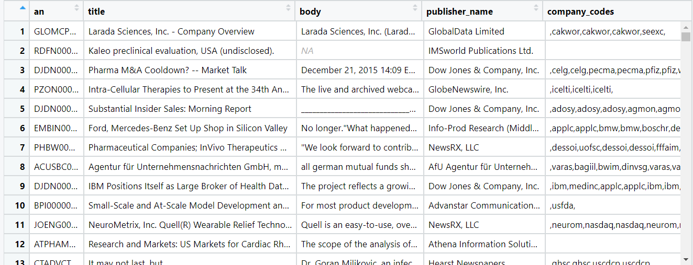
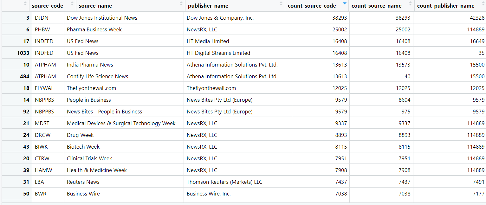

  
```{r setup, include=FALSE, message = FALSE, warning = FALSE}
#Libraries
library(jsonlite)
library(tidyverse)
library(janitor)
library(viridis)
library(purrr)
library(data.table)
library(doParallel)
library(foreach)
library(parallel)
library(maditr)
library(DataExplorer)
library(Hmisc)
library(DescTools)

#Setting root directory
knitr::opts_knit$set(echo = TRUE,
                     root.dir = rprojroot::find_rstudio_root_file())

#Controlling figure output in markdown
knitr::opts_chunk$set(
  #  fig.height =   
  fig.width = 6,
  #  fig.asp = .5,
  out.width = "90%",
  #  out.height = 
  cache = TRUE
)
#Set Theme for ggplot2
theme_set(theme_bw() + theme(plot.title = element_text(hjust = 0.5), legend.position = "bottom"))
#Set Scientific notation output for knitr
options(scipen = 999999)
```


##1. Read Data  

Set year filter here.
```{r}
year <- 2015
path <- sprintf("./data/working/DNA_Aggregated/dna_%s.RDS", year)
dna.dt <- read_rds(path) %>%
  as.data.table() #%>%
#Filter whatever, SEC, cgvfi, etc.   

#Re-run Doc.  
```

This is the profiling for the year `r year`. 

##2. Profile

Tidying the data.  
```{r}
#Unlist columns
dna.dt <- dna.dt %>%
  dt_mutate(
    subject_codes = subject_codes %>% map_chr(.x = ., ~paste0(.x, collapse = ", "))
  )
```

General description. 
```{r}
#Dimension 
dna.dt %>%
  introduce()

#Tidy for head screenshot
dna.dt <- dna.dt %>%
  dplyr::select(c(an, title, body, publisher_name,
                  company_codes, subject_codes, everything()))
```


Names of variables.  
```{r}
#Variable Names
names(dna.dt) %>% paste0(., collapse = ", ")
plot_str(dna.dt)

```




```{r}
#Structure of Data
str(dna.dt)

#Percent Missing by Variable
percent.missing <- dna.dt %>%
  is.na.data.frame() %>%
  apply(., 2, mean) %>%
  round(3)
percent.missing

#plot_bar(dna.dt$action)
```

#3. Preliminary Cleaning


####Word Count (Body of Text)
Here, we filter out articles with body text less than 10 and more than 2000 words (95% Quantile of Distribution) in length, as this indicates is not a "true" article in the scope of our interest. For plotting, we trimmed at 5000 length word. The new data is renamed so the original is still available for later use.  


```{r warning = FALSE}
#Cleaning out WC
dna.2.dt <- dna.dt %>%
  dt_mutate(
    word_count = word_count %>% as.numeric()
  ) %>%
  dt_filter(word_count > 10 & word_count < 2000)

#Summary
summary(dna.2.dt$word_count)

#Distribution
ggplot(dna.2.dt, aes(x = word_count)) +
  geom_density(fill = "purple", alpha = 0.5, adjust = 4, trim = FALSE) +
  labs(
    x = "Word Count",
    y = "Density",
    title = "Distribution of Word Count"
  ) +
  xlim(0, 5000)
```

```{r include = FALSE, echo = FALSE}
#Remove original data for memory storage
remove(dna.dt)
gc()
```


####Sources (of Publishers)

```{r}
#Data frame for all combos of unique codes, names
asd <- dna.2.dt[, list(source_code, source_name, publisher_name)] %>% unique()

#Unique source codes
dna.2.dt$source_code %>% unique() %>% length()

#" " names
dna.2.dt$source_name %>% unique() %>% length()

#Unique publisher names
dna.2.dt$publisher_name %>% unique() %>% length()


#Joining for unique data frame (writen out)
asd <- left_join(asd, dna.2.dt[, list(source_code, source_name, publisher_name)] %>% 
                   group_by(source_code) %>%
                   summarise(
                     count_source_code = n()
                   ), by = "source_code")

asd <- left_join(
  asd, dna.2.dt[, list(source_code, source_name, publisher_name)] %>% 
    group_by(source_name) %>%
    summarise(
      count_source_name = n()
    ), by = "source_name"
)

asd <- left_join(
  asd, dna.2.dt[, list(source_code, source_name, publisher_name)] %>% 
    group_by(publisher_name) %>%
    summarise(
      count_publisher_name = n()
    ), by = "publisher_name"
)

#write_csv(unique(asd), "./data/working/DNA_Aggregated/unique_publisher_sources.csv")

#Top 10 Unique Names
dna.2.dt %>%
  group_by(publisher_name) %>%
  summarise(
    Count = n()
  ) %>%
  arrange(desc(Count)) %>%
  dt_mutate(
    publisher_name = publisher_name %>% 
      as.factor() %>%
      forcats::fct_reorder(., Count)
  ) %>% 
  slice(1:10)

```




####Company Names

Look at unique company names and the top 10 mentioned in these articles for `r year` (in combination with others).  

```{r}
#Str_split to get list of char vectors of region
dna.2.dt <- dna.2.dt %>%
  dt_mutate(
    company_codes = str_split(company_codes, ",") %>%
      lapply(., function(x) {x[c(-1, -length(x))]})    #storing subj codes as nested list of char vector
  )

#Unique 
dna.2.dt$company_codes %>%
  unlist() %>% 
  unique() %>%
  length()

#Summary
company.counts <- dna.2.dt$company_codes %>% map_dbl(.x = ., ~length(.x))
company.counts %>% summary()

#Histogram
tibble(company.counts = company.counts) %>%
  ggplot(aes(x = company.counts)) +
  geom_histogram(fill = "purple") +
  # geom_density(fill = "purple", adjust = 5) +
  xlim(0, 10)

#Top 10
data.table(company = dna.2.dt$company_codes %>%
             unlist() %>%
             table() %>% 
             names(),
           counts = dna.2.dt$company_codes %>%
             unlist() %>%
             table() %>% 
             as.numeric()) %>%
  dt_arrange(counts) %>%
  Rev(margin = 1) %>%
  slice(1:10)

```


####Company Names (About)

Look at unique company names (about) and the top 10 mentioned in these articles for `r year` (in combination with others).  

```{r}
#Str_split to get list of char vectors of region
dna.2.dt <- dna.2.dt %>%
  dt_mutate(
    company_codes_about = str_split(company_codes_about, ",") %>%
      lapply(., function(x) {x[c(-1, -length(x))]})    #storing subj codes as nested list of char vector
  ) 

#Unique 
dna.2.dt$company_codes_about %>%
  unlist() %>% 
  unique() %>% 
  length()

#Summary
company.counts <- dna.2.dt$company_codes_about %>% map_dbl(.x = ., ~length(.x))
company.counts %>% summary()

#Histogram
tibble(company.counts = company.counts) %>%
  ggplot(aes(x = company.counts)) +
  geom_histogram(fill = "purple") +
  # geom_density(fill = "purple", adjust = 5) +
  xlim(0, 10)

#Top 10
data.table(company = dna.2.dt$company_codes_about %>%
             unlist() %>%
             table() %>% 
             names(),
           counts = dna.2.dt$company_codes_about %>%
             unlist() %>%
             table() %>% 
             as.numeric()) %>%
  dt_arrange(counts) %>%
  Rev(margin = 1) %>%
  slice(1:10)


#Notes 

#- Articles w/ no company codes 
#- Count how many only fda, sec, and nasdaq (locate, filter)
#- Subject_code, new_product (investigate?) ns? C22 new product? CDNN innovation, cgvfil gov files?
#- Filtering by keywords "in the text body" / subject code? 
#- iterate "for all years"
```

####Articles With No Company Code?

```{r eval = FALSE}
#Company Codes About
map_lgl(.x = company.about$company_codes_about, is_empty) %>% sum()
map_lgl(company.about$company_codes_about, is_empty) %>% mean()

#Company Codes
map_lgl(.x = company$company_codes, is_empty) %>% sum()
map_lgl(company$company_codes, is_empty) %>% mean()

#Both
map2_lgl(.x = company$company_codes, .y = company.about$company_codes_about, ~is_empty(.x) & is_empty(.y)) %>%
  sum()
map2_lgl(.x = company$company_codes, .y = company.about$company_codes_about, ~is_empty(.x) & is_empty(.y)) %>%
  mean() %>%
  round(4)

#Either
map2_lgl(.x = company$company_codes, .y = company.about$company_codes_about, ~is_empty(.x) | is_empty(.y)) %>%
  sum()
map2_lgl(.x = company$company_codes, .y = company.about$company_codes_about, ~is_empty(.x) | is_empty(.y)) %>%
  mean() %>%
  round(4)
```

The data suggest that `r map_lgl(.x = dna.2.dt$company_codes_about, is_empty) %>% sum()` "Company Codes About" are missing, or roughly `r map_lgl(dna.2.dt$company_codes_about, is_empty) %>% mean() %>% round(4)` proportion of the data; while for companies `r map_lgl(.x = dna.2.dt$company_codes, is_empty) %>% sum()` are empty, comprising roughly `r map_lgl(dna.2.dt$company_codes, is_empty) %>% mean() %>% round(4)` of these data. Considering the overlap between these two missing values, `r map2_lgl(.x = dna.2.dt$company_codes, .y = dna.2.dt$company_codes_about, ~is_empty(.x) & is_empty(.y)) %>% sum()` are missing both company and company about; comprising roughly `r map2_lgl(.x = dna.2.dt$company_codes, .y = dna.2.dt$company_codes_about, ~is_empty(.x) & is_empty(.y)) %>% mean() %>% round(4)` proportion of the data. Lastly, `r map2_lgl(.x = dna.2.dt$company_codes, .y = dna.2.dt$company_codes_about, ~is_empty(.x) | is_empty(.y)) %>% sum()` are missing either value, comprising `r map2_lgl(.x = dna.2.dt$company_codes, .y = dna.2.dt$company_codes_about, ~is_empty(.x) | is_empty(.y)) %>% mean() %>% round(4)` proportion of the data from `r year`. 


####Locate and Filter Company (FDA, SEC, NASDAQ)

```{r}
#Filtered df by company != FDA, SEC, or NASDAQ
dna.3.dt <- dna.2.dt %>%
  dt_mutate(
 #   company_codes = str_split(company_codes, ",") %>%
#      lapply(., function(x) {x[c(-1, -length(x))]}),    #storing subj codes as nested list of char vector
#    company_codes_about = str_split(company_codes_about, ",") %>%
#      lapply(., function(x) {x[c(-1, -length(x))]}),    #storing subj codes as nested list of char vector  
    filter_company = ifelse(map_lgl(.x = company_codes, ~length(.x) != 1),
                            FALSE,
                            map_lgl(.x = company_codes, ~str_detect(.x, "usfda|seexc|nasdaq") %>% any(isTRUE(.)))),
    filter_company_about = ifelse(map_lgl(.x = company_codes_about, ~length(.x) != 1),
                                  FALSE,
                                  map_lgl(.x = company_codes_about, ~str_detect(.x, "usfda|seexc|nasdaq") %>% any(isTRUE(.))))
  )

#Count how many have only fda, sec, nasdaq in company, company about, or either.
dna.3.dt$filter_company %>% sum()
dna.3.dt$filter_company_about %>% sum()
(dna.3.dt$filter_company | dna.3.dt$filter_company_about) %>% sum()

#Filter out either variable
dna.3.dt <- dna.3.dt %>%
  dt_mutate(
    filter_either = dna.3.dt$filter_company | dna.3.dt$filter_company_about
  ) %>%
  dt_filter(filter_either != TRUE) %>%
  dt_select(-c(filter_company, filter_company_about, filter_either))
```

 


####Subject Code Filtering

```{r}
#Remove old data set
remove(dna.2.dt)
gc()

#Number of Unique Subject codes
dna.3.dt <- dna.3.dt %>% 
  dt_mutate(
    subject_codes_split = str_split(subject_codes, ", ") %>%
     map(unlist),
    subject_codes = map(.x = subject_codes, ~ifelse(.x %in% "", character(0), .x)),
    subject_codes_split = map(.x = subject_codes_split, ~ifelse(.x %in% "", character(0), .x))
  )

#Number of Empty Subject Codes
map_lgl(.x = dna.3.dt$subject_codes, ~is.na(.x)) %>% sum()
map_lgl(.x = dna.3.dt$subject_codes, ~is.na(.x)) %>% mean()

#Most Common Subject Codes (10)
data.table(subject = dna.3.dt$subject_codes_split %>%
             unlist() %>%
             table() %>% 
             names(),
           counts = dna.3.dt$subject_codes_split %>%
             unlist() %>%
             table() %>% 
             as.numeric()) %>%
  dt_arrange(counts) %>%
  Rev(margin = 1) %>%
  slice(1:10)

#Count Number of Certain Subj Codes
#New Product
map_lgl(.x = dna.3.dt$subject_codes_split, ~ c("c22") %in% .x) %>% sum()
#Business/Disruptive Innovation
map_lgl(.x = dna.3.dt$subject_codes_split, ~ c("cdinn") %in% .x) %>% sum()
#Securities Filings
map_lgl(.x = dna.3.dt$subject_codes_split, ~ c("cgvfil") %in% .x) %>% sum()
```

####Industry Investigation
```{r}
#Number of Unique Industry codes
dna.3.dt <- dna.3.dt %>% 
  dt_mutate(
    industry_codes_empty =  map(.x = industry_codes, ~ifelse(.x %in% "", character(0), .x)),
    industry_codes = str_split(industry_codes, ",") %>%
      lapply(., function(x) {x[c(-1, -length(x))]}),    #storing industry codes as nested list of char vector
    industry_codes = map(.x = industry_codes, ~ifelse(.x %in% "", character(0), .x))
  )

#Industry codes
#Pharmaceuticals
#Number of Empty INdustry Codes
map_lgl(.x = dna.3.dt$industry_codes_empty, ~is.na(.x)) %>% sum()
map_lgl(.x = dna.3.dt$industry_codes_empty, ~is.na(.x)) %>% mean()

#Most Common Industry Codes (10)
data.table(industry = dna.3.dt$industry_codes %>%
             unlist() %>%
             table() %>% 
             names(),
           counts = dna.3.dt$industry_codes %>%
             unlist() %>%
             table() %>% 
             as.numeric()) %>%
  dt_arrange(counts) %>%
  Rev(margin = 1) %>%
  slice(1:10)

#Pharma
map_lgl(.x = dna.3.dt$industry_codes, ~c("i257") %in% .x) %>% sum()

#Medical Equipment/Supplies
map_lgl(.x = dna.3.dt$industry_codes, ~c("i372") %in% .x ) %>% sum()
```

```{r}
#Remove FDA Source Codes (from publisher)
dna.3.dt <- dna.3.dt %>%
  dt_mutate(
    source_filter = str_detect(source_code, paste0(c("USFOD", "WCUSFOD", "FDADOC", "FDADB", "FDDB"), collapse = "|"))
  )

#Number of Publisher sources coming from FDA
dna.3.dt$source_filter %>% sum()

#Filter and remove sourc_filter variable
dna.3.dt <- dna.3.dt %>%
  dt_filter(source_filter %in% FALSE) %>%
  dt_select(-source_filter)
```


####Summary of Final (FDA & WC) Filtered Data
```{r}
#Dimension
dim(dna.3.dt)
#Summary of final data
#str(dna.3.dt)
```


####Subset Non-SEC for NS Subject Code Test Prediction

```{r}
#Filter out SEC Filing Subject Codes and Empty Body
dna.3.dt <- dna.3.dt %>%
  dt_mutate(
    subject_codes_sec_filter = map_lgl(.x = subject_codes_split, ~ c("cgvfil") %in% .x),
    subject_code_ns          = map_lgl(.x = subject_codes_split, ~ c("c22") %in% .x)
  ) %>% 
  dt_filter(subject_codes_sec_filter == FALSE)  %>%
  slice(-c(which(dna.3.dt$body %>% is.na())))

#New Number of Obs
nrow(dna.3.dt)

#Take Random Stratified Sample of 50/50 NS/Not NS
#Size
N <- 1000
n <- N/2 %>% ceiling()

#Sample
set.seed(2019)
sample <- c(sample(which(dna.3.dt$subject_code_ns == TRUE), n),
            sample(which(dna.3.dt$subject_code_ns == FALSE), n)
            )

#Slice and Remove extra variables
sample.dt <- dna.3.dt %>%
  mutate(subject_codes = subject_codes_split) %>%
  dt_select(-c(industry_codes_empty, subject_codes_split, subject_codes_sec_filter)) %>%
  slice(sample)

#Write out RDS
#write_rds(sample.dt, "./data/working/DNA_Aggregated/Machine_learning_sample/7_15_19_sample_data.RDS")

#Mutate and write out json
#write_json(sample.dt, "./data/working/DNA_Aggregated/Machine_learning_sample/7_15_19_sample_data.json")
#a <- read_json("./data/working/DNA_Aggregated/Machine_learning_sample/7_15_19_sample_data.json")
```
