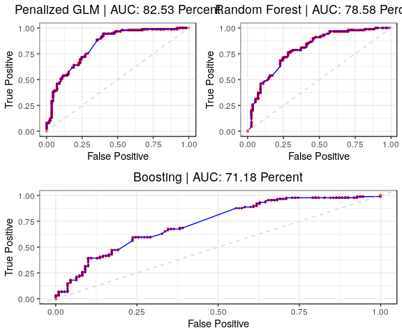
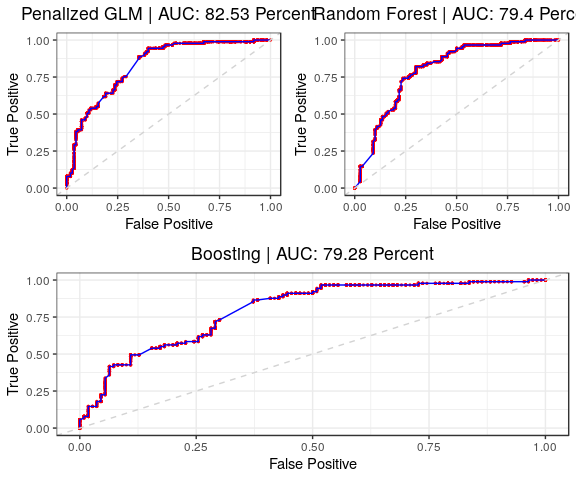

DNA Sample NS Prediction
================
DSPG Business Innovation Team
7/15/2019

1. Read and Split Sample
------------------------

Read, clean, and tidy; just like it's Sunday.

``` r
#Read in the data
dna.df <- read_rds("./data/working/DNA_Aggregated/Machine_learning_sample/7_15_19_sample_data.RDS") %>%
  slice(-c(which(body == "")))

#Transfrom Body Text into a corpus and clean
dna.corpus <- Corpus(VectorSource(dna.df$body)) %>%
  tm_map(content_transformer(tolower)) %>%
  tm_map(removeNumbers) %>%
  tm_map(removePunctuation) %>%
  tm_map(removeWords, c("the", "and", stopwords("english"))) %>%
  tm_map(stripWhitespace)
```

    ## Warning in tm_map.SimpleCorpus(., content_transformer(tolower)):
    ## transformation drops documents

    ## Warning in tm_map.SimpleCorpus(., removeNumbers): transformation drops
    ## documents

    ## Warning in tm_map.SimpleCorpus(., removePunctuation): transformation drops
    ## documents

    ## Warning in tm_map.SimpleCorpus(., removeWords, c("the", "and",
    ## stopwords("english"))): transformation drops documents

    ## Warning in tm_map.SimpleCorpus(., stripWhitespace): transformation drops
    ## documents

``` r
#Document Term Matrix
dna.dtm.df = DocumentTermMatrix(dna.corpus)
#dna.dtm.df = docTfidf
str(dna.dtm.df)
```

    ## List of 6
    ##  $ i       : int [1:143706] 1 1 1 1 1 1 1 1 1 1 ...
    ##  $ j       : int [1:143706] 1 2 3 4 5 6 7 8 9 10 ...
    ##  $ v       : num [1:143706] 1 1 1 2 1 1 1 1 2 2 ...
    ##  $ nrow    : int 999
    ##  $ ncol    : int 24738
    ##  $ dimnames:List of 2
    ##   ..$ Docs : chr [1:999] "1" "2" "3" "4" ...
    ##   ..$ Terms: chr [1:24738] "alfred" "allstock" "andrémichel" "announced" ...
    ##  - attr(*, "class")= chr [1:2] "DocumentTermMatrix" "simple_triplet_matrix"
    ##  - attr(*, "weighting")= chr [1:2] "term frequency" "tf"

``` r
#Outcome
new.product <- dna.df$subject_code_ns

#Add Outcome to Document Matrix
dna.doc.dt = data.table(doc = dna.dtm.df$i, word = dna.dtm.df$dimnames$Terms[dna.dtm.df$j], count = dna.dtm.df$v) %>%
  merge(data.table(doc = seq_along(new.product), new_product = new.product))


# This gives how many words appear a given number of times in total
wordTable <- dna.doc.dt[,.(count = sum(count)), by = c('word')] %>% arrange(-count) %>% data.table
table(wordTable$count)
```

    ## 
    ##     1     2     3     4     5     6     7     8     9    10    11    12 
    ## 11532  3502  1831  1224   855   673   475   378   343   264   255   216 
    ##    13    14    15    16    17    18    19    20    21    22    23    24 
    ##   204   132   144   166   147   116    90    97    77    99    81    56 
    ##    25    26    27    28    29    30    31    32    33    34    35    36 
    ##    62    59    61    53    53    54    49    46    41    36    37    41 
    ##    37    38    39    40    41    42    43    44    45    46    47    48 
    ##    27    31    28    35    20    31    24    14    28    28    28    14 
    ##    49    50    51    52    53    54    55    56    57    58    59    60 
    ##    26    25    20    18    16    17     9    13    20    12    21    11 
    ##    61    62    63    64    65    66    67    68    69    70    71    72 
    ##    12    16    13    13     9    11    13    11    10    14     8    11 
    ##    73    74    75    76    77    78    79    80    81    82    83    84 
    ##     5    11    11     7    11     5     4    14     5     7     6     4 
    ##    85    86    87    88    89    90    91    92    93    94    95    96 
    ##    13    10     6     4    10     4     6     6     5     1     3     3 
    ##    97    98    99   100   101   102   103   104   105   106   107   108 
    ##     5     6     3     6     3     5     5     2     2     3     7     4 
    ##   109   110   111   112   113   114   115   116   117   118   119   121 
    ##     4     5     5     5     4     2     6     3     1     1     5     6 
    ##   122   123   124   125   126   127   128   129   130   131   132   133 
    ##     3     2     2     3     5     2     2     6     3     2     3     2 
    ##   134   135   136   137   138   139   140   141   142   143   144   145 
    ##     2     4     4     1     3     1     2     3     5     2     4     1 
    ##   146   147   148   150   151   153   154   156   157   158   159   160 
    ##     4     4     4     2     2     5     1     1     2     5     1     1 
    ##   161   163   164   165   167   168   169   170   171   173   174   175 
    ##     1     4     1     2     1     4     1     1     1     2     1     1 
    ##   178   179   180   181   182   183   184   187   188   189   190   192 
    ##     1     1     2     1     1     2     3     2     1     1     4     1 
    ##   193   195   196   197   198   200   203   204   205   206   207   208 
    ##     1     2     1     2     1     1     2     1     2     1     1     1 
    ##   210   216   217   218   219   223   224   226   227   229   230   232 
    ##     1     1     2     2     5     2     1     1     2     2     2     1 
    ##   235   238   240   241   243   245   246   249   250   251   253   254 
    ##     1     1     1     2     1     1     1     1     1     1     1     1 
    ##   256   258   263   266   271   272   274   275   277   283   286   287 
    ##     1     3     3     1     2     1     2     1     1     1     1     1 
    ##   296   298   299   300   302   313   314   321   324   327   331   338 
    ##     1     1     1     1     1     1     1     2     2     1     2     1 
    ##   339   342   343   345   346   353   354   373   377   398   402   404 
    ##     1     1     1     1     1     1     1     1     1     2     1     2 
    ##   412   414   416   434   444   452   462   467   481   489   510   519 
    ##     1     1     1     1     1     1     1     1     1     1     1     1 
    ##   527   536   547   549   551   555   578   584   637   684   706   725 
    ##     1     1     1     1     1     1     1     1     1     1     1     1 
    ##   762   773   797   827   872   897   946   986   993  1037  1058  1580 
    ##     1     1     1     1     1     1     1     1     1     1     1     1

``` r
#18722 - sum(table(wordTable$count)[1:20])

# We require a word to appear at least this many times to be included in the analysis
minWordCountThreshold <- 40

survivorWords <- wordTable[count >= minWordCountThreshold, word]

# Now we look at words broken out by topic

reducedWordCount = dna.doc.dt[word %in% survivorWords]
reducedWordCount = data.table(reducedWordCount, filterWordIndex = match(reducedWordCount$word, unique(reducedWordCount$word)))

#
#reducedWordCount = data.table(dna.doc.dt, filterWordIndex = match(dna.doc.dt$word, unique(dna.doc.dt$word)))
#

# Turn into a long format matrix

dna.mat <- matrix(0, nrow = length(dna.corpus), ncol = length(unique(reducedWordCount$word)))
for(i in 1:nrow(reducedWordCount)) dna.mat[reducedWordCount$doc[i], reducedWordCount$filterWordIndex[i]] = reducedWordCount$count[i]
rownames(dna.mat) <- paste0('doc', 1:nrow(dna.mat))
colnames(dna.mat) <- unique(reducedWordCount$word)
```

Split Test/Train 80/20.

``` r
set.seed(2019)
sample <- sample(1:nrow(dna.mat), 
                 (nrow(dna.mat) * .80) %>% ceiling(), replace = FALSE)

train.df      <- dna.mat[sample,  ]
train.product <- new.product[sample] %>% as.factor()
test.df       <- dna.mat[-sample, ]
test.product  <- new.product[-sample] %>% as.factor()
```

1. Exploration
--------------

``` r
#tree.grid <- expand.grid(mtry = nrow(train.df) %>% sqrt(), ntree = c(50, 100, 250)) %>% as.data.frame()

#tree.grid <- expand.grid(mtry = seq(4,16,4), ntree = c(700, 1000,2000) )
#Mixed alpha penalized reg.
glm.mod <- train(train.product ~ ., data = data.frame(train.product, train.df), method = "glmnet",
                 family = "binomial", trControl = trainControl(method = "cv", number = 10))

#Random forest w optimized mtry
#random.rf <- train(train.product ~ ., data = data.frame(train.product, train.df), method = "rf", family = "bernoulli",
#                   trControl = trainControl(method = "cv", number = 5, n = 50, mtry = 5))

random.rf <- train(train.product ~ ., data = data.frame(train.product, train.df), method = "rf", family = "bernoulli",
                  trControl = trainControl(method = "none"))

#Boosting trees
random.gmb <- train(train.product ~ ., data = data.frame(train.product, train.df), distribution = "bernoulli", method = "gbm", trControl = trainControl(method = "none"))
```

    ## Iter   TrainDeviance   ValidDeviance   StepSize   Improve
    ##      1        1.3610            -nan     0.1000    0.0109
    ##      2        1.3409            -nan     0.1000    0.0083
    ##      3        1.3213            -nan     0.1000    0.0086
    ##      4        1.3024            -nan     0.1000    0.0093
    ##      5        1.2872            -nan     0.1000    0.0064
    ##      6        1.2742            -nan     0.1000    0.0070
    ##      7        1.2618            -nan     0.1000    0.0052
    ##      8        1.2511            -nan     0.1000    0.0043
    ##      9        1.2403            -nan     0.1000    0.0051
    ##     10        1.2312            -nan     0.1000    0.0024
    ##     20        1.1646            -nan     0.1000    0.0023
    ##     40        1.0819            -nan     0.1000    0.0014
    ##     50        1.0478            -nan     0.1000    0.0008

``` r
#Fixed/Default Sigmoid SVM
default.svm <- train(train.product ~ ., data = data.frame(train.product, train.df), distribution = "bernoulli", method = "svmLinear", trControl = trainControl(method = "none"))

#Modlist Accuracy
mod.list  <- list(glm.mod, random.rf, random.gmb, default.svm)
pred.list <- map(mod.list, ~predict(.x, newdata = data.frame(test.product, test.df)))
accuracy  <- map_dbl(pred.list, ~ (.x == test.product) %>% mean())
model     <- c("Penalized Regression", "Random Forest", "Boosting", "Default SVM")

#Visualize Accuracy in Table
data.frame(Accuracy = accuracy, Model = model) %>%
  knitr::kable(digits = 4)
```

|  Accuracy| Model                |
|---------:|:---------------------|
|    0.7487| Penalized Regression |
|    0.6935| Random Forest        |
|    0.6533| Boosting             |
|    0.6432| Default SVM          |

3. Visualize Preliminary Results
================================

``` r
pred.list <- map(mod.list[-4], ~predict(.x, newdata = data.frame(test.product, test.df), type = "prob")[,2])
glm.preds <- predict(glm.mod, newdata = data.frame(test.product, test.df))
glm.accuracy <- (glm.preds == test.product) %>% mean()

Roc.Log <- function(result,preds){
  probs <- seq(0,1,by=0.001)
  roc.log <- matrix(0,nrow=length(probs),ncol=2)
 # result <- ifelse(result == "M", TRUE, FALSE)
  i <- 1
  for(p in probs){
    pred <- preds > p
    ##False positive rate
    false.pos <- sum(!result & pred)/sum(!result)
    ##True postive rate
    true.pos <- sum(result & pred)/sum(result)
    roc.log[i,] <- c(false.pos,true.pos)
    i <- i+1
  }
  return(roc.log)
}

plotRoc <- function(roc.log,charstring){
  data.frame(FP =rev(roc.log[,1]),TP=rev(roc.log[,2])) %>% 
    ggplot()+
    geom_point(aes(FP,TP),color="red",size=.5) +
    geom_line(aes(FP,TP),color="blue") +
    geom_abline(slope = 1, linetype = 2, colour = "lightgrey") +
    labs(
      x = "False Positive",
      y = "True Positive",
      title = charstring
    )
}
auc <- function(roc){
  len <- nrow(roc)
  ##The "delta X" values
  delta <- roc[-1,1]-roc[-len,1]
  ##The "heights" the rectangle (drop the first or last).
  hgt <- roc[-1,2]
  ##The Riemann Sum
  sum(-delta*hgt)
}


#Visualize ROC w/AUC
result  <- test.product %>% as.logical()
roc.list <- map(.x = pred.list, ~Roc.Log(result, .x))
names <- c("Penalized GLM", "Random Forest", "Boosting")
plot.list <- map2(.x = roc.list, .y = names, ~plotRoc(.x, sprintf("%s | AUC: %s Percent", .y, auc(.x) %>% round(4)*100)))

ggplot <- (plot.list[[1]] + plot.list[[2]]) / plot.list[[3]]
ggplot
```



``` r
ggsave("./src/nevilleq/dna_sample_predictive_modeling/all_test_roc.jpg", ggplot)
```

    ## Saving 6 x 5 in image

3. Tune Models
--------------

``` r
pred.list <- map(mod.list[-4], ~predict(.x, newdata = data.frame(test.product, test.df), type = "prob")[,2])


#Visualize ROC w/AUC
result  <- test.product %>% as.logical()
roc.list <- map(.x = pred.list, ~Roc.Log(result, .x))
names <- c("Penalized GLM", "Random Forest", "Boosting")
plot.list <- map2(.x = roc.list, .y = names, ~plotRoc(.x, sprintf("%s | AUC: %s Percent", .y, auc(.x) %>% round(4)*100)))

ggplot <- (plot.list[[1]] + plot.list[[2]]) / plot.list[[3]]
ggplot
```



``` r
ggsave("./src/nevilleq/dna_sample_predictive_modeling/all_test_test_roc.jpg", ggplot)
```

    ## Saving 6 x 5 in image

3. Visualize Preliminary Results
================================

4. Visualize All Models
=======================
