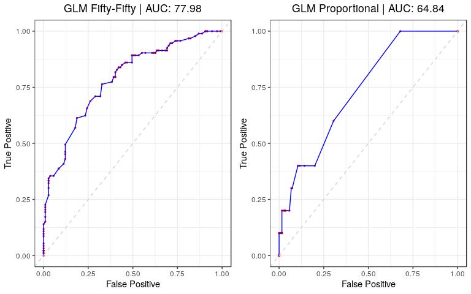
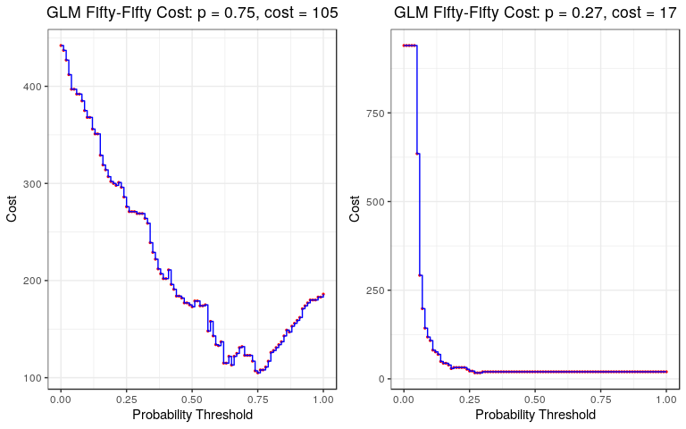
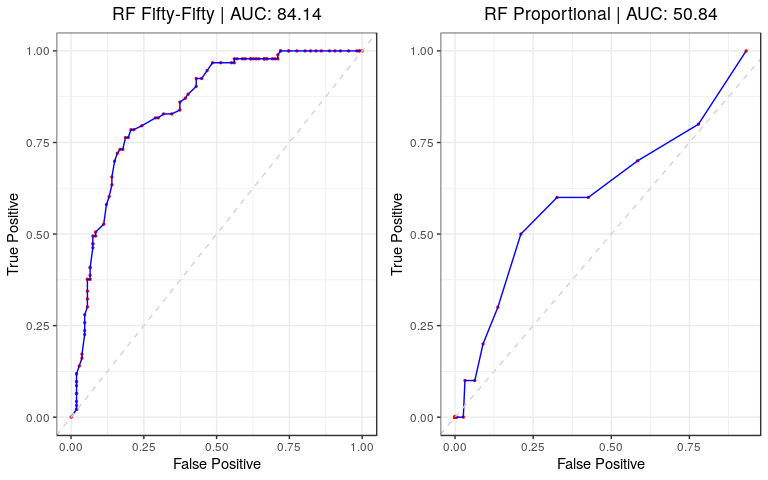
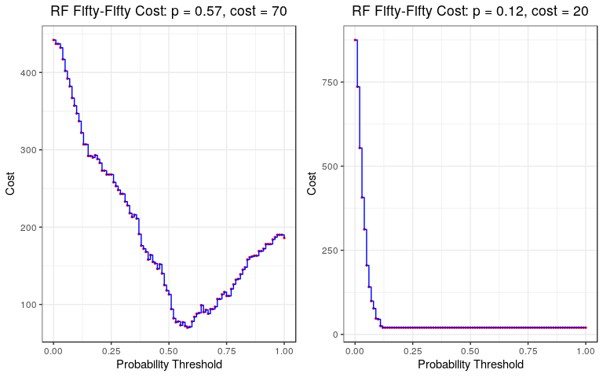
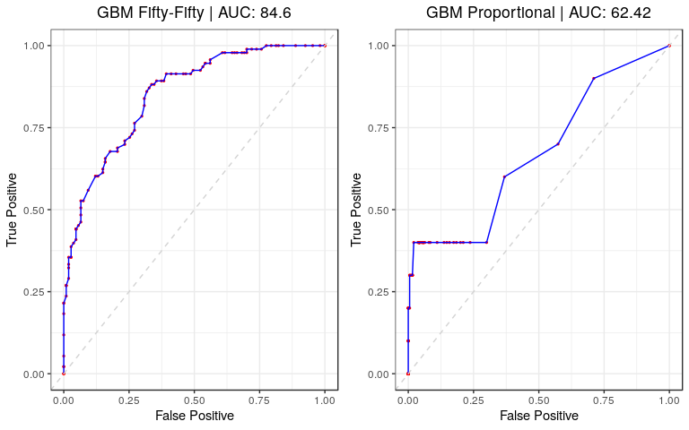
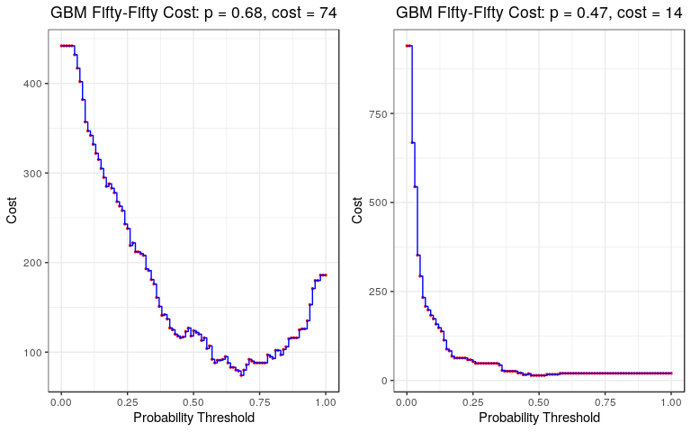

New Product/Service ML Methods
================
DSPG Business Innovation Team
7/23/2019

Introduction
------------

This paper outlines the building, testing, evaluation, and recommendation for building predictive models from a random sample of DNA (2015) articles. The outcome of interest concerns whether or not an article is labeled (by DNA's mixture of dictionary and machine learning) as pertaining to a New Product or Service, or not. In this context, we will consider the following *supervised* models:

-   Penalized Generalized Linear Model
    Logistic regression generating predicted probabilities for a binary classifier, parametric (Binomial Distribution), with penalization and shrinkage parameters to adjust for number of features (words in articles).

-   Random Forest
    Builds a bootstrapped bag or "forest" of independent decision trees, optimizing the both depth and number of trees, averages the results for a robust probability threshold for a binary classifier.

-   Gradiant Boosting Machine (Trees)
    Similar to random forest, however the bag of trees being built is not independent; rather each tree is built based on the performance of the previous one, allowing for a learning rate as the forest grows. Same outcome as random forest.

-   Support Vector Machines
    Geometrically elegant classifier with generally high precision, however it is computationally costly to tune and very dependent on tuning to be a good clasifier. If technical issues (convergence, tuning grid, etc.) can be ameliorated, should provide a robust binary text classifier.

-   Neural Network
    Extremely flexible network of interconnected nodes, performing gradient descent linear models between nodes, to create probablistically likely paths through the network of features ultimately leading to a probability threshold for binary classification.

The main feature of these methods is that require a labeled outcome to be built and optimized, with the result being a direct correspondence to a predicted probability of belonging to said label class (New Product or Service). However, alternative *unsupervised* exploratory and predictive models can also be built without articles having a defined labeled outcome; exploiting the underlying structure of the article data (through distance, hierarchy, latent factors, etc.) to give further insight and provide potential predictive features/models to supplement the supervised models. We investigated the following *unsupervised* method(s):

-   Bag of Words:
    Takes a clean corpus of words, document term matrix of frequency, and utilizes an unsupervised clustering algorithm to predict a binary classification of articles into two corresponding groups (New Product/Service vs. Not). Unsupervised clustering algorithms investigated include:

-   K-means Clustering
    An algorithm that iteratively calculates centroids and euclidean distance of the article data to those centroids, minimizing the centroid distance to points until convergence. This produces groupings of the data that do not rely on a specific outcome.

-   Hierarchical Clustering
    Similar to decision trees, this algorithm considers a hierarchical structure to the data, splitting upon chosen measures of distance, and cutting the tree at the desired number of groups to produce the same clustering structure as above.

-   Bayesian Clustering
    Similar to the above algorithms, this method also utilizes measures of distance but calculates groupings using the MArkov Chain Monte Carlo method with a conditional prior probability driving the predicted posterior probability of a data point falling into that particular group for group classification. Can be much more useful than the above methods if given an informative (good) prior distribution for the probability of being in a particular group.

-   Latent Dirichlet Allocation
    Unlike the previous methods, this utilizes a latent variable clustering algorithm with a conditional expectation probability of being in a particular group. However, unlike the Bayesian method, this algorithm is done using an Expectation Maximization algorithm of the likelihood rather than an MCMC algorithm to describe the predicted probability of a data point falling into a particular latent cluster. Used often in topic modeling, which we are performing here, and has the highest likelihood of being effective given our data and end goal.

1. Read in NPS Sample Data (50%, 20%, 10%, Proportional).
---------------------------------------------------------

Here, we read in the data files each containing 1000 randomly sampled articles from DNA (2015); with 50%, 20%, 10%, and Proportional (to empirical distribution) describing articles coded as a New Product or Service and the remainder coming from elsewhere. The outcome of interest in our modeling is whether or not an article was labeled as a New Product or Service or not (supervised) or the seperation of article clusters into recognizable groups (N.P.S. or not, etc.). Further, we remove stop words, irregular capitalization, white space, numbers, and punctuation to mutate the original article data into Document Term Matrices; where each row is an article observation, each column a unique word from all the articles, and each cell being a frequency count for the aforementioned article observation. These Document Term Matrices are incredibly sparse, which can be particularly for algorithms to find convergence in such high dimensions and will need to be acounted for in the model building processes. Lastly, we split each of the new Document Term Matrice samples into an 80% training set for model fitting and a 20% testing set for model validation and diagnostics.

``` r
#Store desired filepath
file.path <- "./data/working/DNA_Aggregated/Machine_learning_sample/NPS_sample_data/"

#Test train sample
train.split <- 0.8
N <- 1000
set.seed(2019)
train.samp <- sample(1:N, train.split * N, replace = FALSE)

#Create tibble of each sample data identified by the variable 'sample', stored in the variable 'data'
sample.df <- list.files(path = file.path) %>%
  enframe() %>%
  rename(file_path = value) %>%
  filter(file_path %>% str_detect(".RDS")) %>%
  mutate(
    sample      = str_split_fixed(file_path, "_", 5)[ ,4],
    file_path   = str_c(file.path, file_path),
    data        = map(.x = file_path, ~read_rds(.x) %>% as_tibble()),
    subject     = map(.x = data, ~.x %>% dplyr::select(subject_code_ns) %>% 
                                  mutate(subject_code_ns = as.factor(subject_code_ns))),
    data        = map2(.x = data, .y = subject, ~bind_cols(make_dtm(.x, 40), .y) %>%
                                                 dplyr::select(subject_code_ns, everything())),
    train       = map(.x = data, ~.x[train.samp, ]),
    test        = map(.x = data, ~.x[setdiff(1:N, train.samp), ])
  ) %>%
  dplyr::select(-file_path)

#Write out another split of size 500 @ 50/50
export.df <- read_rds("./data/working/DNA_Aggregated/Machine_learning_sample/NPS_sample_data/2019_7_23_half_sample.RDS")
set.seed(2019)
N <- 750
n <- N/2
sampling  <- list(sample(1:N/2, n, replace = FALSE), sample(1:N/2, n, replace = FALSE))
export.df <- bind_rows(export.df %>%
                         filter(subject_code_ns == TRUE) %>%
                         slice(sampling[[1]]),
                       export.df %>%
                         filter(subject_code_ns == FALSE) %>%
                         slice(sampling[[2]]))
#write_rds(export.df, "./data/working/DNA_Aggregated/Machine_learning_sample/2019_7_24_500_sample.RDS")
#write_json(export.df, "./data/working/DNA_Aggregated/Machine_learning_sample/2019_7_24_500_sample.json")


#Read and check for similarities  
export.df <- read_rds("./data/working/DNA_Aggregated/Machine_learning_sample/NPS_sample_data/2019_7_23_half_sample.RDS") 

N <- 1000
set.seed(2019)
sampling  <- list(sample(1:(N/2), N/2, replace = FALSE), sample(1:(N/2), N/2, replace = FALSE))
export.df <- bind_rows(export.df %>%
                         filter(subject_code_ns == TRUE) %>%
                         slice(sampling[[1]]),
                       export.df %>%
                         filter(subject_code_ns == FALSE) %>%
                         slice(sampling[[2]]))
export.df <- export.df[sample(1:nrow(export.df)), ]
#write_rds(export.df, "./data/working/DNA_Aggregated/Machine_learning_sample/2019_7_25_1000_sample.RDS")
#write_json(export.df, "./data/working/DNA_Aggregated/Machine_learning_sample/2019_7_25_1000_sample.json")

#new.data <- read_rds("./data/working/DNA_Aggregated/Machine_learning_sample/2019_7_25_750_sample.RDS")
#old.data <- read_rds("./data/working/DNA_Aggregated/Machine_learning_sample/2019_7_24_500_sample.RDS")

#Check unique, proportion new prod/serv
#new.data[-c(which(new.data$an %in% old.data$an)), ]$an %>% unique()
#new.data[-c(which(new.data$an %in% old.data$an)), ]$subject_code_ns %>% mean()

#Overwrite for new set
#write_rds(new.data, "./data/working/DNA_Aggregated/Machine_learning_sample/2019_7_25_750_sample.RDS")
#write_json(new.data, "./data/working/DNA_Aggregated/Machine_learning_sample/2019_7_25_750_sample.json")
```

2. Machine Learning Methods
---------------------------

We investigated a variety of machine learning methods, supervised and unsupervised, to explore the data and generate predictive models to classify an article from a given DNA (2015) random sample by New Product/Service outcome %; as a New Product/Service or not (binary). We will further assess these models according to diagnostics given by the Area Under the Reciever Operator Curve (calculating the rate of true positives to false positives over all probability thresholds for classification, taking the area under the resulting empirical curve, ~1 is optimal), False-Negative Averse cost optimization, and overall accuracy given the test data. All models were optimized using built in `caret` tuning grids using 5 and 10-Fold Cross validation.

### i. Supervised

#### a. Penalized Logistic Regression

Generalized linear models are one of the simplest and easily understood machine learning techniques, relying on parametric probability distributions and Newton Raphson or Coordinate Descent maximum likelihood algorithms. In this case, we employ a Logistic Regression to model our document term matrices by whether or not a new product or service was labeled for each observation (coming from a Bernoulli/Binomial distribution). In early iterations, this modeling was performing the best (at the 50-50 New Product Split), implying that there may exist some underlying linear structure to the DNA New Product labeling. Here we fit a generalized penalized logistic regression to each training sample, optimize the *α* (geometric penalization type) and *λ* (penalization/shrinkage) parameters, and predict the probability that a given article in each test sample describes a New Product or Service, or not.

Results below give a table of the optimized parameter values, test accuracy, as well as the ROC, AUC, and optimal threshold given a False-Negative averse cost matrix.

``` r
#Penalized Logistic Regression over 
glm.df <- sample.df %>%
  filter(sample == "half" | sample == "prop") %>%
  mutate(
    glm = map(.x = train, ~train(subject_code_ns ~ ., data = .x, method = "glmnet",
                 family = "binomial", trControl = trainControl(method = "cv", number = 10))),
    glm_preds = map2(.x = glm, .y = test, ~predict(.x, newdata = .y)),
    glm_probs = map2(.x = glm, .y = test, ~predict(.x, newdata = .y, type = "prob")[ ,2]),
    alpha     = map_dbl(.x  = glm, ~.x$bestTune[, 1]),
    lambda    = map_dbl(.x = glm,  ~.x$bestTune[, 2])
  )
```

``` r
#Check out best tuning parameters
glm.df %>%
  select(sample, alpha, lambda) %>%
  knitr::kable(digits = 5)
```

| sample |  alpha|   lambda|
|:-------|------:|--------:|
| half   |   0.10|  0.09651|
| prop   |   0.55|  0.04667|

``` r
#Give Accuracy
glm.df %>%
  mutate(
    accuracy = map2(.x = glm_preds, .y = test, ~.x == .y$subject_code_ns) %>%
               map_dbl(mean)
  ) %>%
  dplyr::select(sample, accuracy) %>%
  knitr::kable(digits = 3)
```

| sample |  accuracy|
|:-------|---------:|
| half   |      0.70|
| prop   |      0.95|

``` r
#Plot Roc
plots <- glm.df %>%
  mutate(
    roc     = map2(.x = test, .y = glm_probs, ~roc.log(.x, .y)),
    roc_gg  = map2(.x = roc, .y  = c("Fifty-Fifty", "Proportional"), 
                  ~plot.roc(.x, sprintf("GLM %s | AUC: %s", .y, auc(.x) %>% round(4)*100))),
    cost    = map2(.x = test, .y = glm_probs, ~cost.df(.x, .y)),
    cost_gg = map(.x = cost, .y = c("Fifty-Fifty", "Proportional"), 
                  ~plot.cost(.x, paste("GLM", .y)))
  )

#Store GG panels
glm.roc  <- plots$roc_gg[[1]] + plots$roc_gg[[2]]
glm.cost <- plots$cost_gg[[1]] + plots$cost_gg[[2]]

#Save
ggsave("./src/nevilleq/dna_sample_predictive_modeling/new_prod_ml_figures/glm_roc.jpg" , glm.roc)
```

    ## Saving 8 x 5 in image

``` r
ggsave("./src/nevilleq/dna_sample_predictive_modeling/new_prod_ml_figures/glm_cost.jpg", glm.cost, width = 8)
```

    ## Saving 8 x 5 in image

``` r
#Display
glm.roc
```



``` r
glm.cost
```



We observed significantly decreased AUC and optimized probability threshold between the model fit on the 50% New Product/Services vs. the Proportional (~7%) sample, with likewise reduced accuracy. However, on the 50% sample, this model is performing appreciably well and will be utilized as a baseline model moving forward.

#### b. Random Forest

Decision trees provide a robust and extensive series of geometric splits in the article data, given the features (words), in combination with a parametric binomial machine learning algorithm for binary classification. Further, a random forest is actually a bootstrapped bag of *independent* decision trees, where we have resampled the data with replacement, constructed a new decision tree for that sample, for a specified number of trees (forest size) and tree depth (how many branches the trees have). We optimize both the number of trees and tree depth for this model. The outcome is a predicted probability of being an article which describes a New Product.

Results below give a table of the optimized parameter values, test accuracy, as well as the ROC, AUC, and optimal threshold given a False-Negative averse cost matrix.

``` r
#Random Forest 
rf.df <- sample.df %>%
  filter(sample == "half" | sample == "prop") %>%
  mutate(
    rf        = map(.x = train, ~train(subject_code_ns ~ ., data = .x,
                                       method = "rf", family = "bernoulli",
                                       trControl = trainControl(method = "cv", number = 5))),
    rf_preds = map2(.x = rf, .y = test, ~predict(.x, newdata = .y)),
    rf_probs = map2(.x = rf, .y = test, ~predict(.x, newdata = .y, type = "prob")[ ,2]),
    n_trees  = map_dbl(.x = rf, ~.x$finalModel$ntree),
    mtry     = map_dbl(.x = rf, ~.x$finalModel$mtry)
  )
```

``` r
#Check out best tuning parameters
rf.df %>%
  select(sample, n_trees, mtry) %>%
  knitr::kable(digits = 5)
```

| sample |  n\_trees|  mtry|
|:-------|---------:|-----:|
| half   |       500|    49|
| prop   |       500|     2|

``` r
#Give Accuracy
rf.df %>%
  mutate(
    accuracy = map2(.x = rf_preds, .y = test, ~.x == .y$subject_code_ns) %>%
               map_dbl(mean)
  ) %>%
  dplyr::select(sample, accuracy) %>%
  knitr::kable(digits = 3)
```

| sample |  accuracy|
|:-------|---------:|
| half   |      0.76|
| prop   |      0.95|

``` r
#Plot Roc
plots <- rf.df %>%
  mutate(
    roc     = map2(.x = test, .y = rf_probs, ~roc.log(.x, .y)),
    roc_gg  = map2(.x = roc, .y  = c("Fifty-Fifty", "Proportional"), 
                  ~plot.roc(.x, sprintf("RF %s | AUC: %s", .y, auc(.x) %>% round(4)*100))),
    cost    = map2(.x = test, .y = rf_probs, ~cost.df(.x, .y)),
    cost_gg = map(.x = cost, .y = c("Fifty-Fifty", "Proportional"), 
                  ~plot.cost(.x, paste("RF", .y)))
  )

#Store GG panels
rf.roc  <- plots$roc_gg[[1]] + plots$roc_gg[[2]]
rf.cost <- plots$cost_gg[[1]] + plots$cost_gg[[2]]

#Save
ggsave("./src/nevilleq/dna_sample_predictive_modeling/new_prod_ml_figures/rf_roc.jpg", rf.roc)
```

    ## Saving 8 x 5 in image

``` r
ggsave("./src/nevilleq/dna_sample_predictive_modeling/new_prod_ml_figures/rf_cost.jpg", rf.cost, width = 8)
```

    ## Saving 8 x 5 in image

``` r
#Display
rf.roc
```



``` r
rf.cost
```



We observed that the random forest performed appreciably better than the penalized logistic regression (above) for the 50% split sample, but slightly worse for the smaller sample. This may imply that the logistic regression is more robust for samples with an emperically smaller probability of being about a New Product or Service. Additionally the optimally minimal cost for this model is significantly lower than that of the penalized GLM.

#### c. Boosting (GBM Trees)

Much like random forests, Gradient Boosting Machines (with Trees) also rely on a bag of decision trees built on bootstrapped samples of the original data. However, these trees are not built independently of one another. In fact, each succesive tree is built *dependent* on the previous tree, using a specified learning rate and out of bag sample to improve the accuracy of each individual tree as the bag of trees grows. This effectively allows the algorithm to learn and improve the decision tree construction as the overall bag of trees grows, but also requires the tuning of two additional paramters compared to the random forest: shrinkage (learning rate) and number of bins (size for out-of-bag diagnostics). This allows for more flexibility and learning in the model, which makes it generally more attractive than a random forest, but requires the optimization of two additional parameters which can be computationally expensive. Again, the outcome is a predicted probability of being an article which describes a New Product.

Results below give a table of the optimized parameter values, test accuracy, as well as the ROC, AUC, and optimal threshold given a False-Negative averse cost matrix.

``` r
#Boosting (GBM Trees)
gbm.df <- sample.df %>%
  filter(sample == "half" | sample == "prop") %>%
  mutate(
    gbm        = map(.x = train, ~train(subject_code_ns ~ ., data = .x, 
                                       distribution = "bernoulli", method = "gbm",
                                       trControl = trainControl(method = "cv", number = 5))),
    gbm_preds = map2(.x = gbm, .y = test, ~predict(.x, newdata = .y)),
    gbm_probs = map2(.x = gbm, .y = test, ~predict(.x, newdata = .y, type = "prob")[ ,2]),
    n_trees   = map_dbl(.x = gbm, ~.x$bestTune[, 1]),
    interaction_depth = map_dbl(.x = gbm,  ~.x$bestTune[, 2]),
    shrinkage = map_dbl(.x = gbm,  ~.x$bestTune[, 3]),
    n_bins    = map_dbl(.x = gbm,  ~.x$bestTune[, 4])
  )
```

``` r
#Check out best tuning parameters
gbm.df %>%
  select(sample, n_trees, interaction_depth, shrinkage, n_bins) %>%
  knitr::kable(digits = 5)
```

| sample |  n\_trees|  interaction\_depth|  shrinkage|  n\_bins|
|:-------|---------:|-------------------:|----------:|--------:|
| half   |       100|                   3|        0.1|       10|
| prop   |        50|                   2|        0.1|       10|

``` r
#Give Accuracy
gbm.df %>%
  mutate(
    accuracy = map2(.x = gbm_preds, .y = test, ~.x == .y$subject_code_ns) %>%
               map_dbl(mean)
  ) %>%
  dplyr::select(sample, accuracy) %>%
  knitr::kable(digits = 3)
```

| sample |  accuracy|
|:-------|---------:|
| half   |     0.735|
| prop   |     0.960|

``` r
#Plot Roc
plots <- gbm.df %>%
  mutate(
    roc     = map2(.x = test, .y = gbm_probs, ~roc.log(.x, .y)),
    roc_gg  = map2(.x = roc, .y  = c("Fifty-Fifty", "Proportional"), 
                  ~plot.roc(.x, sprintf("GBM %s | AUC: %s", .y, auc(.x) %>% round(4)*100))),
    cost    = map2(.x = test, .y = gbm_probs, ~cost.df(.x, .y)),
    cost_gg = map(.x = cost, .y = c("Fifty-Fifty", "Proportional"), 
                  ~plot.cost(.x, paste("GBM", .y)))
  )

#Store GG panels
gbm.roc  <- plots$roc_gg[[1]] + plots$roc_gg[[2]]
gbm.cost <- plots$cost_gg[[1]] + plots$cost_gg[[2]]

#Save
ggsave("./src/nevilleq/dna_sample_predictive_modeling/new_prod_ml_figures/gbm_roc.jpg", gbm.roc)
```

    ## Saving 8 x 5 in image

``` r
ggsave("./src/nevilleq/dna_sample_predictive_modeling/new_prod_ml_figures/gbm_cost.jpg", gbm.cost, width = 8)
```

    ## Saving 8 x 5 in image

``` r
#Display
gbm.roc
```



``` r
gbm.cost
```



We observed a moderate improvement in accuracy and ROC AUC of the GBM model versus the random forest (and penalized GLM), while the minimal cost was negligibly higher than that of the random forest model.

#### d. Bag of Words

In progress.

#### e. Neural Networks

In progress.

#### f. Supervised Learning Conclusion

Given the baseline performance of the penalized generalized linear model (section a.), we observed significant improvement in accuracy and ROC AUC, with decreased cost, in both the random forest and gradient (tree) boosting machine models. With respect to the tree based models, it is unclear which method is outperforming the other, and it is our reccomendation that we instead use an ensemble method, averaging the predicted probability given by each model to produce a final predicted probability for classification. This ensemble methodolgy utilizes the "wisdom of the masses" in the sense that while two models generate different predictions and are driven by different sources of variance within these data, taking the average predictions of both theoretically generates a "sum" or whole" prediction that is an improvement upon each of individual parts.
