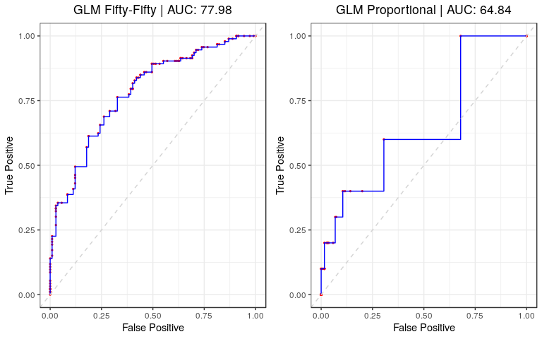
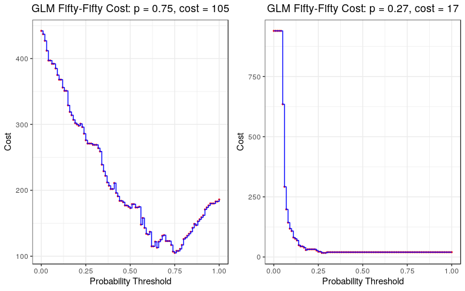
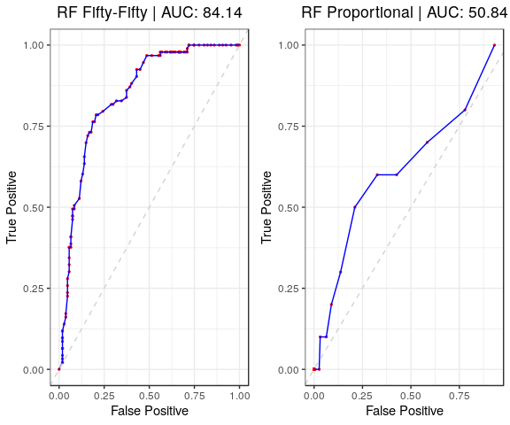
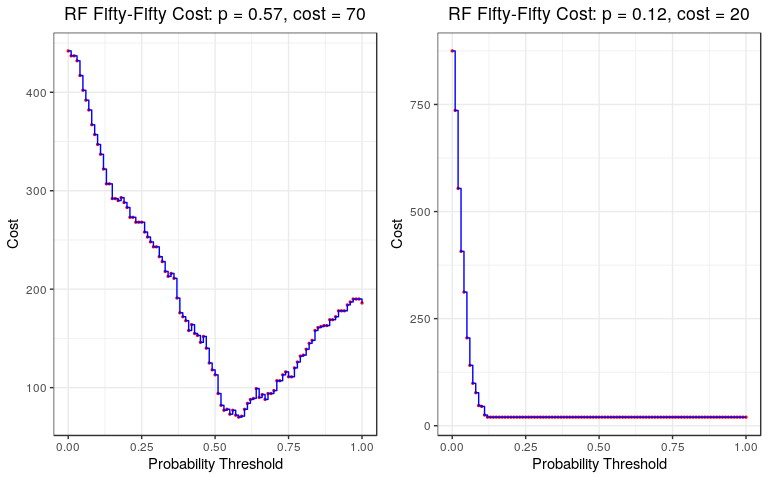
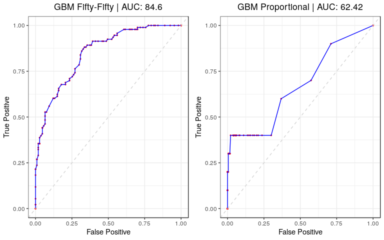
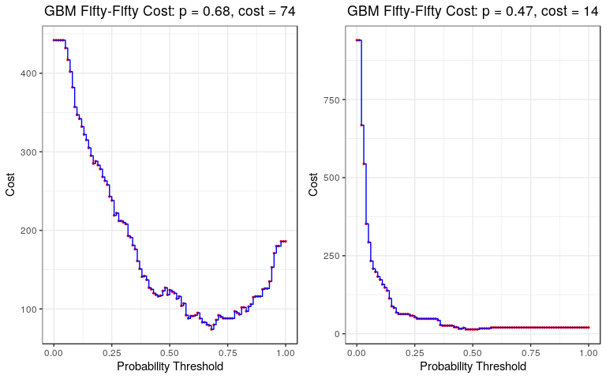

New Product/Service ML Methods
================
DSPG Business Innovation Team
7/23/2019

1. Read in NPS Sample Data (50%, 20%, 10%, Proportional).
---------------------------------------------------------

Here, we read in the data files each containing 1000 randomly sampled articles from DNA (2015); with 50%, 20%, 10%, and Proportional (to empirical distribution) describing articles coded as a New Product or Service and the remainder coming from elsewhere. The outcome of interest in our modeling is whether or not an article was labeled as a New Product or Service or not

``` r
#Store desired filepath
file.path <- "./data/working/DNA_Aggregated/Machine_learning_sample/NPS_sample_data/"

#Test train sample
train.split <- 0.8
N <- 1000
set.seed(2019)
train.samp <- sample(1:N, train.split * N, replace = FALSE)

#Create tibble of each sample data identified by the variable 'sample', stored in the variable 'data'
sample.df <- list.files(path = file.path) %>%
  enframe() %>%
  rename(file_path = value) %>%
  mutate(
    sample      = str_split_fixed(file_path, "_", 5)[ ,4],
    file_path   = str_c(file.path, file_path),
    data        = map(.x = file_path, ~read_rds(.x) %>% as_tibble()),
    subject     = map(.x = data, ~.x %>% dplyr::select(subject_code_ns) %>% 
                                  mutate(subject_code_ns = as.factor(subject_code_ns))),
    data        = map2(.x = data, .y = subject, ~bind_cols(make_dtm(.x, 40), .y) %>%
                                                 dplyr::select(subject_code_ns, everything())),
    train       = map(.x = data, ~.x[train.samp, ]),
    test        = map(.x = data, ~.x[setdiff(1:N, train.samp), ])
  ) %>%
  dplyr::select(-file_path)
```

2. Machine Learning Methods
---------------------------

We investigated a variety of machine learning methods, supervised and unsupervised, to explore the data and generate predictive models to classify an article from a given DNA (2015) random sample by New Product/Service outcome %; as a New Product/Service or not (binary). We will further assess these models according to diagnostics given by A

### i. Supervised

#### a. Penalized Logistic Regression

Generalized linear models are one of the simplest and easily understood machine learning techniques, relying on parametric probability distributions and Newton Raphson or Coordinate Descent maximum likelihood algorithms. In this case, we employ a Logistic Regression to model our document term matrices by whether or not a new product or service was labeled for each observation (coming from a Bernoulli/Binomial distribution). In early iterations, this modeling was performing the best (at the 50-50 New Product Split), implying that there may exist some underlying linear structure to the DNA New Product labeling. Here we fit a generalized penalized logistic regression to each training sample, optimize the *α* (geometric penalization type) and *λ* (penalization/shrinkage) parameters, and predict the probability that a given article in each test sample describes a New Product or Service, or not.

Results below give a table of the optimized parameter values, as well as the ROC and

``` r
#Penalized Logistic Regression over 
glm.df <- sample.df %>%
  filter(sample == "half" | sample == "prop") %>%
  mutate(
    glm = map(.x = train, ~train(subject_code_ns ~ ., data = .x, method = "glmnet",
                 family = "binomial", trControl = trainControl(method = "cv", number = 10))),
    glm_preds = map2(.x = glm, .y = test, ~predict(.x, newdata = .y)),
    glm_probs = map2(.x = glm, .y = test, ~predict(.x, newdata = .y, type = "prob")[ ,2]),
    alpha     = map_dbl(.x  = glm, ~.x$bestTune[, 1]),
    lambda    = map_dbl(.x = glm,  ~.x$bestTune[, 2])
  )

#Check out best tuning parameters
glm.df %>%
  select(sample, alpha, lambda) %>%
  knitr::kable(digits = 5)
```

| sample |  alpha|   lambda|
|:-------|------:|--------:|
| half   |   0.10|  0.09651|
| prop   |   0.55|  0.04667|

``` r
#Plot Roc
plots <- glm.df %>%
  mutate(
    roc     = map2(.x = test, .y = glm_probs, ~roc.log(.x, .y)),
    roc_gg  = map2(.x = roc, .y  = c("Fifty-Fifty", "Proportional"), 
                  ~plot.roc(.x, sprintf("GLM %s | AUC: %s", .y, auc(.x) %>% round(4)*100))),
    cost    = map2(.x = test, .y = glm_probs, ~cost.df(.x, .y)),
    cost_gg = map(.x = cost, .y = c("Fifty-Fifty", "Proportional"), 
                  ~plot.cost(.x, paste("GLM", .y)))
  )

#Store GG panels
glm.roc  <- plots$roc_gg[[1]] + plots$roc_gg[[2]]
glm.cost <- plots$cost_gg[[1]] + plots$cost_gg[[2]]

#Save
ggsave("./src/nevilleq/dna_sample_predictive_modeling/new_prod_ml_figures/glm_roc.jpg" , glm.roc)
```

    ## Saving 8 x 5 in image

``` r
ggsave("./src/nevilleq/dna_sample_predictive_modeling/new_prod_ml_figures/glm_cost.jpg", glm.cost, width = 8)
```

    ## Saving 8 x 5 in image

``` r
#Display
glm.roc
```



``` r
glm.cost
```



#### b. Random Forest

``` r
#Random Forest 
rf.df <- sample.df %>%
  filter(sample == "half" | sample == "prop") %>%
  mutate(
    rf        = map(.x = train, ~train(subject_code_ns ~ ., data = .x,
                                       method = "rf", family = "bernoulli",
                                       trControl = trainControl(method = "cv", number = 5))),
    rf_preds = map2(.x = rf, .y = test, ~predict(.x, newdata = .y)),
    rf_probs = map2(.x = rf, .y = test, ~predict(.x, newdata = .y, type = "prob")[ ,2]),
    n_trees  = map_dbl(.x = rf, ~.x$finalModel$ntree),
    mtry     = map_dbl(.x = rf, ~.x$finalModel$mtry)
  )


#Check out best tuning parameters
rf.df %>%
  select(sample, n_trees, mtry) %>%
  knitr::kable(digits = 5)
```

| sample |  n\_trees|  mtry|
|:-------|---------:|-----:|
| half   |       500|    49|
| prop   |       500|     2|

``` r
#Plot Roc
plots <- rf.df %>%
  mutate(
    roc     = map2(.x = test, .y = rf_probs, ~roc.log(.x, .y)),
    roc_gg  = map2(.x = roc, .y  = c("Fifty-Fifty", "Proportional"), 
                  ~plot.roc(.x, sprintf("RF %s | AUC: %s", .y, auc(.x) %>% round(4)*100))),
    cost    = map2(.x = test, .y = rf_probs, ~cost.df(.x, .y)),
    cost_gg = map(.x = cost, .y = c("Fifty-Fifty", "Proportional"), 
                  ~plot.cost(.x, paste("RF", .y)))
  )

#Store GG panels
rf.roc  <- plots$roc_gg[[1]] + plots$roc_gg[[2]]
rf.cost <- plots$cost_gg[[1]] + plots$cost_gg[[2]]

#Save
ggsave("./src/nevilleq/dna_sample_predictive_modeling/new_prod_ml_figures/rf_roc.jpg", rf.roc)
```

    ## Saving 8 x 5 in image

``` r
ggsave("./src/nevilleq/dna_sample_predictive_modeling/new_prod_ml_figures/rf_cost.jpg", rf.cost, width = 8)
```

    ## Saving 8 x 5 in image

``` r
#Display
rf.roc
```



``` r
rf.cost
```



#### c. Boosting (GBM Trees)

``` r
#Boosting (GBM Trees)
gbm.df <- sample.df %>%
  filter(sample == "half" | sample == "prop") %>%
  mutate(
    gbm        = map(.x = train, ~train(subject_code_ns ~ ., data = .x, 
                                       distribution = "bernoulli", method = "gbm",
                                       trControl = trainControl(method = "cv", number = 5))),
    gbm_preds = map2(.x = gbm, .y = test, ~predict(.x, newdata = .y)),
    gbm_probs = map2(.x = gbm, .y = test, ~predict(.x, newdata = .y, type = "prob")[ ,2]),
    n_trees   = map_dbl(.x = gbm, ~.x$bestTune[, 1]),
    interaction_depth = map_dbl(.x = gbm,  ~.x$bestTune[, 2]),
    shrinkage = map_dbl(.x = gbm,  ~.x$bestTune[, 3]),
    n_bins    = map_dbl(.x = gbm,  ~.x$bestTune[, 4])
  )
```

    ## Warning in (function (x, y, offset = NULL, misc = NULL, distribution =
    ## "bernoulli", : variable 1243: fibrinogen has no variation.

    ## Iter   TrainDeviance   ValidDeviance   StepSize   Improve
    ##      1        1.3602            -nan     0.1000    0.0134
    ##      2        1.3380            -nan     0.1000    0.0097
    ##      3        1.3173            -nan     0.1000    0.0070
    ##      4        1.2988            -nan     0.1000    0.0084
    ##      5        1.2828            -nan     0.1000    0.0065
    ##      6        1.2687            -nan     0.1000    0.0039
    ##      7        1.2529            -nan     0.1000    0.0068
    ##      8        1.2403            -nan     0.1000    0.0050
    ##      9        1.2352            -nan     0.1000   -0.0003
    ##     10        1.2228            -nan     0.1000    0.0055
    ##     20        1.1567            -nan     0.1000    0.0004
    ##     40        1.0837            -nan     0.1000    0.0014
    ##     60        1.0286            -nan     0.1000   -0.0006
    ##     80        0.9763            -nan     0.1000   -0.0020
    ##    100        0.9265            -nan     0.1000   -0.0007
    ##    120        0.8875            -nan     0.1000   -0.0009
    ##    140        0.8548            -nan     0.1000   -0.0010
    ##    150        0.8396            -nan     0.1000   -0.0002

    ## Warning in (function (x, y, offset = NULL, misc = NULL, distribution =
    ## "bernoulli", : variable 1243: fibrinogen has no variation.

    ## Iter   TrainDeviance   ValidDeviance   StepSize   Improve
    ##      1        1.3480            -nan     0.1000    0.0179
    ##      2        1.3192            -nan     0.1000    0.0139
    ##      3        1.2901            -nan     0.1000    0.0130
    ##      4        1.2653            -nan     0.1000    0.0119
    ##      5        1.2446            -nan     0.1000    0.0084
    ##      6        1.2286            -nan     0.1000    0.0060
    ##      7        1.2150            -nan     0.1000    0.0044
    ##      8        1.2003            -nan     0.1000    0.0039
    ##      9        1.1864            -nan     0.1000    0.0053
    ##     10        1.1728            -nan     0.1000    0.0033
    ##     20        1.0850            -nan     0.1000    0.0021
    ##     40        0.9679            -nan     0.1000   -0.0014
    ##     60        0.8820            -nan     0.1000   -0.0001
    ##     80        0.8112            -nan     0.1000    0.0001
    ##    100        0.7564            -nan     0.1000    0.0001
    ##    120        0.7130            -nan     0.1000   -0.0001
    ##    140        0.6688            -nan     0.1000   -0.0012
    ##    150        0.6479            -nan     0.1000   -0.0011

    ## Warning in (function (x, y, offset = NULL, misc = NULL, distribution =
    ## "bernoulli", : variable 1243: fibrinogen has no variation.

    ## Iter   TrainDeviance   ValidDeviance   StepSize   Improve
    ##      1        1.3418            -nan     0.1000    0.0204
    ##      2        1.3056            -nan     0.1000    0.0158
    ##      3        1.2731            -nan     0.1000    0.0122
    ##      4        1.2469            -nan     0.1000    0.0111
    ##      5        1.2216            -nan     0.1000    0.0101
    ##      6        1.2008            -nan     0.1000    0.0085
    ##      7        1.1830            -nan     0.1000    0.0046
    ##      8        1.1642            -nan     0.1000    0.0060
    ##      9        1.1476            -nan     0.1000    0.0061
    ##     10        1.1330            -nan     0.1000    0.0032
    ##     20        1.0176            -nan     0.1000    0.0012
    ##     40        0.8842            -nan     0.1000   -0.0007
    ##     60        0.7844            -nan     0.1000   -0.0006
    ##     80        0.7032            -nan     0.1000   -0.0010
    ##    100        0.6385            -nan     0.1000   -0.0014
    ##    120        0.5801            -nan     0.1000   -0.0003
    ##    140        0.5315            -nan     0.1000   -0.0010
    ##    150        0.5115            -nan     0.1000   -0.0001

    ## Warning in (function (x, y, offset = NULL, misc = NULL, distribution =
    ## "bernoulli", : variable 1246: fesoterodine has no variation.

    ## Iter   TrainDeviance   ValidDeviance   StepSize   Improve
    ##      1        1.3567            -nan     0.1000    0.0146
    ##      2        1.3306            -nan     0.1000    0.0112
    ##      3        1.3091            -nan     0.1000    0.0098
    ##      4        1.2926            -nan     0.1000    0.0097
    ##      5        1.2767            -nan     0.1000    0.0081
    ##      6        1.2620            -nan     0.1000    0.0062
    ##      7        1.2508            -nan     0.1000    0.0069
    ##      8        1.2399            -nan     0.1000    0.0050
    ##      9        1.2301            -nan     0.1000    0.0041
    ##     10        1.2222            -nan     0.1000    0.0032
    ##     20        1.1503            -nan     0.1000    0.0010
    ##     40        1.0732            -nan     0.1000   -0.0004
    ##     60        1.0162            -nan     0.1000   -0.0003
    ##     80        0.9652            -nan     0.1000    0.0006
    ##    100        0.9250            -nan     0.1000   -0.0011
    ##    120        0.8902            -nan     0.1000   -0.0028
    ##    140        0.8595            -nan     0.1000   -0.0004
    ##    150        0.8469            -nan     0.1000   -0.0012

    ## Warning in (function (x, y, offset = NULL, misc = NULL, distribution =
    ## "bernoulli", : variable 1246: fesoterodine has no variation.

    ## Iter   TrainDeviance   ValidDeviance   StepSize   Improve
    ##      1        1.3440            -nan     0.1000    0.0203
    ##      2        1.3118            -nan     0.1000    0.0131
    ##      3        1.2802            -nan     0.1000    0.0123
    ##      4        1.2620            -nan     0.1000    0.0063
    ##      5        1.2379            -nan     0.1000    0.0089
    ##      6        1.2207            -nan     0.1000    0.0066
    ##      7        1.2013            -nan     0.1000    0.0082
    ##      8        1.1888            -nan     0.1000    0.0026
    ##      9        1.1781            -nan     0.1000    0.0026
    ##     10        1.1671            -nan     0.1000    0.0019
    ##     20        1.0746            -nan     0.1000    0.0012
    ##     40        0.9567            -nan     0.1000    0.0004
    ##     60        0.8743            -nan     0.1000    0.0009
    ##     80        0.8085            -nan     0.1000   -0.0017
    ##    100        0.7543            -nan     0.1000   -0.0009
    ##    120        0.7054            -nan     0.1000   -0.0009
    ##    140        0.6656            -nan     0.1000   -0.0007
    ##    150        0.6459            -nan     0.1000   -0.0009

    ## Warning in (function (x, y, offset = NULL, misc = NULL, distribution =
    ## "bernoulli", : variable 1246: fesoterodine has no variation.

    ## Iter   TrainDeviance   ValidDeviance   StepSize   Improve
    ##      1        1.3426            -nan     0.1000    0.0194
    ##      2        1.3025            -nan     0.1000    0.0168
    ##      3        1.2745            -nan     0.1000    0.0093
    ##      4        1.2435            -nan     0.1000    0.0110
    ##      5        1.2190            -nan     0.1000    0.0084
    ##      6        1.2002            -nan     0.1000    0.0067
    ##      7        1.1793            -nan     0.1000    0.0076
    ##      8        1.1647            -nan     0.1000    0.0046
    ##      9        1.1483            -nan     0.1000    0.0038
    ##     10        1.1316            -nan     0.1000    0.0062
    ##     20        1.0160            -nan     0.1000   -0.0001
    ##     40        0.8804            -nan     0.1000   -0.0001
    ##     60        0.7836            -nan     0.1000    0.0001
    ##     80        0.7102            -nan     0.1000   -0.0003
    ##    100        0.6421            -nan     0.1000   -0.0012
    ##    120        0.5853            -nan     0.1000   -0.0009
    ##    140        0.5384            -nan     0.1000   -0.0004
    ##    150        0.5181            -nan     0.1000   -0.0010
    ## 
    ## Iter   TrainDeviance   ValidDeviance   StepSize   Improve
    ##      1        1.3585            -nan     0.1000    0.0126
    ##      2        1.3349            -nan     0.1000    0.0110
    ##      3        1.3143            -nan     0.1000    0.0100
    ##      4        1.2973            -nan     0.1000    0.0059
    ##      5        1.2804            -nan     0.1000    0.0076
    ##      6        1.2673            -nan     0.1000    0.0078
    ##      7        1.2561            -nan     0.1000    0.0051
    ##      8        1.2460            -nan     0.1000    0.0038
    ##      9        1.2357            -nan     0.1000    0.0032
    ##     10        1.2224            -nan     0.1000    0.0053
    ##     20        1.1536            -nan     0.1000    0.0017
    ##     40        1.0665            -nan     0.1000   -0.0002
    ##     60        1.0037            -nan     0.1000    0.0001
    ##     80        0.9509            -nan     0.1000   -0.0003
    ##    100        0.9144            -nan     0.1000   -0.0014
    ##    120        0.8771            -nan     0.1000   -0.0006
    ##    140        0.8456            -nan     0.1000   -0.0011
    ##    150        0.8291            -nan     0.1000   -0.0004
    ## 
    ## Iter   TrainDeviance   ValidDeviance   StepSize   Improve
    ##      1        1.3473            -nan     0.1000    0.0163
    ##      2        1.3155            -nan     0.1000    0.0153
    ##      3        1.2861            -nan     0.1000    0.0135
    ##      4        1.2587            -nan     0.1000    0.0123
    ##      5        1.2379            -nan     0.1000    0.0090
    ##      6        1.2167            -nan     0.1000    0.0088
    ##      7        1.2033            -nan     0.1000    0.0044
    ##      8        1.1845            -nan     0.1000    0.0048
    ##      9        1.1743            -nan     0.1000    0.0022
    ##     10        1.1633            -nan     0.1000    0.0007
    ##     20        1.0688            -nan     0.1000    0.0010
    ##     40        0.9577            -nan     0.1000   -0.0010
    ##     60        0.8725            -nan     0.1000    0.0001
    ##     80        0.8068            -nan     0.1000   -0.0011
    ##    100        0.7501            -nan     0.1000    0.0003
    ##    120        0.7000            -nan     0.1000   -0.0015
    ##    140        0.6552            -nan     0.1000   -0.0001
    ##    150        0.6384            -nan     0.1000   -0.0009
    ## 
    ## Iter   TrainDeviance   ValidDeviance   StepSize   Improve
    ##      1        1.3455            -nan     0.1000    0.0169
    ##      2        1.3082            -nan     0.1000    0.0167
    ##      3        1.2758            -nan     0.1000    0.0093
    ##      4        1.2467            -nan     0.1000    0.0127
    ##      5        1.2192            -nan     0.1000    0.0111
    ##      6        1.1955            -nan     0.1000    0.0103
    ##      7        1.1802            -nan     0.1000    0.0047
    ##      8        1.1587            -nan     0.1000    0.0092
    ##      9        1.1403            -nan     0.1000    0.0044
    ##     10        1.1275            -nan     0.1000    0.0043
    ##     20        1.0070            -nan     0.1000   -0.0002
    ##     40        0.8620            -nan     0.1000   -0.0007
    ##     60        0.7699            -nan     0.1000   -0.0018
    ##     80        0.6979            -nan     0.1000   -0.0009
    ##    100        0.6328            -nan     0.1000   -0.0012
    ##    120        0.5804            -nan     0.1000   -0.0007
    ##    140        0.5357            -nan     0.1000   -0.0011
    ##    150        0.5156            -nan     0.1000   -0.0010

    ## Warning in (function (x, y, offset = NULL, misc = NULL, distribution =
    ## "bernoulli", : variable 1245: imd has no variation.

    ## Iter   TrainDeviance   ValidDeviance   StepSize   Improve
    ##      1        1.3598            -nan     0.1000    0.0129
    ##      2        1.3406            -nan     0.1000    0.0094
    ##      3        1.3246            -nan     0.1000    0.0052
    ##      4        1.3094            -nan     0.1000    0.0079
    ##      5        1.2945            -nan     0.1000    0.0062
    ##      6        1.2814            -nan     0.1000    0.0061
    ##      7        1.2693            -nan     0.1000    0.0041
    ##      8        1.2605            -nan     0.1000    0.0032
    ##      9        1.2488            -nan     0.1000    0.0048
    ##     10        1.2411            -nan     0.1000    0.0038
    ##     20        1.1804            -nan     0.1000    0.0010
    ##     40        1.0999            -nan     0.1000    0.0021
    ##     60        1.0515            -nan     0.1000   -0.0004
    ##     80        0.9976            -nan     0.1000   -0.0004
    ##    100        0.9574            -nan     0.1000    0.0001
    ##    120        0.9194            -nan     0.1000   -0.0011
    ##    140        0.8855            -nan     0.1000   -0.0010
    ##    150        0.8717            -nan     0.1000   -0.0010

    ## Warning in (function (x, y, offset = NULL, misc = NULL, distribution =
    ## "bernoulli", : variable 1245: imd has no variation.

    ## Iter   TrainDeviance   ValidDeviance   StepSize   Improve
    ##      1        1.3524            -nan     0.1000    0.0152
    ##      2        1.3259            -nan     0.1000    0.0142
    ##      3        1.2992            -nan     0.1000    0.0119
    ##      4        1.2831            -nan     0.1000    0.0058
    ##      5        1.2646            -nan     0.1000    0.0073
    ##      6        1.2484            -nan     0.1000    0.0042
    ##      7        1.2335            -nan     0.1000    0.0048
    ##      8        1.2180            -nan     0.1000    0.0067
    ##      9        1.2034            -nan     0.1000    0.0042
    ##     10        1.1925            -nan     0.1000    0.0030
    ##     20        1.1096            -nan     0.1000   -0.0019
    ##     40        0.9977            -nan     0.1000    0.0004
    ##     60        0.9139            -nan     0.1000   -0.0010
    ##     80        0.8475            -nan     0.1000   -0.0012
    ##    100        0.7924            -nan     0.1000   -0.0011
    ##    120        0.7469            -nan     0.1000   -0.0005
    ##    140        0.7060            -nan     0.1000   -0.0016
    ##    150        0.6869            -nan     0.1000   -0.0005

    ## Warning in (function (x, y, offset = NULL, misc = NULL, distribution =
    ## "bernoulli", : variable 1245: imd has no variation.

    ## Iter   TrainDeviance   ValidDeviance   StepSize   Improve
    ##      1        1.3490            -nan     0.1000    0.0175
    ##      2        1.3155            -nan     0.1000    0.0146
    ##      3        1.2808            -nan     0.1000    0.0124
    ##      4        1.2587            -nan     0.1000    0.0071
    ##      5        1.2378            -nan     0.1000    0.0075
    ##      6        1.2227            -nan     0.1000    0.0034
    ##      7        1.2013            -nan     0.1000    0.0071
    ##      8        1.1853            -nan     0.1000    0.0044
    ##      9        1.1721            -nan     0.1000    0.0014
    ##     10        1.1604            -nan     0.1000    0.0028
    ##     20        1.0497            -nan     0.1000   -0.0005
    ##     40        0.9039            -nan     0.1000    0.0006
    ##     60        0.8124            -nan     0.1000   -0.0030
    ##     80        0.7340            -nan     0.1000   -0.0006
    ##    100        0.6687            -nan     0.1000   -0.0005
    ##    120        0.6169            -nan     0.1000   -0.0014
    ##    140        0.5719            -nan     0.1000   -0.0013
    ##    150        0.5525            -nan     0.1000   -0.0007
    ## 
    ## Iter   TrainDeviance   ValidDeviance   StepSize   Improve
    ##      1        1.3583            -nan     0.1000    0.0137
    ##      2        1.3374            -nan     0.1000    0.0105
    ##      3        1.3199            -nan     0.1000    0.0068
    ##      4        1.3018            -nan     0.1000    0.0068
    ##      5        1.2873            -nan     0.1000    0.0042
    ##      6        1.2735            -nan     0.1000    0.0059
    ##      7        1.2598            -nan     0.1000    0.0048
    ##      8        1.2499            -nan     0.1000    0.0045
    ##      9        1.2383            -nan     0.1000    0.0039
    ##     10        1.2282            -nan     0.1000    0.0041
    ##     20        1.1681            -nan     0.1000    0.0027
    ##     40        1.0914            -nan     0.1000   -0.0003
    ##     60        1.0301            -nan     0.1000   -0.0006
    ##     80        0.9764            -nan     0.1000   -0.0001
    ##    100        0.9334            -nan     0.1000   -0.0006
    ##    120        0.8975            -nan     0.1000   -0.0007
    ##    140        0.8649            -nan     0.1000   -0.0005
    ##    150        0.8504            -nan     0.1000   -0.0005
    ## 
    ## Iter   TrainDeviance   ValidDeviance   StepSize   Improve
    ##      1        1.3510            -nan     0.1000    0.0159
    ##      2        1.3244            -nan     0.1000    0.0115
    ##      3        1.2962            -nan     0.1000    0.0141
    ##      4        1.2704            -nan     0.1000    0.0108
    ##      5        1.2511            -nan     0.1000    0.0059
    ##      6        1.2371            -nan     0.1000    0.0035
    ##      7        1.2237            -nan     0.1000    0.0039
    ##      8        1.2102            -nan     0.1000    0.0043
    ##      9        1.1997            -nan     0.1000    0.0012
    ##     10        1.1872            -nan     0.1000    0.0048
    ##     20        1.1008            -nan     0.1000    0.0009
    ##     40        0.9825            -nan     0.1000    0.0017
    ##     60        0.8982            -nan     0.1000   -0.0004
    ##     80        0.8292            -nan     0.1000   -0.0005
    ##    100        0.7732            -nan     0.1000   -0.0003
    ##    120        0.7235            -nan     0.1000   -0.0000
    ##    140        0.6837            -nan     0.1000   -0.0019
    ##    150        0.6646            -nan     0.1000   -0.0015
    ## 
    ## Iter   TrainDeviance   ValidDeviance   StepSize   Improve
    ##      1        1.3517            -nan     0.1000    0.0153
    ##      2        1.3138            -nan     0.1000    0.0164
    ##      3        1.2836            -nan     0.1000    0.0134
    ##      4        1.2567            -nan     0.1000    0.0129
    ##      5        1.2381            -nan     0.1000    0.0066
    ##      6        1.2215            -nan     0.1000    0.0051
    ##      7        1.1991            -nan     0.1000    0.0093
    ##      8        1.1800            -nan     0.1000    0.0079
    ##      9        1.1624            -nan     0.1000    0.0051
    ##     10        1.1511            -nan     0.1000    0.0002
    ##     20        1.0446            -nan     0.1000    0.0033
    ##     40        0.8971            -nan     0.1000    0.0005
    ##     60        0.7922            -nan     0.1000   -0.0020
    ##     80        0.7092            -nan     0.1000   -0.0002
    ##    100        0.6452            -nan     0.1000   -0.0011
    ##    120        0.5951            -nan     0.1000   -0.0007
    ##    140        0.5545            -nan     0.1000   -0.0015
    ##    150        0.5302            -nan     0.1000   -0.0014
    ## 
    ## Iter   TrainDeviance   ValidDeviance   StepSize   Improve
    ##      1        1.3456            -nan     0.1000    0.0203
    ##      2        1.3069            -nan     0.1000    0.0177
    ##      3        1.2789            -nan     0.1000    0.0116
    ##      4        1.2544            -nan     0.1000    0.0095
    ##      5        1.2333            -nan     0.1000    0.0087
    ##      6        1.2127            -nan     0.1000    0.0085
    ##      7        1.1967            -nan     0.1000    0.0046
    ##      8        1.1807            -nan     0.1000    0.0049
    ##      9        1.1660            -nan     0.1000    0.0049
    ##     10        1.1514            -nan     0.1000    0.0053
    ##     20        1.0432            -nan     0.1000    0.0016
    ##     40        0.9140            -nan     0.1000   -0.0006
    ##     60        0.8180            -nan     0.1000   -0.0003
    ##     80        0.7457            -nan     0.1000   -0.0005
    ##    100        0.6876            -nan     0.1000   -0.0013

    ## Warning in (function (x, y, offset = NULL, misc = NULL, distribution =
    ## "bernoulli", : variable 1230: acetazolamide has no variation.

    ## Warning in (function (x, y, offset = NULL, misc = NULL, distribution =
    ## "bernoulli", : variable 1251: guidewire has no variation.

    ## Iter   TrainDeviance   ValidDeviance   StepSize   Improve
    ##      1        0.4843            -nan     0.1000    0.0092
    ##      2        0.4809            -nan     0.1000   -0.0014
    ##      3        0.4728            -nan     0.1000    0.0042
    ##      4        0.4685            -nan     0.1000    0.0011
    ##      5        0.4592            -nan     0.1000    0.0033
    ##      6        0.4557            -nan     0.1000    0.0015
    ##      7        0.4504            -nan     0.1000    0.0006
    ##      8        0.4451            -nan     0.1000    0.0018
    ##      9        0.4400            -nan     0.1000   -0.0005
    ##     10        0.4373            -nan     0.1000   -0.0019
    ##     20        0.4127            -nan     0.1000   -0.0007
    ##     40        0.3776            -nan     0.1000   -0.0005
    ##     60        0.3470            -nan     0.1000   -0.0011
    ##     80        0.3224            -nan     0.1000    0.0005
    ##    100        0.2968            -nan     0.1000    0.0002
    ##    120        0.2783            -nan     0.1000    0.0001
    ##    140        0.2621            -nan     0.1000   -0.0010
    ##    150        0.2512            -nan     0.1000   -0.0003

    ## Warning in (function (x, y, offset = NULL, misc = NULL, distribution =
    ## "bernoulli", : variable 1230: acetazolamide has no variation.

    ## Warning in (function (x, y, offset = NULL, misc = NULL, distribution =
    ## "bernoulli", : variable 1251: guidewire has no variation.

    ## Iter   TrainDeviance   ValidDeviance   StepSize   Improve
    ##      1        0.4835            -nan     0.1000    0.0067
    ##      2        0.4614            -nan     0.1000    0.0084
    ##      3        0.4508            -nan     0.1000    0.0034
    ##      4        0.4425            -nan     0.1000    0.0027
    ##      5        0.4362            -nan     0.1000    0.0002
    ##      6        0.4278            -nan     0.1000    0.0019
    ##      7        0.4210            -nan     0.1000   -0.0003
    ##      8        0.4147            -nan     0.1000    0.0024
    ##      9        0.4083            -nan     0.1000    0.0013
    ##     10        0.4014            -nan     0.1000    0.0005
    ##     20        0.3600            -nan     0.1000   -0.0008
    ##     40        0.2947            -nan     0.1000   -0.0017
    ##     60        0.2563            -nan     0.1000   -0.0014
    ##     80        0.2221            -nan     0.1000   -0.0011
    ##    100        0.1955            -nan     0.1000   -0.0002
    ##    120        0.1751            -nan     0.1000   -0.0008
    ##    140        0.1589            -nan     0.1000   -0.0000
    ##    150        0.1496            -nan     0.1000   -0.0004

    ## Warning in (function (x, y, offset = NULL, misc = NULL, distribution =
    ## "bernoulli", : variable 1230: acetazolamide has no variation.

    ## Warning in (function (x, y, offset = NULL, misc = NULL, distribution =
    ## "bernoulli", : variable 1251: guidewire has no variation.

    ## Iter   TrainDeviance   ValidDeviance   StepSize   Improve
    ##      1        0.4718            -nan     0.1000    0.0125
    ##      2        0.4488            -nan     0.1000    0.0007
    ##      3        0.4337            -nan     0.1000    0.0054
    ##      4        0.4228            -nan     0.1000    0.0030
    ##      5        0.4107            -nan     0.1000   -0.0008
    ##      6        0.4041            -nan     0.1000    0.0003
    ##      7        0.3971            -nan     0.1000    0.0004
    ##      8        0.3889            -nan     0.1000    0.0009
    ##      9        0.3803            -nan     0.1000   -0.0001
    ##     10        0.3752            -nan     0.1000   -0.0016
    ##     20        0.3317            -nan     0.1000   -0.0004
    ##     40        0.2540            -nan     0.1000   -0.0009
    ##     60        0.2116            -nan     0.1000   -0.0003
    ##     80        0.1796            -nan     0.1000   -0.0013
    ##    100        0.1514            -nan     0.1000   -0.0006
    ##    120        0.1286            -nan     0.1000   -0.0009
    ##    140        0.1118            -nan     0.1000    0.0001
    ##    150        0.1071            -nan     0.1000   -0.0004

    ## Warning in (function (x, y, offset = NULL, misc = NULL, distribution =
    ## "bernoulli", : variable 1245: molindone has no variation.

    ## Warning in (function (x, y, offset = NULL, misc = NULL, distribution =
    ## "bernoulli", : variable 1253: rifaximin has no variation.

    ## Iter   TrainDeviance   ValidDeviance   StepSize   Improve
    ##      1        0.4964            -nan     0.1000    0.0035
    ##      2        0.4854            -nan     0.1000    0.0045
    ##      3        0.4763            -nan     0.1000   -0.0007
    ##      4        0.4716            -nan     0.1000   -0.0025
    ##      5        0.4679            -nan     0.1000   -0.0004
    ##      6        0.4642            -nan     0.1000   -0.0009
    ##      7        0.4598            -nan     0.1000   -0.0014
    ##      8        0.4555            -nan     0.1000    0.0008
    ##      9        0.4477            -nan     0.1000    0.0002
    ##     10        0.4423            -nan     0.1000    0.0018
    ##     20        0.4149            -nan     0.1000    0.0001
    ##     40        0.3780            -nan     0.1000   -0.0019
    ##     60        0.3482            -nan     0.1000   -0.0010
    ##     80        0.3234            -nan     0.1000   -0.0000
    ##    100        0.3042            -nan     0.1000   -0.0016
    ##    120        0.2857            -nan     0.1000   -0.0005
    ##    140        0.2716            -nan     0.1000   -0.0003
    ##    150        0.2626            -nan     0.1000   -0.0009

    ## Warning in (function (x, y, offset = NULL, misc = NULL, distribution =
    ## "bernoulli", : variable 1245: molindone has no variation.

    ## Warning in (function (x, y, offset = NULL, misc = NULL, distribution =
    ## "bernoulli", : variable 1253: rifaximin has no variation.

    ## Iter   TrainDeviance   ValidDeviance   StepSize   Improve
    ##      1        0.4949            -nan     0.1000    0.0046
    ##      2        0.4814            -nan     0.1000    0.0004
    ##      3        0.4713            -nan     0.1000    0.0006
    ##      4        0.4616            -nan     0.1000    0.0024
    ##      5        0.4534            -nan     0.1000    0.0013
    ##      6        0.4444            -nan     0.1000    0.0016
    ##      7        0.4386            -nan     0.1000   -0.0002
    ##      8        0.4314            -nan     0.1000    0.0006
    ##      9        0.4257            -nan     0.1000    0.0012
    ##     10        0.4192            -nan     0.1000   -0.0007
    ##     20        0.3754            -nan     0.1000    0.0003
    ##     40        0.3222            -nan     0.1000   -0.0007
    ##     60        0.2854            -nan     0.1000   -0.0015
    ##     80        0.2524            -nan     0.1000   -0.0013
    ##    100        0.2177            -nan     0.1000   -0.0005
    ##    120        0.1947            -nan     0.1000   -0.0004
    ##    140        0.1787            -nan     0.1000    0.0002
    ##    150        0.1702            -nan     0.1000   -0.0005

    ## Warning in (function (x, y, offset = NULL, misc = NULL, distribution =
    ## "bernoulli", : variable 1245: molindone has no variation.

    ## Warning in (function (x, y, offset = NULL, misc = NULL, distribution =
    ## "bernoulli", : variable 1253: rifaximin has no variation.

    ## Iter   TrainDeviance   ValidDeviance   StepSize   Improve
    ##      1        0.4903            -nan     0.1000    0.0007
    ##      2        0.4797            -nan     0.1000   -0.0005
    ##      3        0.4722            -nan     0.1000   -0.0026
    ##      4        0.4530            -nan     0.1000    0.0045
    ##      5        0.4447            -nan     0.1000    0.0013
    ##      6        0.4356            -nan     0.1000   -0.0005
    ##      7        0.4266            -nan     0.1000    0.0021
    ##      8        0.4182            -nan     0.1000   -0.0002
    ##      9        0.4081            -nan     0.1000    0.0007
    ##     10        0.3983            -nan     0.1000    0.0016
    ##     20        0.3475            -nan     0.1000   -0.0013
    ##     40        0.2776            -nan     0.1000   -0.0005
    ##     60        0.2285            -nan     0.1000   -0.0001
    ##     80        0.1943            -nan     0.1000   -0.0004
    ##    100        0.1672            -nan     0.1000   -0.0004
    ##    120        0.1478            -nan     0.1000   -0.0007
    ##    140        0.1317            -nan     0.1000   -0.0003
    ##    150        0.1232            -nan     0.1000   -0.0004
    ## 
    ## Iter   TrainDeviance   ValidDeviance   StepSize   Improve
    ##      1        0.4924            -nan     0.1000    0.0000
    ##      2        0.4762            -nan     0.1000    0.0066
    ##      3        0.4674            -nan     0.1000    0.0042
    ##      4        0.4613            -nan     0.1000    0.0007
    ##      5        0.4492            -nan     0.1000    0.0048
    ##      6        0.4439            -nan     0.1000    0.0012
    ##      7        0.4414            -nan     0.1000   -0.0004
    ##      8        0.4394            -nan     0.1000   -0.0010
    ##      9        0.4370            -nan     0.1000   -0.0009
    ##     10        0.4317            -nan     0.1000    0.0017
    ##     20        0.4036            -nan     0.1000   -0.0006
    ##     40        0.3624            -nan     0.1000   -0.0001
    ##     60        0.3331            -nan     0.1000   -0.0004
    ##     80        0.3098            -nan     0.1000   -0.0011
    ##    100        0.2880            -nan     0.1000   -0.0003
    ##    120        0.2715            -nan     0.1000   -0.0009
    ##    140        0.2543            -nan     0.1000   -0.0008
    ##    150        0.2486            -nan     0.1000   -0.0007
    ## 
    ## Iter   TrainDeviance   ValidDeviance   StepSize   Improve
    ##      1        0.4679            -nan     0.1000    0.0175
    ##      2        0.4557            -nan     0.1000    0.0057
    ##      3        0.4446            -nan     0.1000    0.0025
    ##      4        0.4349            -nan     0.1000    0.0010
    ##      5        0.4229            -nan     0.1000    0.0005
    ##      6        0.4143            -nan     0.1000   -0.0004
    ##      7        0.4062            -nan     0.1000    0.0017
    ##      8        0.4041            -nan     0.1000   -0.0016
    ##      9        0.3946            -nan     0.1000    0.0015
    ##     10        0.3892            -nan     0.1000    0.0004
    ##     20        0.3466            -nan     0.1000   -0.0002
    ##     40        0.2952            -nan     0.1000   -0.0006
    ##     60        0.2523            -nan     0.1000   -0.0004
    ##     80        0.2258            -nan     0.1000   -0.0003
    ##    100        0.2014            -nan     0.1000   -0.0008
    ##    120        0.1774            -nan     0.1000   -0.0006
    ##    140        0.1631            -nan     0.1000   -0.0005
    ##    150        0.1558            -nan     0.1000   -0.0003
    ## 
    ## Iter   TrainDeviance   ValidDeviance   StepSize   Improve
    ##      1        0.4776            -nan     0.1000    0.0087
    ##      2        0.4612            -nan     0.1000    0.0030
    ##      3        0.4479            -nan     0.1000    0.0013
    ##      4        0.4315            -nan     0.1000    0.0036
    ##      5        0.4125            -nan     0.1000    0.0062
    ##      6        0.3982            -nan     0.1000    0.0051
    ##      7        0.3902            -nan     0.1000    0.0011
    ##      8        0.3834            -nan     0.1000   -0.0009
    ##      9        0.3777            -nan     0.1000   -0.0008
    ##     10        0.3718            -nan     0.1000    0.0008
    ##     20        0.3169            -nan     0.1000    0.0006
    ##     40        0.2516            -nan     0.1000   -0.0002
    ##     60        0.2121            -nan     0.1000   -0.0002
    ##     80        0.1770            -nan     0.1000   -0.0010
    ##    100        0.1514            -nan     0.1000   -0.0006
    ##    120        0.1274            -nan     0.1000   -0.0005
    ##    140        0.1134            -nan     0.1000   -0.0006
    ##    150        0.1061            -nan     0.1000   -0.0006
    ## 
    ## Iter   TrainDeviance   ValidDeviance   StepSize   Improve
    ##      1        0.4946            -nan     0.1000    0.0059
    ##      2        0.4829            -nan     0.1000   -0.0004
    ##      3        0.4767            -nan     0.1000   -0.0027
    ##      4        0.4728            -nan     0.1000   -0.0025
    ##      5        0.4689            -nan     0.1000   -0.0032
    ##      6        0.4652            -nan     0.1000    0.0003
    ##      7        0.4594            -nan     0.1000   -0.0001
    ##      8        0.4573            -nan     0.1000   -0.0023
    ##      9        0.4553            -nan     0.1000   -0.0016
    ##     10        0.4446            -nan     0.1000    0.0044
    ##     20        0.4073            -nan     0.1000    0.0004
    ##     40        0.3692            -nan     0.1000   -0.0013
    ##     60        0.3427            -nan     0.1000   -0.0007
    ##     80        0.3194            -nan     0.1000   -0.0005
    ##    100        0.2979            -nan     0.1000    0.0006
    ##    120        0.2805            -nan     0.1000   -0.0008
    ##    140        0.2688            -nan     0.1000   -0.0003
    ##    150        0.2614            -nan     0.1000   -0.0010
    ## 
    ## Iter   TrainDeviance   ValidDeviance   StepSize   Improve
    ##      1        0.4786            -nan     0.1000   -0.0001
    ##      2        0.4662            -nan     0.1000   -0.0007
    ##      3        0.4559            -nan     0.1000    0.0010
    ##      4        0.4417            -nan     0.1000    0.0030
    ##      5        0.4356            -nan     0.1000   -0.0007
    ##      6        0.4291            -nan     0.1000    0.0003
    ##      7        0.4180            -nan     0.1000    0.0010
    ##      8        0.4121            -nan     0.1000    0.0001
    ##      9        0.4065            -nan     0.1000    0.0009
    ##     10        0.3965            -nan     0.1000    0.0016
    ##     20        0.3572            -nan     0.1000    0.0007
    ##     40        0.3093            -nan     0.1000   -0.0026
    ##     60        0.2668            -nan     0.1000   -0.0005
    ##     80        0.2348            -nan     0.1000   -0.0003
    ##    100        0.2078            -nan     0.1000   -0.0014
    ##    120        0.1825            -nan     0.1000   -0.0004
    ##    140        0.1669            -nan     0.1000   -0.0003
    ##    150        0.1599            -nan     0.1000   -0.0004
    ## 
    ## Iter   TrainDeviance   ValidDeviance   StepSize   Improve
    ##      1        0.4691            -nan     0.1000    0.0120
    ##      2        0.4604            -nan     0.1000   -0.0007
    ##      3        0.4475            -nan     0.1000    0.0028
    ##      4        0.4369            -nan     0.1000    0.0007
    ##      5        0.4279            -nan     0.1000    0.0016
    ##      6        0.4161            -nan     0.1000   -0.0005
    ##      7        0.4012            -nan     0.1000    0.0019
    ##      8        0.3957            -nan     0.1000   -0.0017
    ##      9        0.3877            -nan     0.1000   -0.0008
    ##     10        0.3829            -nan     0.1000   -0.0000
    ##     20        0.3317            -nan     0.1000   -0.0011
    ##     40        0.2624            -nan     0.1000   -0.0000
    ##     60        0.2215            -nan     0.1000   -0.0003
    ##     80        0.1825            -nan     0.1000   -0.0003
    ##    100        0.1591            -nan     0.1000   -0.0016
    ##    120        0.1367            -nan     0.1000   -0.0002
    ##    140        0.1204            -nan     0.1000    0.0000
    ##    150        0.1139            -nan     0.1000   -0.0009

    ## Warning in (function (x, y, offset = NULL, misc = NULL, distribution =
    ## "bernoulli", : variable 1250: bore has no variation.

    ## Iter   TrainDeviance   ValidDeviance   StepSize   Improve
    ##      1        0.4904            -nan     0.1000    0.0049
    ##      2        0.4779            -nan     0.1000    0.0039
    ##      3        0.4728            -nan     0.1000    0.0003
    ##      4        0.4640            -nan     0.1000    0.0039
    ##      5        0.4576            -nan     0.1000    0.0007
    ##      6        0.4538            -nan     0.1000    0.0000
    ##      7        0.4485            -nan     0.1000    0.0020
    ##      8        0.4433            -nan     0.1000    0.0007
    ##      9        0.4394            -nan     0.1000    0.0012
    ##     10        0.4364            -nan     0.1000   -0.0009
    ##     20        0.4062            -nan     0.1000    0.0000
    ##     40        0.3689            -nan     0.1000   -0.0015
    ##     60        0.3440            -nan     0.1000   -0.0021
    ##     80        0.3218            -nan     0.1000   -0.0008
    ##    100        0.2993            -nan     0.1000   -0.0009
    ##    120        0.2824            -nan     0.1000   -0.0000
    ##    140        0.2644            -nan     0.1000    0.0002
    ##    150        0.2584            -nan     0.1000   -0.0005

    ## Warning in (function (x, y, offset = NULL, misc = NULL, distribution =
    ## "bernoulli", : variable 1250: bore has no variation.

    ## Iter   TrainDeviance   ValidDeviance   StepSize   Improve
    ##      1        0.4830            -nan     0.1000    0.0021
    ##      2        0.4727            -nan     0.1000   -0.0025
    ##      3        0.4635            -nan     0.1000   -0.0004
    ##      4        0.4548            -nan     0.1000    0.0004
    ##      5        0.4442            -nan     0.1000    0.0013
    ##      6        0.4383            -nan     0.1000    0.0007
    ##      7        0.4299            -nan     0.1000    0.0003
    ##      8        0.4202            -nan     0.1000    0.0005
    ##      9        0.4150            -nan     0.1000   -0.0010
    ##     10        0.4090            -nan     0.1000   -0.0002
    ##     20        0.3691            -nan     0.1000    0.0000
    ##     40        0.3077            -nan     0.1000   -0.0009
    ##     60        0.2727            -nan     0.1000   -0.0003
    ##     80        0.2394            -nan     0.1000   -0.0006
    ##    100        0.2148            -nan     0.1000   -0.0005
    ##    120        0.1921            -nan     0.1000   -0.0009
    ##    140        0.1734            -nan     0.1000   -0.0005
    ##    150        0.1634            -nan     0.1000   -0.0005

    ## Warning in (function (x, y, offset = NULL, misc = NULL, distribution =
    ## "bernoulli", : variable 1250: bore has no variation.

    ## Iter   TrainDeviance   ValidDeviance   StepSize   Improve
    ##      1        0.4837            -nan     0.1000    0.0114
    ##      2        0.4595            -nan     0.1000    0.0060
    ##      3        0.4482            -nan     0.1000   -0.0006
    ##      4        0.4310            -nan     0.1000    0.0053
    ##      5        0.4203            -nan     0.1000    0.0008
    ##      6        0.4123            -nan     0.1000    0.0013
    ##      7        0.4066            -nan     0.1000   -0.0015
    ##      8        0.3983            -nan     0.1000   -0.0005
    ##      9        0.3911            -nan     0.1000   -0.0001
    ##     10        0.3860            -nan     0.1000   -0.0011
    ##     20        0.3338            -nan     0.1000   -0.0002
    ##     40        0.2660            -nan     0.1000   -0.0008
    ##     60        0.2166            -nan     0.1000   -0.0007
    ##     80        0.1880            -nan     0.1000   -0.0007
    ##    100        0.1577            -nan     0.1000   -0.0010
    ##    120        0.1362            -nan     0.1000    0.0001
    ##    140        0.1216            -nan     0.1000   -0.0002
    ##    150        0.1143            -nan     0.1000   -0.0003
    ## 
    ## Iter   TrainDeviance   ValidDeviance   StepSize   Improve
    ##      1        0.4861            -nan     0.1000    0.0066
    ##      2        0.4612            -nan     0.1000    0.0075
    ##      3        0.4531            -nan     0.1000    0.0014
    ##      4        0.4386            -nan     0.1000    0.0035
    ##      5        0.4326            -nan     0.1000   -0.0010
    ##      6        0.4260            -nan     0.1000   -0.0006
    ##      7        0.4209            -nan     0.1000   -0.0005
    ##      8        0.4151            -nan     0.1000    0.0003
    ##      9        0.4107            -nan     0.1000   -0.0007
    ##     10        0.4074            -nan     0.1000   -0.0016
    ##     20        0.3651            -nan     0.1000    0.0000
    ##     40        0.3144            -nan     0.1000   -0.0001
    ##     50        0.2958            -nan     0.1000   -0.0003

``` r
#Check out best tuning parameters
gbm.df %>%
  select(sample, n_trees, interaction_depth, shrinkage, n_bins) %>%
  knitr::kable(digits = 5)
```

| sample |  n\_trees|  interaction\_depth|  shrinkage|  n\_bins|
|:-------|---------:|-------------------:|----------:|--------:|
| half   |       100|                   3|        0.1|       10|
| prop   |        50|                   2|        0.1|       10|

``` r
#Plot Roc
plots <- gbm.df %>%
  mutate(
    roc     = map2(.x = test, .y = gbm_probs, ~roc.log(.x, .y)),
    roc_gg  = map2(.x = roc, .y  = c("Fifty-Fifty", "Proportional"), 
                  ~plot.roc(.x, sprintf("GBM %s | AUC: %s", .y, auc(.x) %>% round(4)*100))),
    cost    = map2(.x = test, .y = gbm_probs, ~cost.df(.x, .y)),
    cost_gg = map(.x = cost, .y = c("Fifty-Fifty", "Proportional"), 
                  ~plot.cost(.x, paste("GBM", .y)))
  )

#Store GG panels
gbm.roc  <- plots$roc_gg[[1]] + plots$roc_gg[[2]]
gbm.cost <- plots$cost_gg[[1]] + plots$cost_gg[[2]]

#Save
ggsave("./src/nevilleq/dna_sample_predictive_modeling/new_prod_ml_figures/gbm_roc.jpg", gbm.roc)
```

    ## Saving 8 x 5 in image

``` r
ggsave("./src/nevilleq/dna_sample_predictive_modeling/new_prod_ml_figures/gbm_cost.jpg", gbm.cost, width = 8)
```

    ## Saving 8 x 5 in image

``` r
#Display
gbm.roc
```



``` r
gbm.cost
```



### ii. Unsupervised

#### a. K-means

#### b. Heirarchical

#### c. Bayesian

#### d. Latent Dirichlet Allocation
