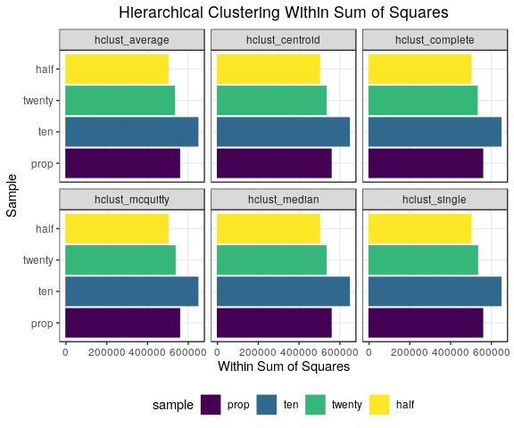
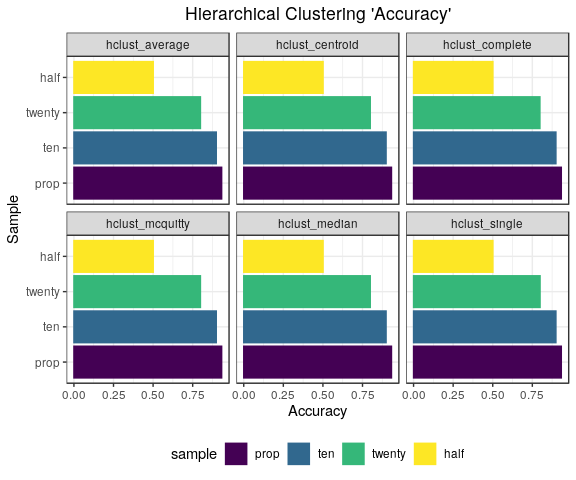
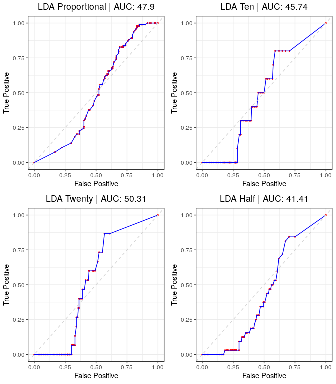
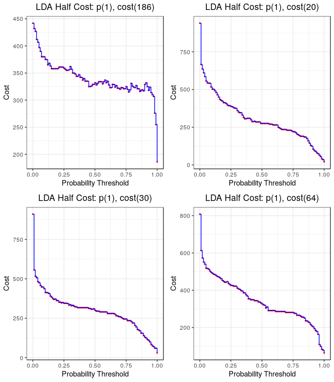

Unsupervised ML Methods
================
DSPG Business Innovation Team
7/25/2019

2. Unsupervised Methods (Bag of Words)
--------------------------------------

``` r
#Store desired filepath
file.path <- "./data/working/DNA_Aggregated/Machine_learning_sample/NPS_sample_data/"

#Test train sample
train.split <- 0.8
N <- 1000
set.seed(2019)
train.samp <- sample(1:N, train.split * N, replace = FALSE)

#Create tibble of each sample data identified by the variable 'sample', stored in the variable 'data'
sample.df <- list.files(path = file.path) %>%
  enframe() %>%
  rename(file_path = value) %>%
  filter(file_path %>% str_detect(".RDS")) %>%
  mutate(
    sample      = str_split_fixed(file_path, "_", 5)[ ,4],
    file_path   = str_c(file.path, file_path),
    data        = map(.x = file_path, ~read_rds(.x) %>% as_tibble()),
    subject     = map(.x = data, ~.x %>% dplyr::select(subject_code_ns) %>% 
                                  mutate(subject_code_ns = as.factor(subject_code_ns))),
    data        = map2(.x = data, .y = subject, ~bind_cols(as_tibble(make_dtm(.x, 40)), .y) %>%
                                                 dplyr::select(subject_code_ns, everything())),
    train       = map(.x = data, ~.x[train.samp, ]),
    test        = map(.x = data, ~.x[setdiff(1:N, train.samp), ])
  )
```

``` r
#Write out json's for Neil 
for(i in 1:nrow(sample.df)) {
  
  write_json(sample.df$data[[i]], sample.df$file_path[i] %>% str_replace(., ".RDS", ".json"))

}

#Remove file path
sample.df <- sample.df %>%
  dplyr::select(-file_path)
```

#### a. K-means

``` r
kmeans.df <- sample.df %>%
  mutate(
    kmean     = map(.x = train, ~kmeans(.x %>% dplyr::select(-subject_code_ns), centers = 2), nstart = 50, iter.max = 100),
    cluster   = map2_dbl(.x = train, 
                     .y = kmean, 
                     ~which.max(
                       c(mean((.y$cluster == 1) == .x$subject_code_ns),
                         mean((.y$cluster == 2) == .x$subject_code_ns))
                               )
                     ),
    k_preds    = map2(.x = kmean, 
                      .y = test, 
                      ~predict.kmeans(.x, 
                                      .y %>% 
                                        dplyr::select(-subject_code_ns) %>% 
                                        as.matrix(), 
                                      method = "classes")),
    k_logical   = map2(.x = k_preds, .y = cluster, ~(.x == .y)),
    k_accuracy  = map2_dbl(.x = k_logical, .y = test, ~mean(.x == .y$subject_code_ns))
  )

#Not splitting well (along NS subject code)
((kmeans.df$kmean[[1]]$cluster == 1) == kmeans.df$test[[1]]$subject_code_ns) %>% mean()
```

    ## [1] 0.53625

``` r
((kmeans.df$kmean[[1]]$cluster == 2) == kmeans.df$test[[1]]$subject_code_ns) %>% mean()
```

    ## [1] 0.46375

``` r
#Accuracy
kmeans.df %>%
  dplyr::select(sample, k_accuracy) %>%
  knitr::kable(digits = 3)
```

| sample |  k\_accuracy|
|:-------|------------:|
| half   |        0.465|
| prop   |        0.910|
| ten    |        0.850|
| twenty |        0.780|

``` r
#The model is basically
empirical.proportion <- map_dbl(.x = kmeans.df$train, ~mean(.x$subject_code_ns %>% as.logical()))
preds                <- map2(.x = kmeans.df$test, .y = empirical.proportion, ~rbinom(nrow(.x), 1, .y) == 1)
accuracy             <- map2_dbl(.x = kmeans.df$test, .y = preds, ~mean(.y == .x$subject_code_ns))

#Uninformed Accuracy
tibble(
  sample   = kmeans.df$sample,
  accuracy = accuracy 
) %>% knitr::kable(digits = 3)
```

| sample |  accuracy|
|:-------|---------:|
| half   |     0.495|
| prop   |     0.865|
| ten    |     0.850|
| twenty |     0.690|

``` r
#Within Sum of Squares
tibble(
  Sample                        = kmeans.df$sample,
  `Total Within Sum of Squares` = map_dbl(.x = kmeans.df$kmean, ~.x$tot.withinss),
  `Between Sum of Squares`      = map_dbl(.x = kmeans.df$kmean, ~.x$betweenss)
) %>% knitr::kable(digits = 2)
```

| Sample |  Total Within Sum of Squares|  Between Sum of Squares|
|:-------|----------------------------:|-----------------------:|
| half   |                     404394.2|                13206.79|
| prop   |                     453343.8|                21501.04|
| ten    |                     517335.3|                25423.82|
| twenty |                     439155.0|                19955.06|

The kmeans models do not appear to be seperating particularly well, and are performing poorly. Compared to the most uninformative model, using the estimated proportion to sample from a bernoulli *N* `TRUE`/`FALSE` with porbability of drawing a true being the estimated proportion of `TRUE` in the training set, on the test set. Our kmeans models are only performing marginally better than the uninformative model; which actually appears to be good when the proportions are small because the models just predict all `FALSE`, which ends up being mostly correct (but it is an entirely inflexible model to variation in the the test data).

#### b. Heirarchical

``` r
#Store method vector
methods <- c("average", "complete", "single", "mcquitty", "median", "centroid")

hclust.df <- sample.df %>%
  mutate(
    hclust_average  = map(.x = data, 
                             ~hclust(.x %>% dplyr::select(-subject_code_ns) %>% dist(), method = "average") %>%
                              cutree(., 2)),
    hclust_complete = map(.x = data, 
                             ~hclust(.x %>% dplyr::select(-subject_code_ns) %>% dist(), method = "complete") %>%
                              cutree(., 2)),
    hclust_single   = map(.x = data, 
                             ~hclust(.x %>% dplyr::select(-subject_code_ns) %>% dist(), method = "single") %>%
                              cutree(., 2)),
    hclust_mcquitty = map(.x = data, 
                             ~hclust(.x %>% dplyr::select(-subject_code_ns) %>% dist(), method = "mcquitty") %>%
                              cutree(., 2)),
    hclust_median   = map(.x = data, 
                             ~hclust(.x %>% dplyr::select(-subject_code_ns) %>% dist(), method = "median") %>%
                              cutree(., 2)),
    hclust_centroid = map(.x = data, 
                             ~hclust(.x %>% dplyr::select(-subject_code_ns) %>% dist(), method = "centroid") %>%
                              cutree(., 2))
  )

accuracy <- hclust.df %>%
            dplyr::select(sample, data, hclust_average:hclust_centroid) %>%
            gather(key = method, value = model, hclust_average:hclust_centroid) %>%
            mutate(
              `Within Sum of Squares` = map2_dbl(.x = model, 
                                                 .y = data,
                                                 ~wrap(.x, .y %>% dplyr::select(-subject_code_ns))),
              cluster       = map2_dbl(.x = data, 
                                       .y = model, 
                                        ~which.max(
                                        c(mean((.y == 1) == .x$subject_code_ns),
                                        mean((.y == 2) == .x$subject_code_ns))
                                     )
                                  ),
              logical       = map2(.x = model, .y = cluster, ~(.x == .y)),
              Accuracy  = map2_dbl(.x = logical, .y = data, ~mean(.x == .y$subject_code_ns))
            ) %>%
  dplyr::select(-c(data, cluster, logical, model))

#Visualize
accuracy %>%
  knitr::kable(digits = 3)
```

| sample | method           |  Within Sum of Squares|  Accuracy|
|:-------|:-----------------|----------------------:|---------:|
| half   | hclust\_average  |               499988.6|     0.501|
| prop   | hclust\_average  |               556838.2|     0.933|
| ten    | hclust\_average  |               646577.4|     0.899|
| twenty | hclust\_average  |               532021.4|     0.799|
| half   | hclust\_complete |               499988.6|     0.501|
| prop   | hclust\_complete |               556838.2|     0.933|
| ten    | hclust\_complete |               646577.4|     0.899|
| twenty | hclust\_complete |               530049.4|     0.798|
| half   | hclust\_single   |               499988.6|     0.501|
| prop   | hclust\_single   |               556838.2|     0.933|
| ten    | hclust\_single   |               646577.4|     0.899|
| twenty | hclust\_single   |               532021.4|     0.799|
| half   | hclust\_mcquitty |               499988.6|     0.501|
| prop   | hclust\_mcquitty |               556838.2|     0.933|
| ten    | hclust\_mcquitty |               646577.4|     0.899|
| twenty | hclust\_mcquitty |               534846.7|     0.799|
| half   | hclust\_median   |               499988.6|     0.501|
| prop   | hclust\_median   |               556838.2|     0.933|
| ten    | hclust\_median   |               646577.4|     0.899|
| twenty | hclust\_median   |               532021.4|     0.799|
| half   | hclust\_centroid |               499988.6|     0.501|
| prop   | hclust\_centroid |               556838.2|     0.933|
| ten    | hclust\_centroid |               646577.4|     0.899|
| twenty | hclust\_centroid |               532021.4|     0.799|

``` r
#Plot
accuracy %>%
  mutate(sample = as.factor(sample) %>% fct_relevel("prop", "ten", "twenty", "half")) %>%
  gather(key = metric, value = value, `Within Sum of Squares`:Accuracy) %>%
  filter(metric == "Within Sum of Squares") %>% 
  ggplot(aes(x = sample, y = value, colour = sample, fill = sample)) +
  labs(
    x = "Sample",
    y = "Within Sum of Squares",
    title = "Hierarchical Clustering Within Sum of Squares"
  ) +
  geom_col() +
  coord_flip() +
  facet_wrap(~method, ncol = 3, nrow = 2) +
  scale_colour_viridis_d() +
  scale_fill_viridis_d()
```



``` r
#Plot
accuracy %>%
  mutate(sample = as.factor(sample) %>% fct_relevel("prop", "ten", "twenty", "half")) %>%
  gather(key = metric, value = value, `Within Sum of Squares`:Accuracy) %>%
  filter(metric == "Accuracy") %>% 
  ggplot(aes(x = sample, y = value, colour = sample, fill = sample)) +
  labs(
    x = "Sample",
    y = "Accuracy",
    title = "Hierarchical Clustering 'Accuracy'"
  ) +
  geom_col() +
  coord_flip() +
  facet_wrap(~method, ncol = 3, nrow = 2) +
  scale_colour_viridis_d() +
  scale_fill_viridis_d()
```



Same problem as Kmeans.

#### c. Bayesian

``` r
#Store method vector
bclust.df <- sample.df %>%
  mutate(
    bclust    = map(.x = data, 
               ~bclust(.x %>% dplyr::select(-subject_code_ns) %>% dist())),
    b_h_clust = map(bclust, ~.x$hclust %>% cutree(., 2)),
    wss       = map2_dbl(.x = data, .y = b_h_clust, ~wrap(.y, .x %>% dplyr::select(-subject_code_ns))),
    cluster   = map2_dbl(.x = data, 
                         .y = b_h_clust, 
                         ~which.max(
                              c(mean((.y == 1) == .x$subject_code_ns),
                              mean((.y == 2) == .x$subject_code_ns))
                              )
                         ),
    logical   = map(.x = b_h_clust, .y = cluster, ~(.x == .y)),
    Accuracy  = map2_dbl(.x = logical, .y = data, ~mean(.x == .y$subject_code_ns)) 

  ) %>%
  dplyr::select(c(sample, `Within Sum of Squares`, Accuracy)) %>%
  rename(`Within Sum of Squares` = wss)

#Visualize
bclust.df %>%
  knitr::kable(digits = 3)

#Plot
bclust.df %>%
  mutate(sample = as.factor(sample) %>% fct_relevel("prop", "ten", "twenty", "half")) %>%
  gather(key = metric, value = value, `Within Sum of Squares`:Accuracy) %>%
  ggplot(aes(x = sample, y = value, colour = sample, fill = sample)) +
  labs(
    x = "Sample",
    title = "Hierarchical Clustering Within Sum of Squares"
  ) +
  geom_col() +
  coord_flip() +
  facet_wrap(~metric, ncol = 2, nrow = 1, scales = "free_x") +
  scale_colour_viridis_d() +
  scale_fill_viridis_d()
```

#### d. Latent Dirichlet Allocation

##### i. Exploration

``` r
remove_zeroes <- function(x) {
  ifelse(which(x[ ,-1] %>% apply(., 1, function(y) {all(y == 0)})) %>% is_empty(),
       return(x),
       return(x %>%
              slice(-(which(x[, -1] %>% apply(., 1, function(y) {all(y == 0)})))))
       )
}

lda.df <- sample.df %>%
  mutate(
    data      = map(.x = data, ~remove_zeroes(.x)),
    lda       = map(.x = data, 
               ~LDA(.x[ ,-1], k = 2, control = list(seed = 2019))),
    lda_probs = map(.x = lda, ~tidytext::tidy(.x, matrix = "gamma") %>%
                               spread(topic, gamma)),
    lda_preds = map(.x = lda_probs, ~ifelse(.x$`2` > 0.5, 2, 1)),
    cluster   = map2_dbl(.x = data, 
                         .y = lda_preds, 
                         ~which.max(
                              c(mean((.y == 1) == .x$subject_code_ns),
                              mean((.y == 2) == .x$subject_code_ns))
                              )
                         ),
    logical   = map(.x = lda_preds, .y = cluster, ~(.x == .y)),
    Accuracy  = map2_dbl(.x = logical, .y = data, ~mean(.x == .y$subject_code_ns)) 
  )


lda.df %>%
  select(sample, Accuracy) %>%
  mutate(sample = as.factor(sample) %>%
                  forcats::fct_relevel("prop", "ten", "twenty", "half")) %>%
  knitr::kable()
```

| sample |   Accuracy|
|:-------|----------:|
| half   |  0.5040000|
| prop   |  0.5626881|
| ten    |  0.5840000|
| twenty |  0.4664665|

##### ii. Prediction

Alternate method to assess the LDA topic modeling as a predictive model.

Need to restructure data to have comaptible data structures for the LDA prediction.

``` r
#Store desired filepath
file.path <- "./data/working/DNA_Aggregated/Machine_learning_sample/NPS_sample_data/"

#Test train sample
train.split <- 0.8
N <- 1000
set.seed(2019)
train.samp <- sample(1:N, train.split * N, replace = FALSE)

#Create tibble of each sample data identified by the variable 'sample', stored in the variable 'data'
sample.df <- list.files(path = file.path) %>%
  enframe() %>%
  rename(file_path = value) %>%
  filter(file_path %>% str_detect(".RDS")) %>%
  mutate(
    sample      = str_split_fixed(file_path, "_", 5)[ ,4],
    file_path   = str_c(file.path, file_path),
    data        = map(.x = file_path, ~read_rds(.x) %>% as_tibble()),
    subject     = map(.x = data, ~.x$subject_code_ns %>% 
                                  as.factor()),
    data        = map(.x = data, 
                       ~CreateDtm(doc_vec = .x$body,
                                  doc_names = .x$an,
                                  ngram_window = c(1, 1),
                                  stopword_vec = c(stopwords::stopwords("en"),
                                                   stopwords::stopwords(source = "smart")),
                                  verbose = FALSE,
                                  cpus = 4)),
    data        = map(.x = data, ~.x[ ,colSums(.x) >= 20]),
    train       = map(.x = data, ~.x[train.samp, ]),
    train_ns    = map(.x = subject, ~.x[train.samp]),
    test        = map(.x = data, ~.x[-train.samp, ]),
    test_ns     = map(.x = subject, ~.x[-train.samp])
  )
```

Here we employ the method, using a gibbs sampler with fixed iteration and burn in period to estimate that latent probabilities of a given document falling into a particular class. The longer the iteration period (and proportionally the burn in period), you are more likely to get optimal classification probabilities and prediction power.

``` r
#Iteration and burnin for gibbs sampler
iter <- 500
burn <- 250

#LDA data frame
lda.df <- sample.df %>%
  mutate(
    lda       = map(.x = train, 
                    ~FitLdaModel(.x, k = 2, method = "gibbs",
                                 iterations = iter, burnin = burn,
                                 optimize_alpha = TRUE)),
    cluster   = map(.x = lda, ~ifelse(.x$theta[,2] > 0.5, 2, 1)),
    cluster   = map2_dbl(.x = train_ns, 
                         .y = cluster, 
                         ~which.max(
                              c(mean((.y == 1) == .x),
                              mean((.y == 2) == .x))
                              )
                         ),
    lda_probs = map2(.x = lda,
                      .y = test,
                      ~predict(.x, .y, k = 2, method = "gibbs", iterations = iter, burnin = burn)),
    lda_preds = map2(.x = lda_probs, .y = cluster, ~ifelse(.x[,.y] > 0.5, TRUE, FALSE)),
    Accuracy  = map2_dbl(.x = lda_preds, .y = test_ns, ~mean(.x == .y)) 
  )
```

Visualize the results.

``` r
#Table of Results
#Accuracy
lda.df %>%
  dplyr::select(sample, Accuracy) %>%
  mutate(sample = as.factor(sample) %>% fct_relevel("prop", "ten", "twenty", "half")) %>%
  knitr::kable()
```

| sample |  Accuracy|
|:-------|---------:|
| half   |     0.535|
| prop   |     0.695|
| ten    |     0.655|
| twenty |     0.585|

``` r
#Plot Roc
plots <- lda.df %>%
  mutate(
    lda_probs = map2(.x = lda_probs, .y = cluster, ~.x[, .y]),
    sample    = sample %>% as.factor() %>% fct_relevel("prop", "ten", "twenty", "half"),
    roc       = map2(.x = test_ns, .y = lda_probs, ~roc.log(.x, .y)),
    roc_gg    = map2(.x = roc, .y  = c("Proportional", "Ten", "Twenty", "Half"), 
                  ~plot.roc(.x, sprintf("LDA %s | AUC: %s", .y, auc(.x) %>% round(4)*100))),
    cost      = map2(.x = test_ns, .y = lda_probs, ~cost.df(.x, .y)),
    cost_gg   = map(.x = cost, .y = c("Proportional", "Ten", "Twenty", "Half"), 
                  ~plot.cost(.x, paste("LDA", .y)))
  )

#Store GG panels
lda.roc  <- (plots$roc_gg[[1]] + plots$roc_gg[[2]])   / (plots$roc_gg[[3]] + plots$roc_gg[[4]])
lda.cost <- (plots$cost_gg[[1]] + plots$cost_gg[[2]]) / (plots$cost_gg[[3]] + plots$cost_gg[[4]])

#Save
ggsave("./src/nevilleq/dna_sample_predictive_modeling/new_prod_ml_figures/lda_roc.jpg" , lda.roc)
```

    ## Saving 7 x 8 in image

``` r
ggsave("./src/nevilleq/dna_sample_predictive_modeling/new_prod_ml_figures/lda_cost.jpg", lda.cost, width = 8)
```

    ## Saving 8 x 8 in image

``` r
#Display
lda.roc
```



``` r
lda.cost
```


