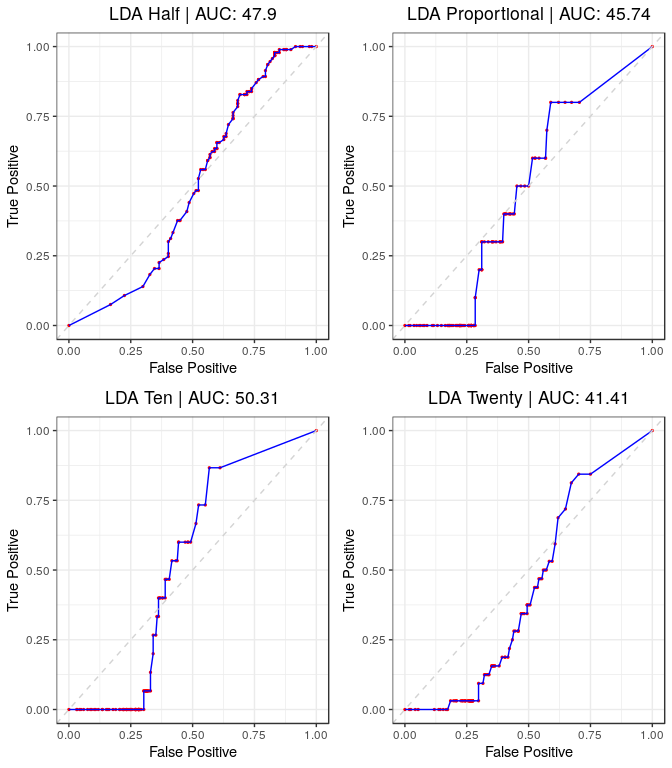

Unsupervised ML Methods
================
DSPG Business Innovation Team
7/25/2019

2. Unsupervised Methods (Bag of Words)
--------------------------------------

Here, we utilize the same document term matrix generation procedure, test/train split, and samples of varying proportions of DNA labeled new product or service codes (50%, 20%, 10%, Proportional ~ 7%) to build and analyze unsupervised methods for clustering the data. Unlike the previous supervised models, all of these methods can be exploratory, with two also providing predictive algorithms for a defined outcome. Recalling from the previous document, the methods we are going to investigate take the form:

However, alternative *unsupervised* exploratory and predictive models can also be built without articles having a defined labeled outcome; exploiting the underlying structure of the article data (through distance, hierarchy, latent factors, etc.) to give further insight and provide potential predictive features/models to supplement the supervised models. We investigated the following *unsupervised* method(s):

-   Bag of Words:
    Takes a clean corpus of words, document term matrix of frequency, and utilizes an unsupervised clustering algorithm to predict a binary classification of articles into two corresponding groups (New Product/Service vs. Not). Unsupervised clustering algorithms investigated include:

-   K-means Clustering (*Predicted Classification*) An algorithm that iteratively calculates centroids and euclidean distance of the article data to those centroids, minimizing the centroid distance to points until convergence. This produces groupings of the data that do not rely on a specific outcome. As a predictive model, we build the clusters on the training set, then, we select whichever cluster has a higher percentage of the desired outcome as the "positive" outcome, calculate which cluster the new test data points fall into, and see how many "positive" outcomes in the testing set were actually grouped into the "positve" cluster.

-   Hierarchical Clustering
    Similar to decision trees, this algorithm considers a hierarchical structure to the data, splitting upon chosen measures of distance, and cutting the tree at the desired number of groups to produce the same clustering structure as above. Only used for exploratory analysis.

-   Bayesian Clustering
    Similar to the above algorithms, this method also utilizes measures of distance but calculates groupings using the MArkov Chain Monte Carlo method with a conditional prior probability driving the predicted posterior probability of a data point falling into that particular group for group classification. Can be much more useful than the above methods if given an informative (good) prior distribution for the probability of being in a particular group. Only used for exploratory analysis.

-   Latent Dirichlet Allocation (*Predicted Probabilities*) Unlike the previous methods, this utilizes a latent variable clustering algorithm with a conditional expectation probability of being in a particular group. However, unlike the Bayesian method, this algorithm is done using an Expectation Maximization algorithm of the likelihood rather than an MCMC algorithm to describe the predicted probability of a data point falling into a particular latent cluster. Used often in topic modeling, which we are performing here, and has the highest likelihood of being effective given our data and end goal. As a predictive model, this is far more advantageous and flexible than K-means as it utilizes a stochastic chain procedure (uses the data to drive the algorithm) and provides *predicted probabilities* of being in a certain class, not just a classification.

We will evaluate the first three distance-driven algorithms based on Within and Between Cluster Sum of Squares (measures of consistency and separation of a distance-clustering model), as well as accuracy where applicable. For the hierarchical models that cannot be used as predictive models, we fit the model to the entire data set and simply calculate how many "positive" articles actually ended up in the "positive" cluster, giving us a sense of whether or not the algorithm is specifically picking up the difference between "positive" articles or not (by seperation into clusters). Finally, for the Latent Dirichlet Allocation clustering method, we will analyze this method as both exploratory (like the hierarchical model analysis) and predictive (just like in the previous supervised methods section).

``` r
#Write out json's for Neil 
for(i in 1:nrow(sample.df)) {
  
  write_json(sample.df$data[[i]], sample.df$file_path[i] %>% str_replace(., ".RDS", ".json"))

}

#Remove file path
sample.df <- sample.df %>%
  dplyr::select(-file_path)
```

#### a. K-means

Below, we analyze the predictive capabality of the *k*-means algorithm through consistency (within sum of squares), separation (between sum of squares), and predictive accuracy (proportion of correct predictions).

``` r
kmeans.df <- sample.df %>%
  mutate(
    kmean     = map(.x = train, ~kmeans(.x %>% dplyr::select(-subject_code_ns), centers = 2), nstart = 50, iter.max = 100),
    cluster   = map2_dbl(.x = train, 
                     .y = kmean, 
                     ~which.max(
                       c(mean((.y$cluster == 1) == .x$subject_code_ns),
                         mean((.y$cluster == 2) == .x$subject_code_ns))
                               )
                     ),
    k_preds    = map2(.x = kmean, 
                      .y = test, 
                      ~predict.kmeans(.x, 
                                      .y %>% 
                                        dplyr::select(-subject_code_ns) %>% 
                                        as.matrix(), 
                                      method = "classes")),
    k_logical   = map2(.x = k_preds, .y = cluster, ~(.x == .y)),
    k_accuracy  = map2_dbl(.x = k_logical, .y = test, ~mean(.x == .y$subject_code_ns))
  )

#Not splitting well (along NS subject code)
((kmeans.df$kmean[[1]]$cluster == 1) == kmeans.df$test[[1]]$subject_code_ns) %>% mean()
```

    ## [1] 0.53625

``` r
((kmeans.df$kmean[[1]]$cluster == 2) == kmeans.df$test[[1]]$subject_code_ns) %>% mean()
```

    ## [1] 0.46375

``` r
#Accuracy
kmeans.df %>%
  dplyr::select(sample, k_accuracy) %>%
  knitr::kable(digits = 3)
```

| sample |  k\_accuracy|
|:-------|------------:|
| half   |        0.465|
| prop   |        0.910|
| ten    |        0.850|
| twenty |        0.780|

``` r
#The model is basically
empirical.proportion <- map_dbl(.x = kmeans.df$train, ~mean(.x$subject_code_ns %>% as.logical()))
preds                <- map2(.x = kmeans.df$test, .y = empirical.proportion, ~rbinom(nrow(.x), 1, .y) == 1)
accuracy             <- map2_dbl(.x = kmeans.df$test, .y = preds, ~mean(.y == .x$subject_code_ns))

#Uninformed Accuracy
tibble(
  sample   = kmeans.df$sample,
  accuracy = accuracy 
) %>% knitr::kable(digits = 3)
```

| sample |  accuracy|
|:-------|---------:|
| half   |     0.495|
| prop   |     0.865|
| ten    |     0.850|
| twenty |     0.690|

``` r
#Within Sum of Squares
tibble(
  Sample                        = kmeans.df$sample,
  `Total Within Sum of Squares` = map_dbl(.x = kmeans.df$kmean, ~.x$tot.withinss),
  `Between Sum of Squares`      = map_dbl(.x = kmeans.df$kmean, ~.x$betweenss)
) %>% knitr::kable(digits = 2)
```

| Sample |  Total Within Sum of Squares|  Between Sum of Squares|
|:-------|----------------------------:|-----------------------:|
| half   |                     404394.2|                13206.79|
| prop   |                     453343.8|                21501.04|
| ten    |                     517335.3|                25423.82|
| twenty |                     439155.0|                19955.06|

The kmeans models do not appear to be seperating particularly well, and are performing poorly. Compared to the most uninformative model, using the estimated proportion to sample from a bernoulli *N* `TRUE`/`FALSE` with porbability of drawing a true being the estimated proportion of `TRUE` in the training set, on the test set. Our kmeans models are only performing marginally better than the uninformative model; which actually appears to be good when the proportions are small because the models just predict all `FALSE`, which ends up being mostly correct (but it is an entirely inflexible model to variation in the the test data).

#### b. Heirarchical

As an exploratory method, we will fit 6 different hierarchical clustering models to the entire data, each utilizing one of the following metrics to calculate distance: average, complete, single, McQuitty, median, or centroid. Further analysis consisted of comparing cluster consistency (within sum of squares) and overall ability to separate into "positive" and "negative" new product/services clusters ("accuracy" - number of "positive" articles in the "positive" cluster).

``` r
#Store method vector
methods <- c("average", "complete", "single", "mcquitty", "median", "centroid")

hclust.df <- sample.df %>%
  mutate(
    hclust_average  = map(.x = data, 
                             ~hclust(.x %>% dplyr::select(-subject_code_ns) %>% dist(), method = "average") %>%
                              cutree(., 2)),
    hclust_complete = map(.x = data, 
                             ~hclust(.x %>% dplyr::select(-subject_code_ns) %>% dist(), method = "complete") %>%
                              cutree(., 2)),
    hclust_single   = map(.x = data, 
                             ~hclust(.x %>% dplyr::select(-subject_code_ns) %>% dist(), method = "single") %>%
                              cutree(., 2)),
    hclust_mcquitty = map(.x = data, 
                             ~hclust(.x %>% dplyr::select(-subject_code_ns) %>% dist(), method = "mcquitty") %>%
                              cutree(., 2)),
    hclust_median   = map(.x = data, 
                             ~hclust(.x %>% dplyr::select(-subject_code_ns) %>% dist(), method = "median") %>%
                              cutree(., 2)),
    hclust_centroid = map(.x = data, 
                             ~hclust(.x %>% dplyr::select(-subject_code_ns) %>% dist(), method = "centroid") %>%
                              cutree(., 2))
  )

accuracy <- hclust.df %>%
            dplyr::select(sample, data, hclust_average:hclust_centroid) %>%
            gather(key = method, value = model, hclust_average:hclust_centroid) %>%
            mutate(
              `Within Sum of Squares` = map2_dbl(.x = model, 
                                                 .y = data,
                                                 ~wrap(.x, .y %>% dplyr::select(-subject_code_ns))),
              cluster       = map2_dbl(.x = data, 
                                       .y = model, 
                                        ~which.max(
                                        c(mean((.y == 1) == .x$subject_code_ns),
                                        mean((.y == 2) == .x$subject_code_ns))
                                     )
                                  ),
              logical       = map2(.x = model, .y = cluster, ~(.x == .y)),
              Accuracy  = map2_dbl(.x = logical, .y = data, ~mean(.x == .y$subject_code_ns))
            ) %>%
  dplyr::select(-c(data, cluster, logical, model))

#Visualize
accuracy %>%
  knitr::kable(digits = 3)
```

| sample | method           |  Within Sum of Squares|  Accuracy|
|:-------|:-----------------|----------------------:|---------:|
| half   | hclust\_average  |               499988.6|     0.501|
| prop   | hclust\_average  |               556838.2|     0.933|
| ten    | hclust\_average  |               646577.4|     0.899|
| twenty | hclust\_average  |               532021.4|     0.799|
| half   | hclust\_complete |               499988.6|     0.501|
| prop   | hclust\_complete |               556838.2|     0.933|
| ten    | hclust\_complete |               646577.4|     0.899|
| twenty | hclust\_complete |               530049.4|     0.798|
| half   | hclust\_single   |               499988.6|     0.501|
| prop   | hclust\_single   |               556838.2|     0.933|
| ten    | hclust\_single   |               646577.4|     0.899|
| twenty | hclust\_single   |               532021.4|     0.799|
| half   | hclust\_mcquitty |               499988.6|     0.501|
| prop   | hclust\_mcquitty |               556838.2|     0.933|
| ten    | hclust\_mcquitty |               646577.4|     0.899|
| twenty | hclust\_mcquitty |               534846.7|     0.799|
| half   | hclust\_median   |               499988.6|     0.501|
| prop   | hclust\_median   |               556838.2|     0.933|
| ten    | hclust\_median   |               646577.4|     0.899|
| twenty | hclust\_median   |               532021.4|     0.799|
| half   | hclust\_centroid |               499988.6|     0.501|
| prop   | hclust\_centroid |               556838.2|     0.933|
| ten    | hclust\_centroid |               646577.4|     0.899|
| twenty | hclust\_centroid |               532021.4|     0.799|

``` r
#Plot
accuracy %>%
  mutate(sample = as.factor(sample) %>% fct_relevel("prop", "ten", "twenty", "half")) %>%
  gather(key = metric, value = value, `Within Sum of Squares`:Accuracy) %>%
  filter(metric == "Within Sum of Squares") %>% 
  ggplot(aes(x = sample, y = value, colour = sample, fill = sample)) +
  labs(
    x = "Sample",
    y = "Within Sum of Squares",
    title = "Hierarchical Clustering Within Sum of Squares"
  ) +
  geom_col() +
  coord_flip() +
  facet_wrap(~method, ncol = 3, nrow = 2) +
  scale_colour_viridis_d() +
  scale_fill_viridis_d()
```


``` r
#Plot
accuracy %>%
  mutate(sample = as.factor(sample) %>% fct_relevel("prop", "ten", "twenty", "half")) %>%
  gather(key = metric, value = value, `Within Sum of Squares`:Accuracy) %>%
  filter(metric == "Accuracy") %>% 
  ggplot(aes(x = sample, y = value, colour = sample, fill = sample)) +
  labs(
    x = "Sample",
    y = "Accuracy",
    title = "Hierarchical Clustering 'Accuracy'"
  ) +
  geom_col() +
  coord_flip() +
  facet_wrap(~method, ncol = 3, nrow = 2) +
  scale_colour_viridis_d() +
  scale_fill_viridis_d()
```


Similarly to *k*-means above, this method is performing quite horribly at both creating consistent clusters (high within sum of squares) or seperating clearly into new product/service "positive" vs. "negative" clusters. Put simply, it is doing only marginally better than flipping a coin, using the empirical "positive" proportion as a model, or simply grouping every observation into the "negative" cluster (high "accuracy" when proportion of "positives" is small).

#### c. Bayesian Hierarchical

In similar fashion to the algorithm directly above, we will repeat a mirrored separability analysis; although given the poor performance above it would be unlikely for this method to perform much better. It is a similar hierarchical method with addition of a Bayesian hyperparameter describing the underlying probability of being in one group vs. another. In a setting where hierarchical clustering was useful/separating well, this method ought to be an improvement on the former.

``` r
#Store method vector
bclust.df <- sample.df %>%
  mutate(
    bclust    = map(.x = data, 
               ~bclust(.x %>% dplyr::select(-subject_code_ns))),
    b_h_clust = map(bclust, ~.x$hclust %>% cutree(., 2)),
    wss       = map2_dbl(.x = data, .y = b_h_clust, ~wrap(.y, .x %>% dplyr::select(-subject_code_ns))),
    cluster   = map2_dbl(.x = data, 
                         .y = b_h_clust, 
                         ~which.max(
                              c(mean((.y == 1) == .x$subject_code_ns),
                              mean((.y == 2) == .x$subject_code_ns))
                              )
                         ),
    logical   = map(.x = b_h_clust, .y = cluster, ~(.x == .y)),
    Accuracy  = map2_dbl(.x = logical, .y = data, ~mean(.x == .y$subject_code_ns)) 

  ) %>%
  dplyr::select(c(sample, wss, Accuracy)) %>%
  rename(`Within Sum of Squares` = wss)
```

    ## Committee Member: 1(1) 2(1) 3(1) 4(1) 5(1) 6(1) 7(1) 8(1) 9(1) 10(1)
    ## Computing Hierarchical Clustering
    ## Committee Member: 1(1) 2(1) 3(1) 4(1) 5(1) 6(1) 7(1) 8(1) 9(1) 10(1)
    ## Computing Hierarchical Clustering
    ## Committee Member: 1(1) 2(1) 3(1) 4(1) 5(1) 6(1) 7(1) 8(1) 9(1) 10(1)
    ## Computing Hierarchical Clustering
    ## Committee Member: 1(1) 2(1) 3(1) 4(1) 5(1) 6(1) 7(1) 8(1) 9(1) 10(1)
    ## Computing Hierarchical Clustering

``` r
#Visualize
bclust.df %>%
  knitr::kable(digits = 3)
```

| sample |  Within Sum of Squares|  Accuracy|
|:-------|----------------------:|---------:|
| half   |               513927.6|     0.500|
| prop   |               574227.7|     0.702|
| ten    |               666260.0|     0.679|
| twenty |               545317.9|     0.644|

``` r
#Plot
bclust.df %>%
  mutate(sample = as.factor(sample) %>% fct_relevel("prop", "ten", "twenty", "half")) %>%
  gather(key = metric, value = value, `Within Sum of Squares`:Accuracy) %>%
  ggplot(aes(x = sample, y = value, colour = sample, fill = sample)) +
  labs(
    x = "Sample",
    title = "Hierarchical Clustering Within Sum of Squares"
  ) +
  geom_col() +
  coord_flip() +
  facet_wrap(~metric, ncol = 2, nrow = 1, scales = "free_x") +
  scale_colour_viridis_d() +
  scale_fill_viridis_d()
```


In almost exactly the same fashion as the hierarchical clustering above, we see that this method does lead to a clear separation into "positive" vs. "negative" new product or service article clusters. Further, it actually appears to be performing worse than general hierarchical clustering, which is a bit counterintuitive. Perhaps further time exploring the tuning and fitting of these models is necessary to produce better clustering separation.

#### d. Latent Dirichlet Allocation

Recalling from the introduction the characteristics of Latent Dirichlet Allocation (LDA), this algorithm affords us the opportunity to both explore the data and be a 'true' predictive model. Unlike *k*-means, which is a quasi-predictive model, LDA outputs a predicted probability that each observation falls into one of *k* categories. In our case, *k* = 2 and we obtain predicted probabilities that an article falls into one of the two latent variable clusters. For exploration, we fit the model to the entire data and then compute the separation or "accuracy" between articles "positive" or "negative" for new products or services. With respect to prediction, we fit the model to the training set, assign which ever latent cluster has the highest percentage of new product/service articles as the "positive" cluster, and predict on the test set to obtain predicted probabilities of an article falling into the "positive" cluster. These predicted probabilites can then be used to classify the articles and obtain ROC, AUC, and cost metrics for analysis.

##### i. Exploration

``` r
remove_zeroes <- function(x) {
  ifelse(which(x[ ,-1] %>% apply(., 1, function(y) {all(y == 0)})) %>% is_empty(),
       return(x),
       return(x %>%
              slice(-(which(x[, -1] %>% apply(., 1, function(y) {all(y == 0)})))))
       )
}

lda.df <- sample.df %>%
  mutate(
    data      = map(.x = data, ~remove_zeroes(.x)),
    lda       = map(.x = data, 
               ~LDA(.x[ ,-1], k = 2, control = list(seed = 2019))),
    lda_probs = map(.x = lda, ~tidytext::tidy(.x, matrix = "gamma") %>%
                               spread(topic, gamma)),
    lda_preds = map(.x = lda_probs, ~ifelse(.x$`2` > 0.5, 2, 1)),
    cluster   = map2_dbl(.x = data, 
                         .y = lda_preds, 
                         ~which.max(
                              c(mean((.y == 1) == .x$subject_code_ns),
                              mean((.y == 2) == .x$subject_code_ns))
                              )
                         ),
    logical   = map(.x = lda_preds, .y = cluster, ~(.x == .y)),
    Accuracy  = map2_dbl(.x = logical, .y = data, ~mean(.x == .y$subject_code_ns)) 
  )


lda.df %>%
  select(sample, Accuracy) %>%
  mutate(sample = as.factor(sample) %>%
                  forcats::fct_relevel("prop", "ten", "twenty", "half")) %>%
  knitr::kable()
```

| sample |   Accuracy|
|:-------|----------:|
| half   |  0.5040000|
| prop   |  0.5626881|
| ten    |  0.5840000|
| twenty |  0.4664665|

Here, we see that the separation (through "accuracy" on the whole data) is not particularly high for this method. However, we are not seeing the same trend where the algorithm is basically putting everything into one bucket, and in essence predicting that everything will be "negative" at lower proportions of true "positive" values in each DNA article data sample. This is actually a potential positive, because as we extend these methods to articles labeled for innovation (not by DNA), a method such as this may actually be useful.

##### ii. Prediction

Alternative methodology to assess the LDA topic modeling as a predictive model. Recall that identical analyses to the previous supervised methods will be applied here.

To utilize this method, we must employ different `r` packages to restructure data to have comaptible structures for the LDA prediction from the `textmineR` package vs. `tidytext` and `tm` above.

``` r
#Store desired filepath
file.path <- "./data/working/DNA_Aggregated/Machine_learning_sample/NPS_sample_data/"

#Test train sample
train.split <- 0.8
N <- 1000
set.seed(2019)
train.samp <- sample(1:N, train.split * N, replace = FALSE)

#Create tibble of each sample data identified by the variable 'sample', stored in the variable 'data'
sample.df <- list.files(path = file.path) %>%
  enframe() %>%
  rename(file_path = value) %>%
  filter(file_path %>% str_detect(".RDS")) %>%
  mutate(
    sample      = str_split_fixed(file_path, "_", 5)[ ,4],
    file_path   = str_c(file.path, file_path),
    data        = map(.x = file_path, ~read_rds(.x) %>% as_tibble()),
    subject     = map(.x = data, ~.x$subject_code_ns %>% 
                                  as.factor()),
    data        = map(.x = data, 
                       ~CreateDtm(doc_vec = .x$body,
                                  doc_names = .x$an,
                                  ngram_window = c(1, 1),
                                  stopword_vec = c(stopwords::stopwords("en"),
                                                   stopwords::stopwords(source = "smart")),
                                  verbose = FALSE,
                                  cpus = 4)),
    data        = map(.x = data, ~.x[ ,colSums(.x) >= 20]),
    train       = map(.x = data, ~.x[train.samp, ]),
    train_ns    = map(.x = subject, ~.x[train.samp]),
    test        = map(.x = data, ~.x[-train.samp, ]),
    test_ns     = map(.x = subject, ~.x[-train.samp])
  )
```

Here we employ the method, using a gibbs sampler with fixed iteration and burn in period to estimate that latent probabilities of a given document falling into a particular class. The longer the iteration period (and proportionally the burn in period), the more likely one is to obtain optimal classification probabilities and prediction power.

``` r
#Iteration and burnin for gibbs sampler
iter <- 500
burn <- 250

#LDA data frame
lda.df <- sample.df %>%
  mutate(
    lda       = map(.x = train, 
                    ~FitLdaModel(.x, k = 2, method = "gibbs",
                                 iterations = iter, burnin = burn,
                                 optimize_alpha = TRUE)),
    cluster   = map(.x = lda, ~ifelse(.x$theta[,2] > 0.5, 2, 1)),
    cluster   = map2_dbl(.x = train_ns, 
                         .y = cluster, 
                         ~which.max(
                              c(mean((.y == 1) == .x),
                              mean((.y == 2) == .x))
                              )
                         ),
    lda_probs = map2(.x = lda,
                      .y = test,
                      ~predict(.x, .y, k = 2, method = "gibbs", iterations = iter, burnin = burn)),
    lda_preds = map2(.x = lda_probs, .y = cluster, ~ifelse(.x[,.y] > 0.5, TRUE, FALSE)),
    Accuracy  = map2_dbl(.x = lda_preds, .y = test_ns, ~mean(.x == .y)) 
  )
```

Visualize the results.

``` r
#Table of Results
#Accuracy
lda.df %>%
  dplyr::select(sample, Accuracy) %>%
  mutate(sample = as.factor(sample) %>% fct_relevel("prop", "ten", "twenty", "half")) %>%
  knitr::kable()
```

| sample |  Accuracy|
|:-------|---------:|
| half   |     0.535|
| prop   |     0.695|
| ten    |     0.655|
| twenty |     0.585|

``` r
#Plot Roc
plots <- lda.df %>%
  mutate(
    lda_probs = map2(.x = lda_probs, .y = cluster, ~.x[, .y]),
    sample    = sample %>% as.factor() %>% fct_relevel("prop", "ten", "twenty", "half"),
    roc       = map2(.x = test_ns, .y = lda_probs, ~roc.log(.x, .y)),
    roc_gg    = map2(.x = roc, .y  = c("Half", "Proportional", "Ten", "Twenty"), 
                  ~plot.roc(.x, sprintf("LDA %s | AUC: %s", .y, auc(.x) %>% round(4)*100))),
    cost      = map2(.x = test_ns, .y = lda_probs, ~cost.df(.x, .y)),
    cost_gg   = map(.x = cost, .y = c("Half", "Proportional", "Ten", "Twenty"), 
                  ~plot.cost(.x, paste("LDA", .y)))
  )

#Store GG panels
lda.roc  <- (plots$roc_gg[[1]] + plots$roc_gg[[2]])   / (plots$roc_gg[[3]] + plots$roc_gg[[4]])
lda.cost <- (plots$cost_gg[[1]] + plots$cost_gg[[2]]) / (plots$cost_gg[[3]] + plots$cost_gg[[4]])

#Save
ggsave("./src/nevilleq/dna_sample_predictive_modeling/new_prod_ml_figures/lda_roc.jpg" , lda.roc)
```

    ## Saving 7 x 8 in image

``` r
ggsave("./src/nevilleq/dna_sample_predictive_modeling/new_prod_ml_figures/lda_cost.jpg", lda.cost, width = 8)
```

    ## Saving 8 x 8 in image

``` r
#Display
lda.roc
```



``` r
lda.cost
```


Here we observed some very interesting and unique behavior for LDA models by varying sample, with ROC curves below 0.5 for a probability threshold less than 0.5, and above for thresholds greater than 0.5. This implies that the accuracy measure above is not necessarilly reflective of the predictive capabiltiy of the model, given that a sufficiently high threshold is chosen for "positive" classification. Further, we see that this method, by sample, reaches an optimally minimized cost at a threshold of *p* = 1, meaning that every new observation is simply classified as false. That is a bit concerning, but the model still holds promise for alternative classification of innovation labeled articles vs. DNA labeling of new product/service.

#### e. Conclusion

Overall, none of these methods were convincing in their effectiveness, usefulness, or compability to aid in separating and classifying these DNA news articles into new product/service articles vs. not (according to DNA's own labeling system). However, that does not mean that the exercise has been useless. We have observed and recorded the temperment of each method given our specific data, seeing where each method is potentially strong or weak. Moving forward, we would recommend that for the innovation labeled articles, we investigate both *k*-means and LDA as predictive algorithms (Bag of Words). It is unclear whether hierarchical modeling is useful at all given these data, but those methods will likewise be investigated. Changing the outcome from new product/service to innovation may greatly change the results for both the supervised and unsupervised methodology.
